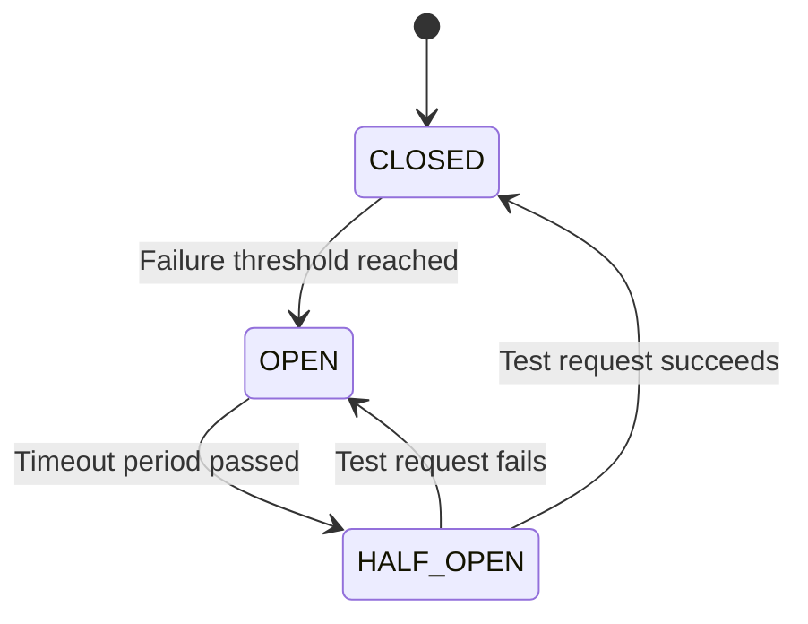

# Thư viện gRPC cho NestJS

Thư viện gRPC toàn diện cho các ứng dụng NestJS với các tính năng cấp doanh nghiệp.

:::tip Mẹo sử dụng
Thư viện này được thiết kế để cung cấp trải nghiệm phát triển tốt nhất với gRPC trong NestJS, bao gồm xử lý lỗi tự động, logging, validation và nhiều tính năng nâng cao khác.
:::

## Tổng quan kiến trúc

```mermaid
graph TB
    A[NestJS Application] --> B[gRPC Module]
    B --> C[Decorators]
    B --> D[Filters]
    B --> E[Pipes]
    B --> F[Interceptors]
    B --> G[Enhancements]
    
    C --> C1[@GrpcMethod]
    C --> C2[@Cacheable]
    C --> C3[@MonitorPerformance]
    C --> C4[@TraceOperation]
    
    D --> D1[GrpcExceptionFilter]
    D --> D2[GrpcClientExceptionFilter]
    
    E --> E1[GrpcValidationPipe]
    
    F --> F1[GrpcLoggingInterceptor]
    
    G --> G1[Circuit Breaker]
    G --> G2[Distributed Tracing]
    G --> G3[Wrapped Client]
```

## Cài đặt và cấu hình cơ bản

### Cài đặt package

```bash
npm install @ecom-co/grpc
```

### Cấu hình cơ bản cho gRPC Service

```typescript
import { NestFactory } from '@nestjs/core';
import { Transport } from '@nestjs/microservices';
import { 
    GrpcExceptionFilter, 
    GrpcValidationPipe, 
    GrpcLoggingInterceptor 
} from '@ecom-co/grpc';
import { AppModule } from './app.module';

async function bootstrap() {
    const app = await NestFactory.createMicroservice(AppModule, {
        transport: Transport.GRPC,
        options: {
            package: 'user',
            protoPath: 'user.proto',
            url: '0.0.0.0:50052',
        },
    });

    // Cấu hình exception filter
    app.useGlobalFilters(
        new GrpcExceptionFilter({
            enableLogging: true,
            exposeInternalErrors: process.env.NODE_ENV !== 'production',
        }),
    );

    // Cấu hình validation pipe
    app.useGlobalPipes(
        new GrpcValidationPipe({
            enableErrorLogging: true,
            stripUnknownProperties: true,
        }),
    );

    // Cấu hình logging interceptor
    app.useGlobalInterceptors(
        new GrpcLoggingInterceptor({
            logLevel: process.env.NODE_ENV === 'production' ? 'error' : 'info',
            logRequest: process.env.NODE_ENV !== 'production',
            logResponse: process.env.NODE_ENV === 'development',
        }),
    );

    await app.listen();
}

bootstrap();
```

## Decorators nâng cao

### @GrpcMethod - Decorator cải tiến

Decorator `@GrpcMethod` cung cấp metadata bổ sung cho các phương thức gRPC:

```typescript
import { Controller } from '@nestjs/common';
import { GrpcMethod } from '@ecom-co/grpc';

@Controller()
export class UserService {
    @GrpcMethod('UserService', 'GetUser', {
        description: 'Lấy thông tin người dùng theo ID',
        requiresAuth: true,
        rateLimit: 100,
        logLevel: 'info'
    })
    async getUser(data: { id: string }) {
        if (!data.id) {
            throw new Error('ID người dùng là bắt buộc');
        }
        return { id: data.id, name: 'Nguyễn Văn A' };
    }

    @GrpcMethod('UserService', 'CreateUser', {
        description: 'Tạo người dùng mới',
        requiresAuth: true,
        rateLimit: 50
    })
    async createUser(data: CreateUserDto) {
        // Logic tạo người dùng
        return { success: true, userId: 'new-user-id' };
    }
}
```

:::warning Lưu ý
Metadata `requiresAuth` và `rateLimit` chỉ là thông tin mô tả. Bạn cần implement logic xác thực và rate limiting riêng trong guards hoặc interceptors.
:::

### @Cacheable - Cache tự động

```typescript
import { Cacheable } from '@ecom-co/grpc';

@Controller()
export class ProductService {
    @GrpcMethod('ProductService', 'GetProduct')
    @Cacheable({
        ttl: 300, // 5 phút
        key: (args) => `product:${args[0].id}`,
        condition: (args) => !!args[0].id
    })
    async getProduct(data: { id: string }) {
        // Kết quả sẽ được cache trong 5 phút
        return await this.productRepository.findById(data.id);
    }
}
```

### @MonitorPerformance - Giám sát hiệu suất

```typescript
import { MonitorPerformance } from '@ecom-co/grpc';

@Controller()
export class OrderService {
    @GrpcMethod('OrderService', 'ProcessOrder')
    @MonitorPerformance({
        threshold: 1000, // Warning nếu > 1s
        includeMemory: true,
        logger: customLogger
    })
    async processOrder(data: ProcessOrderDto) {
        // Logic xử lý đơn hàng phức tạp
        return await this.processComplexOrder(data);
    }
}
```

### @TraceOperation - Distributed Tracing

```typescript
import { TraceOperation } from '@ecom-co/grpc';

@Controller()
export class PaymentService {
    @GrpcMethod('PaymentService', 'ProcessPayment')
    @TraceOperation({
        operationName: 'payment.process',
        tags: { service: 'payment', version: '1.0' }
    })
    async processPayment(data: PaymentDto) {
        // Tự động tạo span cho operation này
        return await this.handlePayment(data);
    }
}
```

## Xử lý Exception và Error

### Các Exception Class được hỗ trợ

```typescript
import {
    GrpcBadRequestException,
    GrpcUnauthorizedException,
    GrpcForbiddenException,
    GrpcNotFoundException,
    GrpcConflictException,
    GrpcInternalException,
    GrpcUnavailableException,
    GrpcTimeoutException,
    GrpcValidationException
} from '@ecom-co/grpc';

@Controller()
export class UserService {
    @GrpcMethod('UserService', 'GetUser')
    async getUser(data: { id: string }) {
        if (!data.id) {
            throw new GrpcBadRequestException('ID người dùng không hợp lệ');
        }

        const user = await this.userRepository.findById(data.id);
        if (!user) {
            throw new GrpcNotFoundException('Không tìm thấy người dùng');
        }

        return user;
    }

    @GrpcMethod('UserService', 'CreateUser')
    async createUser(data: CreateUserDto) {
        const existingUser = await this.userRepository.findByEmail(data.email);
        if (existingUser) {
            throw new GrpcConflictException('Email đã được sử dụng');
        }

        try {
            return await this.userRepository.create(data);
        } catch (error) {
            throw new GrpcInternalException('Lỗi khi tạo người dùng', {
                originalError: error.message
            });
        }
    }
}
```

### Cấu hình Exception Filter nâng cao

```typescript
import { GrpcExceptionFilter } from '@ecom-co/grpc';

const exceptionFilter = new GrpcExceptionFilter({
    enableLogging: true,
    enableAsyncLogging: true,
    enableMetrics: true,
    exposeInternalErrors: process.env.NODE_ENV === 'development',
    defaultErrorMessage: 'Dịch vụ tạm thời không khả dụng',
    customErrorMappings: {
        'DatabaseConnectionError': GrpcUnavailableException,
        'ValidationError': GrpcValidationException,
        'AuthenticationError': GrpcUnauthorizedException
    },
    errorRateLimit: 10,
    rateLimitWindowMs: 60000,
    maxDetailsSize: 1000,
    isDevelopment: process.env.NODE_ENV === 'development'
});

app.useGlobalFilters(exceptionFilter);
```

## Validation với GrpcValidationPipe

### Cấu hình Validation Pipe

```typescript
import { GrpcValidationPipe } from '@ecom-co/grpc';
import { IsEmail, IsNotEmpty, MinLength } from 'class-validator';

class CreateUserDto {
    @IsNotEmpty({ message: 'Tên không được để trống' })
    name: string;

    @IsEmail({}, { message: 'Email không đúng định dạng' })
    email: string;

    @MinLength(6, { message: 'Mật khẩu phải có ít nhất 6 ký tự' })
    password: string;
}

const validationPipe = new GrpcValidationPipe({
    enableErrorLogging: true,
    stripUnknownProperties: true,
    errorMessagePrefix: 'Dữ liệu không hợp lệ',
    validationGroups: ['create'],
    transformOptions: {
        enableImplicitConversion: true,
        excludeExtraneousValues: true
    },
    exceptionFactory: (message, errors) => {
        return new GrpcValidationException(message, { errors });
    }
});

app.useGlobalPipes(validationPipe);
```

:::tip Mẹo Validation
Sử dụng validation groups để áp dụng các rule khác nhau cho create và update operations:

```typescript
class UserDto {
    @IsNotEmpty({ groups: ['create'] })
    @IsOptional({ groups: ['update'] })
    name: string;

    @IsEmail({}, { groups: ['create', 'update'] })
    email: string;
}
```
:::

## Logging và Monitoring

### Cấu hình Logging Interceptor

```typescript
import { GrpcLoggingInterceptor } from '@ecom-co/grpc';

const loggingInterceptor = new GrpcLoggingInterceptor({
    logLevel: 'info',
    logRequest: true,
    logResponse: process.env.NODE_ENV === 'development',
    enableRequestId: true,
    enableUserTracking: true,
    requestIdHeader: 'x-request-id',
    userIdExtractor: (context) => {
        // Logic extract user ID từ context
        return context.getArgs()[0]?.userId;
    },
    sensitiveFields: ['password', 'token', 'secret', 'apiKey'],
    maxLogSize: 1000,
    logDuration: true,
    enableMetrics: true,
    isDevelopment: process.env.NODE_ENV === 'development'
});

app.useGlobalInterceptors(loggingInterceptor);
```

### Ví dụ log output

```json
{
  "level": "info",
  "message": "🚀 gRPC Request: UserService.GetUser",
  "context": "GrpcLoggingInterceptor",
  "timestamp": "2024-01-15T10:30:00.000Z",
  "requestId": "req-123-456",
  "userId": "user-789",
  "method": "GetUser",
  "service": "UserService",
  "args": [
    {
      "id": "user-123",
      "password": "[REDACTED]"
    }
  ]
}
```

## Circuit Breaker

Circuit Breaker giúp ngăn chặn cascade failures trong hệ thống microservices:



### Cấu hình Circuit Breaker

```typescript
import { CircuitBreakerService } from '@ecom-co/grpc';

@Injectable()
export class ExternalApiService {
    private circuitBreaker: CircuitBreakerService;

    constructor() {
        this.circuitBreaker = new CircuitBreakerService({
            failureThreshold: 5,          // Mở circuit sau 5 lỗi
            recoveryTimeout: 60000,       // Thử lại sau 60s
            monitoringPeriod: 120000,     // Giám sát trong 2 phút
            expectedErrors: ['TimeoutError', 'ConnectionError'],
            onStateChange: (state) => {
                console.log(`Circuit breaker state: ${state}`);
            }
        });
    }

    async callExternalApi(data: any) {
        return this.circuitBreaker.execute(async () => {
            // Gọi external API
            return await this.httpClient.post('/external-api', data);
        });
    }
}
```

:::warning Quan trọng
Circuit Breaker chỉ nên được sử dụng cho các external services không tin cậy. Đừng áp dụng cho internal services trong cùng một hệ thống.
:::

## Distributed Tracing

### Cấu hình Tracing Service

```typescript
import { DistributedTracer } from '@ecom-co/grpc';

@Injectable()
export class OrderService {
    constructor(private tracer: DistributedTracer) {}

    async processOrder(orderData: OrderDto) {
        const spanId = this.tracer.startSpan('order.process', {
            tags: {
                orderId: orderData.id,
                userId: orderData.userId,
                amount: orderData.amount
            }
        });

        try {
            // Bước 1: Validate order
            const validationSpan = this.tracer.startSpan('order.validate', {
                parentSpanId: spanId,
                tags: { step: 'validation' }
            });
            
            await this.validateOrder(orderData);
            this.tracer.finishSpan(validationSpan, 'completed');

            // Bước 2: Process payment
            const paymentSpan = this.tracer.startSpan('payment.process', {
                parentSpanId: spanId,
                tags: { step: 'payment', amount: orderData.amount }
            });
            
            const paymentResult = await this.processPayment(orderData);
            this.tracer.addLog(paymentSpan, 'info', 'Payment processed', {
                transactionId: paymentResult.transactionId
            });
            this.tracer.finishSpan(paymentSpan, 'completed');

            // Bước 3: Update inventory
            const inventorySpan = this.tracer.startSpan('inventory.update', {
                parentSpanId: spanId,
                tags: { step: 'inventory' }
            });
            
            await this.updateInventory(orderData);
            this.tracer.finishSpan(inventorySpan, 'completed');

            this.tracer.finishSpan(spanId, 'completed');
            return { success: true, orderId: orderData.id };

        } catch (error) {
            this.tracer.addLog(spanId, 'error', 'Order processing failed', {
                error: error.message
            });
            this.tracer.finishSpan(spanId, 'failed');
            throw error;
        }
    }
}
```

### Tracing Statistics

```typescript
const stats = this.tracer.getStats();
console.log('Tracing Statistics:', {
    activeSpans: stats.activeSpans,
    completedSpans: stats.completedSpans,
    totalTraces: stats.totalTraces,
    samplingRate: stats.samplingRate,
    serviceName: stats.serviceName
});
```

## gRPC Client với Wrapper

### Cấu hình Wrapped Client

```typescript
import { WrappedGrpc } from '@ecom-co/grpc';

@Injectable()
export class UserClientService {
    private userService: any;

    constructor(@Inject('USER_SERVICE') private client: ClientGrpc) {
        this.userService = new WrappedGrpc(this.client, {
            enableLogging: true,
            retry: 3,
            timeout: 5000,
            maxRetryDelay: 10000,
            retryableCodes: [1, 4, 8, 10, 13, 14, 15] // gRPC error codes
        }).getService('UserService');
    }

    async getUser(id: string) {
        try {
            return await this.userService.getUser({ id }).toPromise();
        } catch (error) {
            // WrappedGrpc tự động retry và log
            this.logger.error('Failed to get user', error);
            throw error;
        }
    }
}
```

### Auto-retry và Timeout

```typescript
const wrappedClient = new WrappedGrpc(client, {
    retry: 3,                    // Retry tối đa 3 lần
    timeout: 10000,              // Timeout 10s
    maxRetryDelay: 5000,         // Delay tối đa giữa các retry
    retryableCodes: [14],        // Chỉ retry UNAVAILABLE errors
    enableLogging: true
});
```

:::tip Mẹo Retry
Cấu hình retry codes một cách thông minh:
- `1` (CANCELLED): Thường không nên retry
- `4` (DEADLINE_EXCEEDED): Có thể retry với timeout cao hơn
- `14` (UNAVAILABLE): Nên retry cho network issues
- `13` (INTERNAL): Cân nhắc retry tùy theo context
:::

## Global Middleware

### Cấu hình Global Middleware

```typescript
import { Module } from '@nestjs/common';
import { 
    GrpcModule, 
    GrpcValidationPipe, 
    GrpcExceptionFilter,
    GrpcLoggingInterceptor 
} from '@ecom-co/grpc';

@Module({
    imports: [
        GrpcModule.forRoot({
            configs: [
                {
                    name: 'user-service',
                    type: 'server',
                    package: 'user',
                    port: 50052,
                    protoPath: 'src/proto/services/user.proto',
                },
                {
                    name: 'order-service',
                    type: 'server',
                    package: 'order',
                    port: 50053,
                    protoPath: 'src/proto/services/order.proto',
                }
            ],
            globalMiddleware: {
                pipes: [
                    new GrpcValidationPipe({
                        enableErrorLogging: true,
                        stripUnknownProperties: true
                    })
                ],
                filters: [
                    new GrpcExceptionFilter({
                        enableLogging: true,
                        enableMetrics: true,
                        isDevelopment: process.env.NODE_ENV === 'development'
                    })
                ],
                interceptors: [
                    new GrpcLoggingInterceptor({
                        logLevel: 'info',
                        logRequest: true,
                        logResponse: false
                    })
                ],
                guards: [
                    new AuthGuard(),
                    new RateLimitGuard()
                ]
            }
        })
    ]
})
export class AppModule {}
```

### Middleware Types được hỗ trợ

```typescript
interface GlobalMiddleware {
    pipes?: PipeTransform[];         // Validation & transformation
    filters?: ExceptionFilter[];     // Exception handling
    interceptors?: NestInterceptor[]; // Cross-cutting concerns
    guards?: CanActivate[];          // Access control
}
```

:::warning Lưu ý quan trọng
- Global middleware chỉ nhận **instance** (không nhận class)
- Middleware được áp dụng cho từng microservice riêng biệt
- Thứ tự áp dụng: Guards → Interceptors → Pipes → Controller → Interceptors → Filters
:::

## Best Practices

### 1. Error Handling Pattern

```typescript
@Controller()
export class UserService {
    @GrpcMethod('UserService', 'GetUser')
    async getUser(data: { id: string }) {
        try {
            // Validate input
            if (!data.id) {
                throw new GrpcBadRequestException('ID là bắt buộc');
            }

            // Business logic
            const user = await this.userRepository.findById(data.id);
            if (!user) {
                throw new GrpcNotFoundException(`Không tìm thấy user với ID: ${data.id}`);
            }

            return user;
        } catch (error) {
            // Log error với context
            this.logger.error('Error in getUserService', {
                userId: data.id,
                error: error.message,
                stack: error.stack
            });

            // Re-throw để filter xử lý
            throw error;
        }
    }
}
```

### 2. Performance Monitoring

```typescript
@Controller()
export class ProductService {
    @GrpcMethod('ProductService', 'SearchProducts')
    @MonitorPerformance({ 
        threshold: 2000,  // Warning if > 2s
        includeMemory: true 
    })
    @TraceOperation({ 
        operationName: 'product.search',
        tags: { version: '2.0' }
    })
    async searchProducts(criteria: SearchCriteria) {
        // Complex search logic
        return await this.productSearchEngine.search(criteria);
    }
}
```

### 3. Caching Strategy

```typescript
@Controller()
export class ConfigService {
    @GrpcMethod('ConfigService', 'GetConfig')
    @Cacheable({
        ttl: 3600, // 1 hour
        key: (args) => `config:${args[0].environment}:${args[0].version}`,
        condition: (args) => args[0].environment !== 'development'
    })
    async getConfig(data: { environment: string; version: string }) {
        return await this.configRepository.getByEnvironment(data.environment);
    }
}
```

### 4. Testing với Mock

```typescript
import { Test } from '@nestjs/testing';
import { WrappedGrpc } from '@ecom-co/grpc';

describe('UserService', () => {
    let service: UserService;
    let mockClient: any;

    beforeEach(async () => {
        mockClient = {
            getUser: jest.fn().mockReturnValue(of({ id: '1', name: 'Test User' }))
        };

        const module = await Test.createTestingModule({
            providers: [
                UserService,
                {
                    provide: 'USER_CLIENT',
                    useValue: new WrappedGrpc(mockClient, { enableLogging: false })
                }
            ]
        }).compile();

        service = module.get<UserService>(UserService);
    });

    it('should get user successfully', async () => {
        const result = await service.getUser('1');
        expect(result).toEqual({ id: '1', name: 'Test User' });
        expect(mockClient.getUser).toHaveBeenCalledWith({ id: '1' });
    });
});
```

## Tổng kết

Thư viện `@ecom-co/grpc` cung cấp một bộ công cụ toàn diện để phát triển microservices với gRPC trong NestJS. Với các tính năng như:

- ✅ **Enhanced Decorators**: Metadata phong phú cho gRPC methods
- ✅ **Smart Exception Handling**: Tự động chuyển đổi errors sang gRPC status codes
- ✅ **Advanced Validation**: Class-validator integration với error messaging
- ✅ **Comprehensive Logging**: Request/response logging với sensitive data protection
- ✅ **Circuit Breaker**: Ngăn chặn cascade failures
- ✅ **Distributed Tracing**: Theo dõi request flow across services  
- ✅ **Auto-retry Client**: Intelligent retry với exponential backoff
- ✅ **Global Middleware**: Centralized configuration cho tất cả services
- ✅ **Performance Monitoring**: Real-time metrics và alerts
- ✅ **Caching Support**: Flexible caching với TTL và conditions

:::tip Khuyến nghị cuối
Bắt đầu với cấu hình cơ bản, sau đó dần dần thêm các tính năng nâng cao như tracing và circuit breaker khi hệ thống phát triển. Luôn monitor performance và adjust configuration cho phù hợp với use case cụ thể.
:::