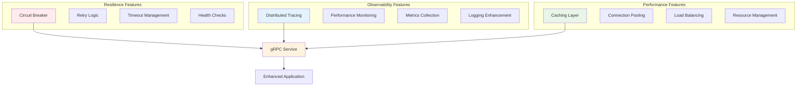
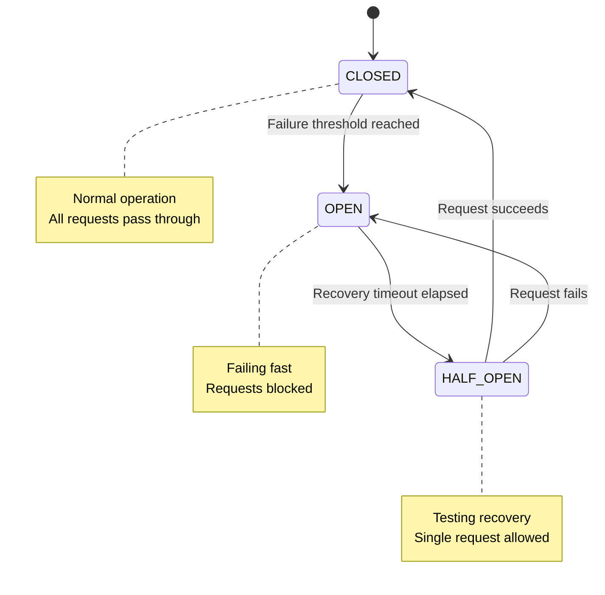
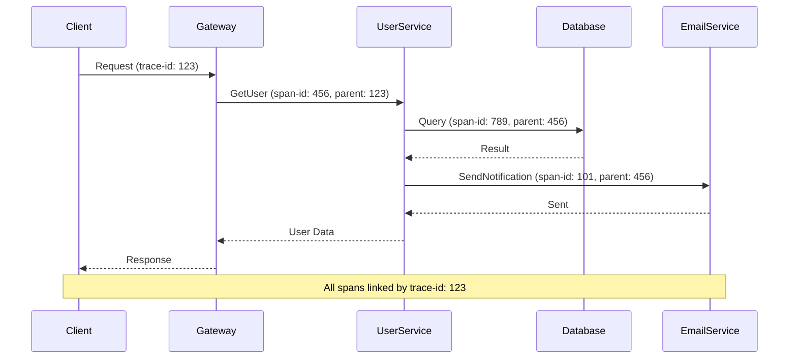

# Advanced Features

The `@ecom-co/grpc` library includes enterprise-grade advanced features for building resilient, observable, and high-performance gRPC applications.

:::info Enterprise Features
Advanced features include circuit breaker pattern for fault tolerance, distributed tracing for observability, performance monitoring, caching capabilities, and health check systems.
:::

## Overview



## Circuit Breaker

### Overview

The circuit breaker pattern protects your system from cascading failures by monitoring service health and temporarily blocking requests to failing services.



### Basic Circuit Breaker Usage

```typescript title="circuit-breaker-basic.service.ts"
import { Injectable } from '@nestjs/common';
import { CircuitBreakerService, CircuitBreakerConfig } from '@ecom-co/grpc';

@Injectable()
export class ExternalApiService {
  private circuitBreakerConfig: CircuitBreakerConfig = {
    failureThreshold: 5, // Open circuit after 5 failures
    recoveryTimeout: 30000, // 30 seconds recovery timeout
    monitoringPeriod: 60000, // 1 minute monitoring window
    expectedErrors: ['TIMEOUT', 'CONNECTION_ERROR'],
  };

  constructor(private circuitBreaker: CircuitBreakerService) {}

  async callExternalService(data: any) {
    return this.circuitBreaker.execute(
      async () => {
        // Your risky operation
        return await this.makeApiCall(data);
      }
    );
  }

  private async makeApiCall(data: any) {
    // External API call that might fail
    const response = await fetch('https://external-api.com/data', {
      method: 'POST',
      headers: { 'Content-Type': 'application/json' },
      body: JSON.stringify(data),
    });

    if (!response.ok) {
      throw new Error(`API call failed: ${response.status}`);
    }

    return response.json();
  }
}
```

### Advanced Circuit Breaker Configuration

```typescript title="advanced-circuit-breaker.service.ts"
import { Injectable } from '@nestjs/common';
import { 
  CircuitBreakerService, 
  CircuitBreakerConfig,
  CircuitBreakerMetrics 
} from '@ecom-co/grpc';

@Injectable()
export class AdvancedCircuitBreakerService {
  private configurations: Map<string, CircuitBreakerConfig> = new Map();

  constructor(private circuitBreaker: CircuitBreakerService) {
    this.setupConfigurations();
  }

  private setupConfigurations() {
    // Critical service - strict settings
    this.configurations.set('payment-service', {
      failureThreshold: 3,
      recoveryTimeout: 60000, // 1 minute
      monitoringPeriod: 300000, // 5 minutes
      expectedErrors: ['PAYMENT_GATEWAY_ERROR', 'TIMEOUT'],
    });

    // Non-critical service - relaxed settings
    this.configurations.set('notification-service', {
      failureThreshold: 10,
      recoveryTimeout: 15000, // 15 seconds
      monitoringPeriod: 60000, // 1 minute
      expectedErrors: ['NOTIFICATION_FAILED'],
    });

    // Analytics service - very relaxed
    this.configurations.set('analytics-service', {
      failureThreshold: 20,
      recoveryTimeout: 5000, // 5 seconds
      monitoringPeriod: 30000, // 30 seconds
      expectedErrors: ['ANALYTICS_UNAVAILABLE'],
    });
  }

  async executeWithService<T>(
    serviceName: string,
    operation: () => Promise<T>
  ): Promise<T> {
    const config = this.configurations.get(serviceName);
    if (!config) {
      throw new Error(`No circuit breaker configuration for service: ${serviceName}`);
    }

    return this.circuitBreaker.execute(operation);
  }

  async getServiceMetrics(serviceName: string): Promise<CircuitBreakerMetrics> {
    return this.circuitBreaker.getMetrics();
  }

  async getServiceHealth(serviceName: string): Promise<{
    serviceName: string;
    status: 'healthy' | 'degraded' | 'unhealthy';
    metrics: CircuitBreakerMetrics;
    lastCheck: Date;
  }> {
    const metrics = await this.getServiceMetrics(serviceName);
    const state = this.circuitBreaker.getState();

    let status: 'healthy' | 'degraded' | 'unhealthy';
    
    if (state.state === 'CLOSED' && metrics.failedRequests === 0) {
      status = 'healthy';
    } else if (state.state === 'HALF_OPEN' || metrics.failedRequests > 0) {
      status = 'degraded';
    } else {
      status = 'unhealthy';
    }

    return {
      serviceName,
      status,
      metrics,
      lastCheck: new Date(),
    };
  }
}
```

### Circuit Breaker Configuration Options

| Option | Type | Description |
|--------|------|-------------|
| `failureThreshold` | `number` | Number of failures before opening circuit |
| `recoveryTimeout` | `number` | Time (ms) to wait before trying half-open state |
| `monitoringPeriod` | `number` | Time window (ms) for failure counting |
| `expectedErrors` | `string[]` | Error types that count towards failure threshold |

## Distributed Tracing

### Overview

Distributed tracing provides end-to-end visibility into request flows across multiple services, helping you understand performance bottlenecks and debug complex distributed systems.



### Basic Tracing Setup

```typescript title="tracing-basic.service.ts"
import { Injectable } from '@nestjs/common';
import { DistributedTracer, TracingOptions } from '@ecom-co/grpc';

@Injectable()
export class TracingService {
  private tracer: DistributedTracer;

  constructor() {
    const options: TracingOptions = {
      serviceName: 'user-service',
      enableSampling: true,
      samplingRate: 1.0, // 100% sampling in development
      maxSpans: 10000,
    };

    this.tracer = new DistributedTracer(options);
  }

  async tracedOperation(userId: string) {
    // Start main span
    const span = this.tracer.startSpan('user-operation', undefined, {
      'user.id': userId,
      'operation.type': 'user-lookup',
    });

    try {
      // Database operation
      const dbSpan = this.tracer.startSpan(
        'database-query',
        span.spanId,
        { 'query.type': 'select', 'table': 'users' }
      );

      const user = await this.queryDatabase(userId);
      this.tracer.finishSpan(dbSpan.spanId, 'completed');

      // External service call
      const emailSpan = this.tracer.startSpan(
        'email-service-call',
        span.spanId,
        { 'service': 'email', 'operation': 'send-welcome' }
      );

      await this.sendWelcomeEmail(user.email);
      this.tracer.finishSpan(emailSpan.spanId, 'completed');

      this.tracer.finishSpan(span.spanId, 'completed');
      return user;

    } catch (error) {
      this.tracer.addLog(span.spanId, 'error', `Operation failed: ${error.message}`, {
        error: error.message,
        stack: error.stack,
      });
      
      this.tracer.finishSpan(span.spanId, 'failed');
      throw error;
    }
  }
}
```

### Decorator-Based Tracing

```typescript title="trace-decorators.service.ts"
import { Injectable } from '@nestjs/common';
import { TraceOperation } from '@ecom-co/grpc';

@Injectable()
export class UserService {
  @TraceOperation({
    operationName: 'getUserProfile',
    includeArgs: true,
    includeResult: false, // Don't log user data for privacy
  })
  async getUserProfile(userId: string) {
    return this.userRepository.findById(userId);
  }

  @TraceOperation({
    operationName: 'createUser',
    includeArgs: false, // Don't log sensitive creation data
    includeResult: true,
  })
  async createUser(userData: CreateUserRequest) {
    const user = await this.userRepository.create(userData);
    await this.sendWelcomeEmail(user.email);
    return user;
  }

  @TraceOperation({
    operationName: 'updateUserSettings',
    includeArgs: true,
    includeResult: true,
  })
  async updateUserSettings(userId: string, settings: UserSettings) {
    return this.userRepository.updateSettings(userId, settings);
  }
}
```

### TraceOperation Decorator Options

| Option | Type | Default | Description |
|--------|------|---------|-------------|
| `operationName` | `string` | `ClassName.methodName` | Custom operation name for tracing |
| `includeArgs` | `boolean` | `false` | Include method arguments in trace logs |
| `includeResult` | `boolean` | `false` | Include method result in trace logs |
| `logger` | `Logger` | `new Logger()` | Custom logger instance |

## Performance Monitoring

### Enhanced Operation Decorator

```typescript title="performance-monitoring.service.ts"
import { Injectable } from '@nestjs/common';
import { 
  EnhancedOperation, 
  MonitorPerformance,
  EnhancedOperationOptions 
} from '@ecom-co/grpc';

@Injectable()
export class PerformanceMonitoredService {
  @EnhancedOperation({
    operationName: 'complexBusinessLogic',
    performanceThreshold: 1000, // Log if takes > 1 second
    includeArgs: true,
    includeResult: false,
    cacheEnabled: true,
    cacheTtl: 300, // 5 minutes
  })
  @MonitorPerformance()
  async complexBusinessLogic(input: ComplexInput) {
    // Expensive operation that benefits from monitoring and caching
    return this.performComplexCalculation(input);
  }

  @EnhancedOperation({
    operationName: 'criticalPath',
    performanceThreshold: 500, // Stricter threshold
    includeArgs: false,
    includeResult: true,
  })
  async criticalPath(data: CriticalData) {
    // Critical path that must be fast
    return this.processCriticalData(data);
  }
}
```

### EnhancedOperation Decorator Options

| Option | Type | Default | Description |
|--------|------|---------|-------------|
| `operationName` | `string` | `method name` | Operation name for monitoring |
| `performanceThreshold` | `number` | `1000` | Log warning if operation exceeds this time (ms) |
| `includeArgs` | `boolean` | `false` | Include arguments in performance logs |
| `includeResult` | `boolean` | `false` | Include result in performance logs |
| `cacheEnabled` | `boolean` | `false` | Enable result caching |
| `cacheTtl` | `number` | `300` | Cache TTL in seconds |
| `logger` | `Logger` | `new Logger()` | Custom logger instance |

## Caching System

### Method-Level Caching

```typescript title="caching.service.ts"
import { Injectable } from '@nestjs/common';
import { Cacheable } from '@ecom-co/grpc';

@Injectable()
export class CachingService {
  @Cacheable({ ttl: 300 }) // Cache for 5 minutes
  async getExpensiveData(id: string) {
    // Expensive operation that benefits from caching
    return this.performExpensiveCalculation(id);
  }

  @Cacheable({ 
    ttl: 3600, // 1 hour
    key: (args) => `user-profile-${args[0]}` // Custom cache key
  })
  async getUserProfile(userId: string) {
    return this.userRepository.findById(userId);
  }

  @Cacheable({ 
    ttl: 1800, // 30 minutes
    condition: (result) => result.status === 'success' // Only cache successful results
  })
  async getApiData(endpoint: string) {
    const response = await this.externalApiCall(endpoint);
    return response;
  }
}
```

### Cacheable Decorator Options

| Option | Type | Default | Description |
|--------|------|---------|-------------|
| `ttl` | `number` | `300` | Time to live in seconds |
| `key` | `function` | `auto-generated` | Custom cache key generator |
| `condition` | `function` | `() => true` | Condition for caching the result |

## Health Check System

### Service Health Monitoring

```typescript title="health-check.service.ts"
import { Injectable } from '@nestjs/common';
import { 
  CircuitBreakerService,
  DistributedTracer,
  HealthCheckService 
} from '@ecom-co/grpc';

@Injectable()
export class HealthCheckService {
  constructor(
    private circuitBreaker: CircuitBreakerService,
    private tracer: DistributedTracer,
  ) {}

  async getSystemHealth(): Promise<{
    status: 'healthy' | 'degraded' | 'unhealthy';
    services: Record<string, any>;
    timestamp: Date;
  }> {
    const span = this.tracer.startSpan('health-check');

    try {
      const services = await Promise.allSettled([
        this.checkDatabaseHealth(),
        this.checkExternalServiceHealth(),
        this.checkCircuitBreakerHealth(),
        this.checkMemoryUsage(),
      ]);

      const results = services.map((service, index) => {
        const serviceNames = ['database', 'external-api', 'circuit-breaker', 'memory'];
        return {
          name: serviceNames[index],
          status: service.status === 'fulfilled' ? service.value : service.reason,
        };
      });

      const overallStatus = this.determineOverallHealth(results);

      this.tracer.finishSpan(span.spanId, 'completed');

      return {
        status: overallStatus,
        services: results.reduce((acc, result) => {
          acc[result.name] = result.status;
          return acc;
        }, {}),
        timestamp: new Date(),
      };

    } catch (error) {
      this.tracer.finishSpan(span.spanId, 'failed');
      throw error;
    }
  }

  private async checkDatabaseHealth() {
    try {
      await this.database.query('SELECT 1');
      return { status: 'healthy', responseTime: '<1ms' };
    } catch (error) {
      return { status: 'unhealthy', error: error.message };
    }
  }

  private async checkExternalServiceHealth() {
    return this.circuitBreaker.execute(async () => {
      const response = await fetch('https://external-service.com/health');
      return { 
        status: response.ok ? 'healthy' : 'degraded',
        responseTime: response.headers.get('x-response-time') 
      };
    });
  }

  private async checkCircuitBreakerHealth() {
    const metrics = this.circuitBreaker.getMetrics();
    const state = this.circuitBreaker.getState();

    return {
      status: state.state === 'CLOSED' ? 'healthy' : 'degraded',
      circuitState: state.state,
      metrics,
    };
  }

  private async checkMemoryUsage() {
    const usage = process.memoryUsage();
    const maxHeap = 1024 * 1024 * 1024; // 1GB

    return {
      status: usage.heapUsed < maxHeap * 0.8 ? 'healthy' : 'degraded',
      heapUsed: `${Math.round(usage.heapUsed / 1024 / 1024)}MB`,
      heapTotal: `${Math.round(usage.heapTotal / 1024 / 1024)}MB`,
    };
  }

  private determineOverallHealth(results: any[]): 'healthy' | 'degraded' | 'unhealthy' {
    const unhealthyCount = results.filter(r => r.status.status === 'unhealthy').length;
    const degradedCount = results.filter(r => r.status.status === 'degraded').length;

    if (unhealthyCount > 0) return 'unhealthy';
    if (degradedCount > 0) return 'degraded';
    return 'healthy';
  }
}
```

## Complete Advanced Setup

### Module Configuration

```typescript title="advanced-app.module.ts"
import { Module } from '@nestjs/common';
import { 
  GrpcModule,
  CircuitBreakerModule,
  TracingModule 
} from '@ecom-co/grpc';

@Module({
  imports: [
    // Basic gRPC setup
    GrpcModule.forRoot({
      configs: [...],
      globalMiddleware: {...},
    }),

    // Circuit breaker configuration
    CircuitBreakerModule.forRoot({
      failureThreshold: 5,
      recoveryTimeout: 30000,
      monitoringPeriod: 60000,
    }),

    // Distributed tracing
    TracingModule.forRoot({
      serviceName: 'user-service',
      enableSampling: true,
      samplingRate: process.env.NODE_ENV === 'production' ? 0.1 : 1.0,
      maxSpans: 10000,
    }),
  ],
  providers: [
    HealthCheckService,
    PerformanceMonitoredService,
    // ... other services
  ],
})
export class AppModule {}
```

### Production Configuration

```typescript title="production-config.ts"
const productionConfig = {
  circuitBreaker: {
    failureThreshold: 3, // Stricter in production
    recoveryTimeout: 60000, // Longer recovery time
    monitoringPeriod: 300000, // 5 minute window
  },
  
  tracing: {
    serviceName: process.env.SERVICE_NAME,
    enableSampling: true,
    samplingRate: 0.01, // 1% sampling to reduce overhead
    maxSpans: 5000, // Lower limit for memory usage
  },
  
  performance: {
    performanceThreshold: 500, // Stricter thresholds
    cacheDefaultTtl: 1800, // 30 minutes
    enableDetailedLogging: false,
  },
  
  health: {
    checkInterval: 30000, // 30 seconds
    timeout: 5000, // 5 second timeout for health checks
  },
};
```

## Monitoring and Observability

### Metrics Collection

```typescript title="metrics.service.ts"
import { Injectable } from '@nestjs/common';

@Injectable()
export class MetricsService {
  private metrics = new Map<string, any>();

  recordCircuitBreakerMetric(serviceName: string, state: string) {
    this.incrementCounter(`circuit_breaker_state_${state}`, {
      service: serviceName,
    });
  }

  recordTraceSpan(operationName: string, duration: number, status: string) {
    this.recordHistogram('span_duration_seconds', duration / 1000, {
      operation: operationName,
      status,
    });
  }

  recordPerformance(operationName: string, duration: number) {
    this.recordHistogram('operation_duration_seconds', duration / 1000, {
      operation: operationName,
    });

    if (duration > 1000) {
      this.incrementCounter('slow_operations_total', {
        operation: operationName,
      });
    }
  }
}
```

:::tip Best Practices
- **Circuit Breaker**: Configure thresholds based on service criticality
- **Tracing**: Use sampling in production to reduce overhead
- **Caching**: Cache expensive operations with appropriate TTL
- **Monitoring**: Set up alerts for circuit breaker state changes
- **Performance**: Monitor slow operations and set appropriate thresholds
:::

:::warning Performance Impact
- **Tracing Overhead**: High sampling rates can impact performance
- **Circuit Breaker**: Monitor memory usage with many circuit breakers
- **Caching**: Be careful with cache size and memory usage
- **Logging**: Excessive logging can impact performance
:::

:::note Production Readiness
- Set up proper monitoring and alerting
- Configure appropriate sampling rates for tracing
- Implement proper error handling for circuit breaker failures
- Monitor memory usage and performance metrics
- Use external tracing systems (Jaeger, Zipkin) for production
:::

These advanced features provide the foundation for building resilient, observable, and high-performance gRPC applications that can handle production workloads effectively.