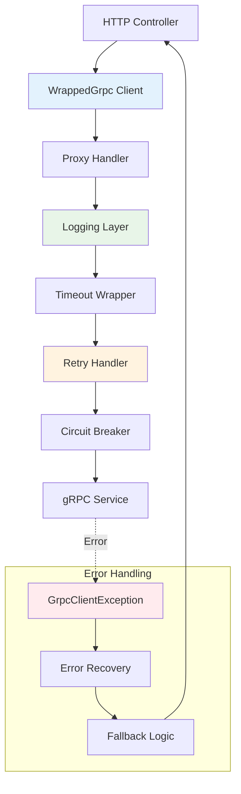
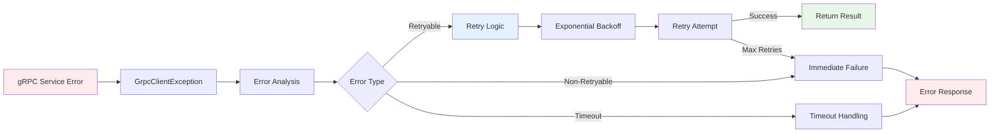

# gRPC Client Module

gRPC Client Module cung cấp chức năng client nâng cao với logic retry tích hợp, xử lý timeout, phục hồi lỗi và khả năng logging toàn diện.

:::info Tính Năng Client Nâng Cao
`WrappedGrpc` client wrapper thêm các tính năng cấp enterprise như automatic retries, circuit breaker patterns, logging chi tiết và xử lý lỗi graceful cho các kết nối gRPC client của bạn.
:::

## Tính Năng Cốt Lõi

- **🔄 Automatic Retries**: Logic retry có thể cấu hình với exponential backoff
- **⏱️ Quản Lý Timeout**: Xử lý và cấu hình timeout request
- **📝 Logging Toàn Diện**: Logging request/response chi tiết với redaction sensitive data
- **🛡️ Phục Hồi Lỗi**: Xử lý graceful các lỗi network và service
- **🎯 Selective Retries**: Chỉ retry các gRPC status codes cụ thể
- **🔐 Bảo Mật**: Tự động sanitization sensitive data trong logs

## Kiến Trúc Client



## Quick Setup

### 1. Basic Client Configuration

```typescript title="user-grpc.service.ts"
import { Injectable, OnModuleInit } from '@nestjs/common';
import { ClientGrpc } from '@nestjs/microservices';
import { createWrappedGrpc, GrpcOptions } from '@ecom-co/grpc';

@Injectable()
export class UserGrpcService implements OnModuleInit {
  private userService: any;

  constructor(private client: ClientGrpc) {}

  onModuleInit() {
    const options: GrpcOptions = {
      enableLogging: true,
      retry: 3,
      timeout: 10000, // 10 seconds
    };

    const wrappedClient = createWrappedGrpc(this.client, options);
    this.userService = wrappedClient.getService('UserService');
  }

  async getUser(id: string) {
    return this.userService.getUser({ id }).toPromise();
  }
}
```

### 2. Enhanced Configuration

```typescript title="enhanced-client.service.ts"
import { Injectable, OnModuleInit } from '@nestjs/common';
import { ClientGrpc } from '@nestjs/microservices';
import { createWrappedGrpc, GrpcOptions } from '@ecom-co/grpc';

@Injectable()
export class EnhancedClientService implements OnModuleInit {
  private userService: any;
  private productService: any;

  constructor(private client: ClientGrpc) {}

  onModuleInit() {
    const options: GrpcOptions = {
      enableLogging: process.env.NODE_ENV !== 'production',
      retry: 5,
      timeout: 30000, // 30 seconds
      maxRetryDelay: 10000, // 10 seconds max delay between retries
      retryableCodes: [
        1,  // CANCELLED
        4,  // DEADLINE_EXCEEDED  
        8,  // RESOURCE_EXHAUSTED
        10, // ABORTED
        13, // INTERNAL
        14, // UNAVAILABLE
        15, // DATA_LOSS
      ],
    };

    const wrappedClient = createWrappedGrpc(this.client, options);
    
    // Get multiple services from the same client
    this.userService = wrappedClient.getService('UserService');
    this.productService = wrappedClient.getService('ProductService');
  }
}
```

## Configuration Options

### GrpcOptions Interface

| Option | Type | Default | Description |
|--------|------|---------|-------------|
| `enableLogging` | `boolean` | `true` | Enable detailed request/response logging |
| `retry` | `number` | `0` | Number of retry attempts for failed requests |
| `timeout` | `number` | `30000` | Request timeout in milliseconds |
| `maxRetryDelay` | `number` | `10000` | Maximum delay between retries in milliseconds |
| `retryableCodes` | `number[]` | `[1,4,8,10,13,14,15]` | gRPC status codes that should trigger retries |

### Default Retryable Codes

:::note gRPC Status Codes
The library includes sensible defaults for retryable gRPC status codes based on common failure scenarios:
:::

| Code | Status | Description | Retryable |
|------|--------|-------------|-----------|
| `1` | CANCELLED | Request was cancelled | ✅ |
| `4` | DEADLINE_EXCEEDED | Timeout occurred | ✅ |
| `8` | RESOURCE_EXHAUSTED | Rate limited | ✅ |
| `10` | ABORTED | Operation aborted | ✅ |
| `13` | INTERNAL | Internal server error | ✅ |
| `14` | UNAVAILABLE | Service unavailable | ✅ |
| `15` | DATA_LOSS | Data corruption | ✅ |
| `3` | INVALID_ARGUMENT | Bad request | ❌ |
| `5` | NOT_FOUND | Resource not found | ❌ |
| `7` | PERMISSION_DENIED | Access denied | ❌ |

## Error Handling

### Client-Side Error Transformation

The client automatically transforms gRPC errors for better handling in HTTP contexts:



### HTTP Exception Filter Integration

```typescript title="http.controller.ts"
import { Controller, Get, Param, UseFilters } from '@nestjs/common';
import { GrpcClientExceptionFilter } from '@ecom-co/grpc';

@Controller('api/users')
@UseFilters(new GrpcClientExceptionFilter({
  enableDetailedLogging: true,
  logLevel: 'error',
  exposeInternalErrors: process.env.NODE_ENV !== 'production',
  includeMetadata: true,
}))
export class UserController {
  constructor(private readonly userGrpcService: UserGrpcService) {}

  @Get(':id')
  async getUser(@Param('id') id: string) {
    // gRPC errors are automatically converted to HTTP responses
    return this.userGrpcService.getUser(id);
  }
}
```

### GrpcClientExceptionFilter Options

| Option | Type | Default | Description |
|--------|------|---------|-------------|
| `enableDetailedLogging` | `boolean` | `true` | Enable detailed error logging |
| `enableStackTrace` | `boolean` | `false` | Include stack traces in logs |
| `includeMetadata` | `boolean` | `false` | Include gRPC metadata in logs |
| `isDevelopment` | `boolean` | `false` | Development mode for debug info |
| `logLevel` | `'debug'\|'error'\|'warn'` | `'error'` | Logging level for errors |
| `defaultErrorMessage` | `string` | `'An unexpected error occurred'` | Default error message |
| `exposeInternalErrors` | `boolean` | `false` | Expose internal error details |

## Advanced Usage Patterns

### Environment-Specific Configuration

```typescript title="client-config.service.ts"
import { Injectable } from '@nestjs/common';
import { ConfigService } from '@nestjs/config';
import { GrpcOptions } from '@ecom-co/grpc';

@Injectable()
export class ClientConfigService {
  constructor(private configService: ConfigService) {}

  getClientOptions(): GrpcOptions {
    const env = this.configService.get('NODE_ENV');
    
    if (env === 'production') {
      return this.getProductionConfig();
    } else if (env === 'staging') {
      return this.getStagingConfig();
    } else {
      return this.getDevelopmentConfig();
    }
  }

  private getProductionConfig(): GrpcOptions {
    return {
      enableLogging: false, // Minimal logging
      retry: 2, // Conservative retries
      timeout: 15000, // 15 seconds
      maxRetryDelay: 5000, // 5 seconds max
      retryableCodes: [14, 8], // Only unavailable and resource exhausted
    };
  }

  private getStagingConfig(): GrpcOptions {
    return {
      enableLogging: true,
      retry: 3,
      timeout: 20000, // 20 seconds
      maxRetryDelay: 8000, // 8 seconds max
      retryableCodes: [1, 4, 8, 10, 13, 14, 15],
    };
  }

  private getDevelopmentConfig(): GrpcOptions {
    return {
      enableLogging: true, // Full logging
      retry: 5, // Aggressive retries for testing
      timeout: 60000, // 60 seconds for debugging
      maxRetryDelay: 10000, // 10 seconds max
      retryableCodes: [1, 4, 8, 10, 13, 14, 15],
    };
  }
}
```

### Circuit Breaker Integration

```typescript title="resilient-client.service.ts"
import { Injectable, OnModuleInit } from '@nestjs/common';
import { ClientGrpc } from '@nestjs/microservices';
import { 
  createWrappedGrpc, 
  GrpcOptions, 
  CircuitBreakerService 
} from '@ecom-co/grpc';

@Injectable()
export class ResilientClientService implements OnModuleInit {
  private userService: any;

  constructor(
    private client: ClientGrpc,
    private circuitBreaker: CircuitBreakerService,
  ) {}

  onModuleInit() {
    const options: GrpcOptions = {
      enableLogging: true,
      retry: 3,
      timeout: 10000,
    };

    const wrappedClient = createWrappedGrpc(this.client, options);
    this.userService = wrappedClient.getService('UserService');
  }

  async getUserWithCircuitBreaker(id: string) {
    return this.circuitBreaker.execute(
      'user-service',
      () => this.userService.getUser({ id }).toPromise(),
      {
        failureThreshold: 5,
        recoveryTimeout: 30000,
        monitoringPeriod: 60000,
      }
    );
  }
}
```

### Custom Error Handling

```typescript title="custom-error-handling.service.ts"
import { Injectable } from '@nestjs/common';
import { GrpcClientException } from '@ecom-co/grpc';

@Injectable()
export class CustomErrorHandlingService {
  async handleGrpcCall<T>(grpcCall: () => Promise<T>): Promise<T> {
    try {
      return await grpcCall();
    } catch (error) {
      if (error instanceof GrpcClientException) {
        return this.handleGrpcError(error);
      }
      throw error;
    }
  }

  private handleGrpcError<T>(error: GrpcClientException): Promise<T> {
    switch (error.code) {
      case 5: // NOT_FOUND
        throw new NotFoundException(`Resource not found: ${error.message}`);
      
      case 3: // INVALID_ARGUMENT
        throw new BadRequestException(`Invalid request: ${error.message}`);
      
      case 7: // PERMISSION_DENIED
        throw new ForbiddenException(`Access denied: ${error.message}`);
      
      case 16: // UNAUTHENTICATED
        throw new UnauthorizedException(`Authentication required: ${error.message}`);
      
      case 14: // UNAVAILABLE
        throw new ServiceUnavailableException(`Service unavailable: ${error.message}`);
      
      default:
        throw new InternalServerErrorException(`gRPC error: ${error.message}`);
    }
  }
}
```

## Logging and Monitoring

### Request/Response Logging

The wrapped client automatically logs:

- **Request Details**: Method name, arguments (sanitized), timestamp
- **Response Details**: Response data, duration, status
- **Error Details**: Error codes, messages, stack traces (in development)
- **Retry Information**: Retry attempts, delays, reasons

```typescript title="logging-example.ts"
// Example log output:
{
  "level": "debug",
  "message": "Calling gRPC method: UserService.getUser",
  "args": [{ "id": "123" }],
  "timestamp": "2024-01-15T10:30:00.000Z"
}

{
  "level": "warn", 
  "message": "Retrying UserService.getUser (attempt 2/4) due to error code: 14",
  "timestamp": "2024-01-15T10:30:01.000Z"
}

{
  "level": "error",
  "message": "gRPC call failed after 3 retries: UserService.getUser",
  "error": "Service unavailable",
  "code": 14,
  "timestamp": "2024-01-15T10:30:05.000Z"
}
```

### Sensitive Data Redaction

The client automatically redacts sensitive fields from logs:

```typescript
// Before redaction:
{ id: "123", password: "secret123", token: "jwt-token" }

// After redaction:
{ id: "123", password: "[REDACTED]", token: "[REDACTED]" }
```

Redacted fields include:
- `password`
- `token`
- `secret`
- `key`

## Testing

### Mocking gRPC Clients

```typescript title="client.service.spec.ts"
import { Test, TestingModule } from '@nestjs/testing';
import { ClientGrpc } from '@nestjs/microservices';
import { of, throwError } from 'rxjs';
import { UserGrpcService } from './user-grpc.service';
import { GrpcClientException } from '@ecom-co/grpc';

describe('UserGrpcService', () => {
  let service: UserGrpcService;
  let mockClient: jest.Mocked<ClientGrpc>;

  beforeEach(async () => {
    const mockService = {
      getUser: jest.fn(),
      createUser: jest.fn(),
    };

    mockClient = {
      getService: jest.fn().mockReturnValue(mockService),
    } as any;

    const module: TestingModule = await Test.createTestingModule({
      providers: [
        UserGrpcService,
        { provide: ClientGrpc, useValue: mockClient },
      ],
    }).compile();

    service = module.get<UserGrpcService>(UserGrpcService);
  });

  it('should handle successful responses', async () => {
    const mockUser = { id: '1', name: 'Test User' };
    const mockService = mockClient.getService('UserService');
    mockService.getUser.mockReturnValue(of(mockUser));

    const result = await service.getUser('1');
    expect(result).toEqual(mockUser);
  });

  it('should handle gRPC errors with retries', async () => {
    const mockService = mockClient.getService('UserService');
    const grpcError = new GrpcClientException('Service unavailable', 14);
    
    mockService.getUser.mockReturnValue(throwError(grpcError));

    await expect(service.getUser('1')).rejects.toThrow(GrpcClientException);
  });
});
```

## Best Practices

:::tip Client Configuration
- **Timeouts**: Set appropriate timeouts based on expected response times
- **Retries**: Use conservative retry counts in production
- **Logging**: Disable detailed logging in production for performance
- **Error Handling**: Always use the exception filter for HTTP endpoints
:::

### 1. Connection Management

```typescript title="connection-management.ts"
// Good: Reuse client instances
@Injectable()
export class UserService implements OnModuleInit {
  private userService: any;

  onModuleInit() {
    // Configure once, reuse multiple times
    const wrappedClient = createWrappedGrpc(this.client, options);
    this.userService = wrappedClient.getService('UserService');
  }
}

// Bad: Creating new clients for each request
@Injectable() 
export class BadUserService {
  async getUser(id: string) {
    // Don't do this - creates new client every time
    const wrappedClient = createWrappedGrpc(this.client, options);
    const userService = wrappedClient.getService('UserService');
    return userService.getUser({ id }).toPromise();
  }
}
```

### 2. Error Recovery Strategies

```typescript title="error-recovery.ts"
@Injectable()
export class RobustUserService {
  async getUserWithFallback(id: string) {
    try {
      // Try primary service
      return await this.primaryUserService.getUser(id);
    } catch (error) {
      if (error instanceof GrpcClientException && error.code === 14) {
        // Service unavailable, try fallback
        return await this.fallbackUserService.getUser(id);
      }
      throw error; // Re-throw other errors
    }
  }

  async getUserWithCache(id: string) {
    try {
      const result = await this.userService.getUser(id);
      // Cache successful result
      await this.cacheService.set(`user:${id}`, result, 300); // 5 minutes
      return result;
    } catch (error) {
      // Return cached data if available
      const cached = await this.cacheService.get(`user:${id}`);
      if (cached) {
        this.logger.warn(`Returning cached data for user ${id} due to service error`);
        return cached;
      }
      throw error;
    }
  }
}
```

### 3. Performance Optimization

```typescript title="performance-optimization.ts"
@Injectable()
export class OptimizedUserService {
  // Use different timeouts for different operations
  async getUser(id: string) {
    // Fast operation - short timeout
    const fastClient = createWrappedGrpc(this.client, {
      timeout: 5000, // 5 seconds
      retry: 2,
    });
    return fastClient.getService('UserService').getUser({ id }).toPromise();
  }

  async generateUserReport(id: string) {
    // Slow operation - longer timeout
    const slowClient = createWrappedGrpc(this.client, {
      timeout: 60000, // 60 seconds
      retry: 1, // Fewer retries for long operations
    });
    return slowClient.getService('UserService').generateReport({ id }).toPromise();
  }

  // Batch operations when possible
  async getMultipleUsers(ids: string[]) {
    // Single batch call instead of multiple individual calls
    return this.userService.getUsersBatch({ ids }).toPromise();
  }
}
```

:::warning Common Pitfalls
- **Memory Leaks**: Don't create new wrapped clients for each request
- **Timeout Issues**: Set timeouts based on actual operation complexity  
- **Retry Storms**: Use exponential backoff and circuit breakers
- **Security**: Never log sensitive data in production
:::

:::note Next Steps
- Learn about [Exception Handling](./exception-handling.md) for comprehensive error management
- Explore [Advanced Features](./advanced-features.md) for circuit breakers and distributed tracing  
- Check out [API Reference](./api-reference.md) for complete configuration options
:::