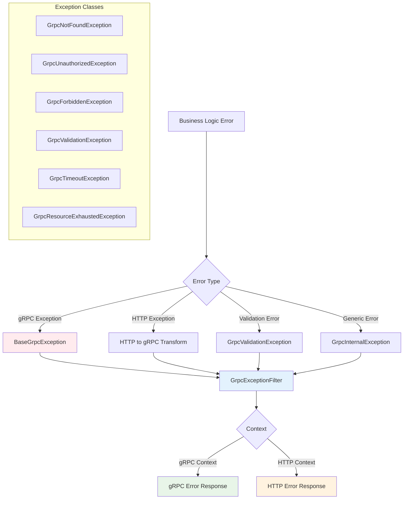
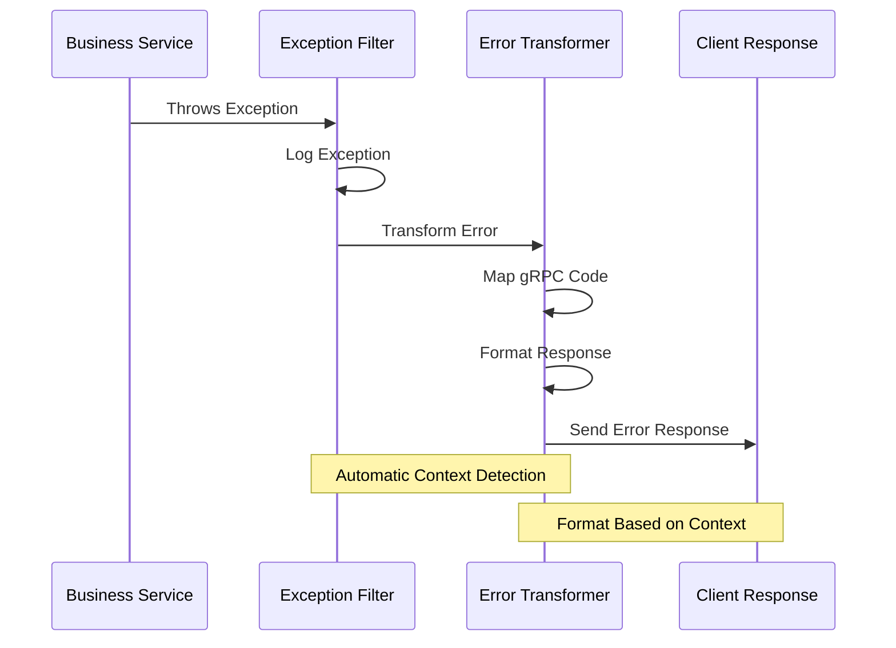

# Xử Lý Exception

Thư viện `@ecom-co/grpc` cung cấp xử lý exception toàn diện với các gRPC exceptions có cấu trúc, chuyển đổi lỗi tự động và tích hợp HTTP liền mạch.

:::info Tổng Quan Hệ Thống Exception
Thư viện bao gồm bộ exception classes tuân thủ gRPC hoàn chỉnh, chuyển đổi lỗi tự động giữa gRPC và HTTP contexts, và khả năng filtering nâng cao cho quản lý lỗi mạnh mẽ.
:::

## Kiến Trúc Exception



## Exception Classes

### Base Exception

All gRPC exceptions extend the `BaseGrpcException` class:

```typescript
export abstract class BaseGrpcException extends RpcException {
  constructor(errorDetails: GrpcErrorDetails) {
    super({
      code: errorDetails.code,
      details: errorDetails.details,
      message: errorDetails.message,
    });
  }
}

interface GrpcErrorDetails {
  code: GrpcStatusCodes;
  message: string;
  details?: Record<string, unknown>;
  metadata?: Record<string, unknown>;
}
```

### Core Exception Types

| Exception Class | gRPC Code | HTTP Status | Use Case |
|----------------|-----------|-------------|----------|
| `GrpcNotFoundException` | 5 (NOT_FOUND) | 404 | Resource not found |
| `GrpcUnauthorizedException` | 16 (UNAUTHENTICATED) | 401 | Authentication required |
| `GrpcForbiddenException` | 7 (PERMISSION_DENIED) | 403 | Authorization failed |
| `GrpcBadRequestException` | 3 (INVALID_ARGUMENT) | 400 | Invalid input data |
| `GrpcConflictException` | 6 (ALREADY_EXISTS) | 409 | Resource conflict |
| `GrpcInternalException` | 13 (INTERNAL) | 500 | Server error |
| `GrpcTimeoutException` | 4 (DEADLINE_EXCEEDED) | 504 | Request timeout |
| `GrpcUnavailableException` | 14 (UNAVAILABLE) | 503 | Service unavailable |
| `GrpcResourceExhaustedException` | 8 (RESOURCE_EXHAUSTED) | 429 | Rate limit exceeded |
| `GrpcValidationException` | 3 (INVALID_ARGUMENT) | 400 | Validation failed |

## Usage Examples

### Basic Exception Throwing

```typescript title="user.service.ts"
import { Injectable } from '@nestjs/common';
import { 
  GrpcNotFoundException,
  GrpcConflictException,
  GrpcUnauthorizedException,
  GrpcValidationException
} from '@ecom-co/grpc';

@Injectable()
export class UserService {
  async findById(id: string): Promise<User> {
    const user = await this.userRepository.findById(id);
    
    if (!user) {
      throw new GrpcNotFoundException(
        `User with ID ${id} not found`,
        'User' // Resource type for better error context
      );
    }
    
    return user;
  }

  async createUser(userData: CreateUserRequest): Promise<User> {
    // Check if user already exists
    const existingUser = await this.userRepository.findByEmail(userData.email);
    
    if (existingUser) {
      throw new GrpcConflictException(
        `User with email ${userData.email} already exists`,
        userData.email // Conflicting resource identifier
      );
    }

    // Validate business rules
    if (userData.age < 18) {
      throw new GrpcValidationException(
        'Age validation failed',
        [{ field: 'age', message: 'Must be at least 18 years old' }],
        'age'
      );
    }

    return this.userRepository.create(userData);
  }

  async authenticatedAction(userId: string, token: string) {
    if (!token) {
      throw new GrpcUnauthorizedException(
        'Authentication token required',
        'missing_token'
      );
    }

    const isValid = await this.authService.validateToken(token);
    if (!isValid) {
      throw new GrpcUnauthorizedException(
        'Invalid or expired token',
        'invalid_token'
      );
    }

    return this.performAction(userId);
  }
}
```

### Advanced Exception Usage

```typescript title="advanced-exceptions.service.ts"
import { Injectable } from '@nestjs/common';
import {
  GrpcResourceExhaustedException,
  GrpcTimeoutException,
  GrpcFailedPreconditionException,
  GrpcOutOfRangeException,
  GrpcDataLossException
} from '@ecom-co/grpc';

@Injectable()
export class AdvancedExceptionService {
  async rateLimitedOperation(userId: string) {
    const currentUsage = await this.getRateLimit(userId);
    const limit = 100;

    if (currentUsage >= limit) {
      throw new GrpcResourceExhaustedException(
        'Rate limit exceeded',
        'API_CALLS', // Resource type
        limit,       // Limit
        currentUsage // Current usage
      );
    }

    return this.performOperation(userId);
  }

  async timeoutSensitiveOperation(data: any) {
    const timeoutMs = 5000;
    const startTime = Date.now();

    try {
      return await this.slowOperation(data);
    } catch (error) {
      const elapsed = Date.now() - startTime;
      
      if (elapsed >= timeoutMs) {
        throw new GrpcTimeoutException(
          'Operation timed out',
          timeoutMs
        );
      }
      
      throw error;
    }
  }

  async conditionalOperation(user: User, requiredRole: string) {
    const preconditions = [
      'email_verified',
      'profile_complete', 
      'terms_accepted'
    ];

    const missingConditions = preconditions.filter(
      condition => !user[condition]
    );

    if (missingConditions.length > 0) {
      throw new GrpcFailedPreconditionException(
        'User does not meet required conditions',
        missingConditions
      );
    }

    if (!user.roles.includes(requiredRole)) {
      throw new GrpcForbiddenException(
        `Access denied. Required role: ${requiredRole}`,
        [requiredRole]
      );
    }

    return this.performConditionalOperation(user);
  }

  async paginatedQuery(page: number, limit: number) {
    const maxLimit = 100;
    const maxPage = 1000;

    if (limit > maxLimit) {
      throw new GrpcOutOfRangeException(
        'Limit exceeds maximum allowed',
        { min: 1, max: maxLimit, actual: limit }
      );
    }

    if (page > maxPage) {
      throw new GrpcOutOfRangeException(
        'Page number exceeds maximum',
        { min: 1, max: maxPage, actual: page }
      );
    }

    return this.queryWithPagination(page, limit);
  }
}
```

## Exception Filters

### GrpcExceptionFilter

The main exception filter handles server-side gRPC exceptions:

```typescript title="grpc-exception-filter.ts"
import { GrpcExceptionFilter } from '@ecom-co/grpc';

// Global configuration
@Module({
  imports: [
    GrpcModule.forRoot({
      configs: [...],
      globalMiddleware: {
        filters: [
          new GrpcExceptionFilter({
            enableLogging: true,
            exposeInternalErrors: process.env.NODE_ENV !== 'production',
            defaultErrorMessage: 'An unexpected error occurred',
            customErrorMappings: {
              'DatabaseError': GrpcInternalException,
              'ValidationError': GrpcValidationException,
              'AuthenticationError': GrpcUnauthorizedException,
            },
          }),
        ],
      },
    }),
  ],
})
export class AppModule {}
```

#### GrpcExceptionFilter Options

| Option | Type | Default | Description |
|--------|------|---------|-------------|
| `enableLogging` | `boolean` | `true` | Enable exception logging |
| `exposeInternalErrors` | `boolean` | `NODE_ENV !== 'production'` | Show internal error details |
| `defaultErrorMessage` | `string` | `'Unknown error occurred'` | Default error message |
| `customErrorMappings` | `Record<string, Constructor>` | `{}` | Map error types to gRPC exceptions |
| `logger` | `Logger` | `new Logger()` | Custom logger instance |

### GrpcClientExceptionFilter

For HTTP endpoints that use gRPC clients:

```typescript title="http-controller.ts"
import { Controller, Get, UseFilters } from '@nestjs/common';
import { GrpcClientExceptionFilter } from '@ecom-co/grpc';

@Controller('api/users')
@UseFilters(new GrpcClientExceptionFilter({
  enableDetailedLogging: true,
  logLevel: 'error',
  exposeInternalErrors: false,
  includeMetadata: true,
  defaultErrorMessage: 'Service temporarily unavailable',
}))
export class UserHttpController {
  constructor(private readonly userGrpcService: UserGrpcService) {}

  @Get(':id')
  async getUser(@Param('id') id: string) {
    // Automatic gRPC to HTTP error conversion
    return this.userGrpcService.getUser(id);
  }
}
```

#### GrpcClientExceptionFilter Options

| Option | Type | Default | Description |
|--------|------|---------|-------------|
| `enableDetailedLogging` | `boolean` | `true` | Enable detailed error logging |
| `enableStackTrace` | `boolean` | `false` | Include stack traces in logs |
| `includeMetadata` | `boolean` | `false` | Include gRPC metadata in logs |
| `isDevelopment` | `boolean` | `false` | Development mode for debug info |
| `logLevel` | `'debug'\|'error'\|'warn'` | `'error'` | Logging level |
| `defaultErrorMessage` | `string` | `'An unexpected error occurred'` | Default error message |
| `exposeInternalErrors` | `boolean` | `false` | Expose internal error details |

## Error Response Formats

### gRPC Error Response

```json
{
  "code": 5,
  "message": "User with ID 123 not found",
  "details": {
    "type": "NOT_FOUND_ERROR",
    "resource": "User",
    "timestamp": "2024-01-15T10:30:00.000Z"
  }
}
```

### HTTP Error Response

```json
{
  "statusCode": 404,
  "message": "User with ID 123 not found",
  "error": "Not Found",
  "timestamp": "2024-01-15T10:30:00.000Z",
  "path": "/api/users/123",
  "grpcCode": 5,
  "grpcMessage": "User with ID 123 not found",
  "details": {
    "type": "NOT_FOUND_ERROR",
    "resource": "User"
  }
}
```

### Validation Error Response

```json
{
  "statusCode": 400,
  "message": "Validation failed",
  "error": "Bad Request",
  "timestamp": "2024-01-15T10:30:00.000Z",
  "path": "/api/users",
  "grpcCode": 3,
  "grpcMessage": "Data validation failed",
  "errors": [
    "name should not be empty",
    "email must be an email"
  ],
  "fieldErrors": {
    "name": {
      "isNotEmpty": "name should not be empty"
    },
    "email": {
      "isEmail": "email must be an email"
    }
  }
}
```

## Utility Functions

### Exception Creation

```typescript title="exception-utilities.ts"
import { 
  createGrpcExceptionFromHttp,
  isGrpcException,
  BaseGrpcException 
} from '@ecom-co/grpc';

// Create gRPC exception from HTTP status
function handleHttpError(httpStatus: number, message: string) {
  const grpcException = createGrpcExceptionFromHttp(httpStatus, message);
  throw grpcException;
}

// Type guard for gRPC exceptions
function handleError(error: unknown) {
  if (isGrpcException(error)) {
    // Handle as gRPC exception
    console.log('gRPC error code:', error.getError().code);
    console.log('gRPC error message:', error.getError().message);
  } else {
    // Handle as generic error
    console.log('Generic error:', error);
  }
}

// Custom exception factory
function createCustomException(
  code: GrpcStatusCodes, 
  message: string, 
  details?: Record<string, unknown>
): BaseGrpcException {
  return new (class extends BaseGrpcException {
    constructor() {
      super({ code, message, details });
    }
  })();
}
```

### Error Transformation Chain



## Advanced Error Handling Patterns

### Error Recovery Strategies

```typescript title="error-recovery.service.ts"
import { Injectable } from '@nestjs/common';
import { 
  GrpcUnavailableException,
  GrpcTimeoutException,
  GrpcResourceExhaustedException 
} from '@ecom-co/grpc';

@Injectable()
export class ErrorRecoveryService {
  async resilientOperation(data: any) {
    const maxRetries = 3;
    let attempt = 0;

    while (attempt < maxRetries) {
      try {
        return await this.unstableOperation(data);
      } catch (error) {
        attempt++;

        if (error instanceof GrpcUnavailableException) {
          // Service unavailable - wait and retry
          if (attempt < maxRetries) {
            await this.delay(1000 * attempt); // Exponential backoff
            continue;
          }
        } else if (error instanceof GrpcTimeoutException) {
          // Timeout - retry with longer timeout
          if (attempt < maxRetries) {
            await this.delay(500);
            continue;
          }
        } else if (error instanceof GrpcResourceExhaustedException) {
          // Rate limited - wait longer
          if (attempt < maxRetries) {
            await this.delay(5000);
            continue;
          }
        }

        // Re-throw if not recoverable or max retries reached
        throw error;
      }
    }
  }

  async fallbackStrategy(primaryData: any) {
    try {
      return await this.primaryService.process(primaryData);
    } catch (error) {
      if (error instanceof GrpcUnavailableException) {
        // Use fallback service
        return await this.fallbackService.process(primaryData);
      } else if (error instanceof GrpcTimeoutException) {
        // Return cached data if available
        const cached = await this.cacheService.get(primaryData.id);
        if (cached) {
          return cached;
        }
      }
      
      throw error;
    }
  }

  private delay(ms: number): Promise<void> {
    return new Promise(resolve => setTimeout(resolve, ms));
  }
}
```

### Custom Exception Hierarchy

```typescript title="custom-exceptions.ts"
import { BaseGrpcException, GrpcStatusCodes } from '@ecom-co/grpc';

// Domain-specific exceptions
export class UserNotFoundException extends BaseGrpcException {
  constructor(userId: string) {
    super({
      code: GrpcStatusCodes.NOT_FOUND,
      message: `User with ID ${userId} not found`,
      details: {
        type: 'USER_NOT_FOUND',
        userId,
        domain: 'user-management',
      },
    });
  }
}

export class OrderValidationException extends BaseGrpcException {
  constructor(orderId: string, validationErrors: string[]) {
    super({
      code: GrpcStatusCodes.INVALID_ARGUMENT,
      message: `Order validation failed for order ${orderId}`,
      details: {
        type: 'ORDER_VALIDATION_ERROR',
        orderId,
        validationErrors,
        domain: 'order-management',
      },
    });
  }
}

export class PaymentProcessingException extends BaseGrpcException {
  constructor(paymentId: string, paymentError: string) {
    super({
      code: GrpcStatusCodes.FAILED_PRECONDITION,
      message: `Payment processing failed for payment ${paymentId}`,
      details: {
        type: 'PAYMENT_PROCESSING_ERROR',
        paymentId,
        paymentError,
        domain: 'payment-processing',
      },
    });
  }
}
```

## Testing Exception Handling

### Unit Testing

```typescript title="exception-handling.spec.ts"
import { Test, TestingModule } from '@nestjs/testing';
import { UserService } from './user.service';
import { 
  GrpcNotFoundException,
  GrpcConflictException,
  GrpcValidationException 
} from '@ecom-co/grpc';

describe('UserService Exception Handling', () => {
  let service: UserService;

  beforeEach(async () => {
    const module: TestingModule = await Test.createTestingModule({
      providers: [UserService],
    }).compile();

    service = module.get<UserService>(UserService);
  });

  describe('findById', () => {
    it('should throw GrpcNotFoundException when user not found', async () => {
      jest.spyOn(service, 'findById').mockRejectedValue(
        new GrpcNotFoundException('User not found', 'User')
      );

      await expect(service.findById('nonexistent')).rejects.toThrow(
        GrpcNotFoundException
      );
    });

    it('should include proper error details', async () => {
      const error = new GrpcNotFoundException('User not found', 'User');
      const errorDetails = error.getError();

      expect(errorDetails.code).toBe(5); // NOT_FOUND
      expect(errorDetails.message).toBe('User not found: User not found');
      expect(errorDetails.details).toEqual({
        type: 'NOT_FOUND_ERROR',
        resource: 'User',
      });
    });
  });

  describe('createUser', () => {
    it('should throw GrpcConflictException for duplicate email', async () => {
      const userData = { email: 'test@example.com', name: 'Test' };
      
      jest.spyOn(service, 'createUser').mockRejectedValue(
        new GrpcConflictException('User already exists', userData.email)
      );

      await expect(service.createUser(userData)).rejects.toThrow(
        GrpcConflictException
      );
    });
  });
});
```

### Integration Testing

```typescript title="exception-filter.spec.ts"
import { Test } from '@nestjs/testing';
import { GrpcExceptionFilter } from '@ecom-co/grpc';
import { createMock } from '@golevelup/ts-jest';
import { ArgumentsHost } from '@nestjs/common';

describe('GrpcExceptionFilter', () => {
  let filter: GrpcExceptionFilter;

  beforeEach(() => {
    filter = new GrpcExceptionFilter({
      enableLogging: false, // Disable for testing
      exposeInternalErrors: true,
    });
  });

  it('should handle GrpcNotFoundException correctly', () => {
    const exception = new GrpcNotFoundException('User not found');
    const host = createMock<ArgumentsHost>();

    // Mock the exception handling
    const result = filter.catch(exception, host);

    expect(result).toBeDefined();
    // Verify the error transformation logic
  });
});
```

:::tip Best Practices
- **Specific Exceptions**: Use specific exception types rather than generic ones
- **Meaningful Messages**: Provide clear, actionable error messages
- **Error Details**: Include relevant context in error details
- **Security**: Never expose sensitive information in error messages
- **Logging**: Log exceptions appropriately based on severity
:::

:::warning Security Considerations
- **Production Errors**: Never expose internal errors in production
- **Sensitive Data**: Avoid including sensitive data in error details
- **Error Codes**: Don't expose internal system information through error codes
- **Stack Traces**: Only include stack traces in development environments
:::

:::note Performance Impact
- **Exception Creation**: Creating exceptions has overhead - don't use for control flow
- **Logging**: Excessive error logging can impact performance
- **Error Details**: Large error details can increase response size
- **Recovery**: Implement proper error recovery to avoid cascading failures
:::

## Error Monitoring and Observability

### Error Metrics Collection

```typescript title="error-metrics.service.ts"
import { Injectable } from '@nestjs/common';
import { BaseGrpcException } from '@ecom-co/grpc';

@Injectable()
export class ErrorMetricsService {
  collectErrorMetrics(error: BaseGrpcException, context: string) {
    const errorDetails = error.getError();
    
    // Increment error counters by type
    this.incrementCounter('grpc_errors_total', {
      code: errorDetails.code.toString(),
      type: errorDetails.details?.type || 'unknown',
      context,
    });

    // Track error distribution
    this.recordHistogram('grpc_error_frequency', 1, {
      code: errorDetails.code.toString(),
    });

    // Alert on critical errors
    if (this.isCriticalError(errorDetails.code)) {
      this.sendAlert('Critical gRPC error', {
        code: errorDetails.code,
        message: errorDetails.message,
        context,
      });
    }
  }

  private isCriticalError(code: number): boolean {
    // Internal errors, data loss, etc.
    return [13, 15].includes(code);
  }
}
```

This comprehensive exception handling system provides robust error management for your gRPC services with proper HTTP integration and monitoring capabilities.