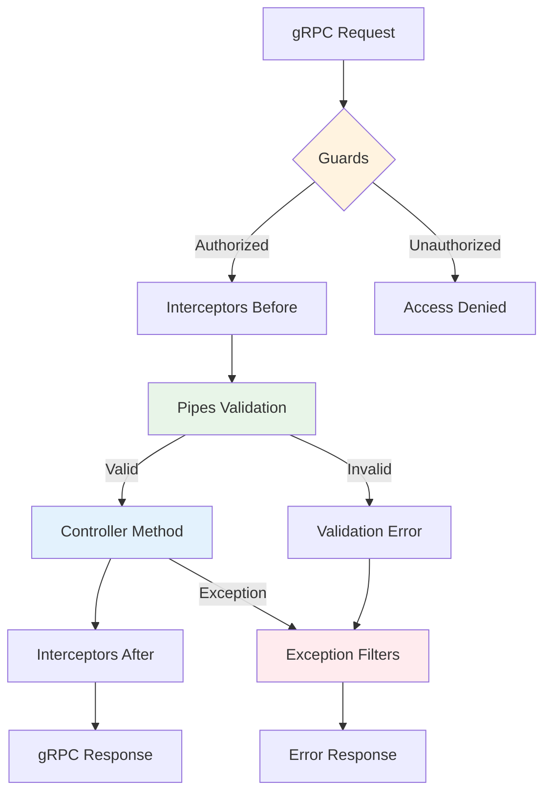
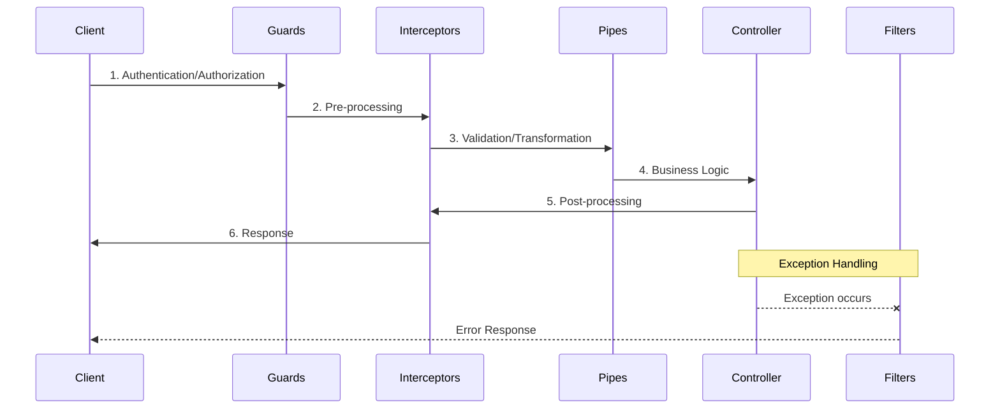

# Global Middleware

The `@ecom-co/grpc` library provides Global Middleware functionality that allows you to apply middleware (pipes, filters, interceptors, guards) to all methods in gRPC controllers without declaring individual decorators for each method.

:::info What is Global Middleware?
Global Middleware automatically applies common functionality like validation, error handling, logging, and authentication to all gRPC methods in your application, reducing boilerplate code and ensuring consistency.
:::

## Benefits

- **🔄 Automatic Application**: Middleware is automatically applied to all gRPC methods
- **📝 Reduced Boilerplate**: No need to add decorators to every method
- **🎯 Centralized Management**: Configure middleware in one place
- **🛠️ Easy Maintenance**: Change configuration once, apply everywhere

## Middleware Execution Flow



## Supported Middleware Types

### 1. Pipes (Validation & Transformation)

Pipes transform input data and validate requests before they reach your controller methods.

```typescript
import { PipeTransform } from '@nestjs/common';

pipes?: PipeTransform[];
```

#### Example Configuration

```typescript
import { ValidationPipe } from '@nestjs/common';
import { GrpcValidationPipe } from '@ecom-co/grpc';

pipes: [
  new GrpcValidationPipe({
    enableErrorLogging: true,
    stripUnknownProperties: true,
    validationOptions: {
      whitelist: true,
      transform: true,
    },
  }),
  new ValidationPipe()
]
```

### 2. Filters (Exception Handling)

Filters handle exceptions and transform them into appropriate gRPC responses.

```typescript
import { ExceptionFilter } from '@nestjs/common';

filters?: ExceptionFilter[];
```

#### Example Configuration

```typescript
import { GrpcExceptionFilter } from '@ecom-co/grpc';

filters: [
  new GrpcExceptionFilter({
    enableLogging: true,
    exposeInternalErrors: process.env.NODE_ENV !== 'production',
    defaultErrorMessage: 'An unexpected error occurred',
  })
]
```

### 3. Interceptors (Cross-cutting Concerns)

Interceptors handle cross-cutting concerns like logging, caching, and monitoring.

```typescript
import { NestInterceptor } from '@nestjs/common';

interceptors?: NestInterceptor[];
```

#### Example Configuration

```typescript
import { GrpcLoggingInterceptor } from '@ecom-co/grpc';

interceptors: [
  new GrpcLoggingInterceptor({
    logLevel: 'info',
    logRequest: true,
    logResponse: process.env.NODE_ENV === 'development',
    isDevelopment: process.env.NODE_ENV === 'development',
  })
]
```

### 4. Guards (Access Control)

Guards handle authentication and authorization before method execution.

```typescript
import { CanActivate } from '@nestjs/common';

guards?: CanActivate[];
```

#### Example Configuration

```typescript
import { AuthGuard } from './guards/auth.guard';
import { RoleGuard } from './guards/role.guard';

guards: [
  new AuthGuard(),
  new RoleGuard()
]
```

## Complete Setup Example

### Module Configuration

```typescript title="app.module.ts"
import { Module } from '@nestjs/common';
import { 
  GrpcModule, 
  GrpcValidationPipe, 
  GrpcExceptionFilter,
  GrpcLoggingInterceptor 
} from '@ecom-co/grpc';

@Module({
  imports: [
    GrpcModule.forRoot({
      configs: [
        {
          name: 'user-service',
          type: 'server',
          package: 'user',
          port: 50052,
          protoPath: 'src/proto/services/user.proto',
        },
      ],
      globalMiddleware: {
        // Authentication and authorization
        guards: [
          new AuthGuard(),
          new RoleGuard(),
        ],
        
        // Request/response processing
        interceptors: [
          new GrpcLoggingInterceptor({
            logLevel: 'info',
            logRequest: true,
            logResponse: process.env.NODE_ENV === 'development',
          }),
          new MetricsInterceptor(),
        ],
        
        // Input validation and transformation
        pipes: [
          new GrpcValidationPipe({
            enableErrorLogging: true,
            stripUnknownProperties: true,
            validationOptions: {
              whitelist: true,
              transform: true,
            },
          }),
        ],
        
        // Exception handling
        filters: [
          new GrpcExceptionFilter({
            enableLogging: true,
            exposeInternalErrors: process.env.NODE_ENV !== 'production',
            customErrorMappings: {
              'DatabaseError': GrpcInternalException,
              'ValidationError': GrpcInvalidArgumentException,
            },
          }),
        ],
      },
    }),
  ],
})
export class AppModule {}
```

### Clean Controller Implementation

With Global Middleware, your controllers become much cleaner:

```typescript title="user.controller.ts"
import { Controller } from '@nestjs/common';
import { GrpcMethod } from '@ecom-co/grpc';

@Controller()
export class UserController {
  constructor(private readonly userService: UserService) {}

  @GrpcMethod('UserService', 'GetUser')
  async getUser(data: GetUserRequest): Promise<UserResponse> {
    // All middleware is automatically applied:
    // ✅ Authentication (AuthGuard)
    // ✅ Authorization (RoleGuard) 
    // ✅ Logging (GrpcLoggingInterceptor)
    // ✅ Metrics (MetricsInterceptor)
    // ✅ Validation (GrpcValidationPipe)
    // ✅ Exception handling (GrpcExceptionFilter)
    
    return this.userService.findById(data.id);
  }

  @GrpcMethod('UserService', 'CreateUser')
  async createUser(data: CreateUserRequest): Promise<UserResponse> {
    // All middleware is also applied to this method automatically
    return this.userService.create(data);
  }
}
```

## Middleware Execution Order

:::note Execution Sequence
Middleware executes in a specific order to ensure proper request/response processing:
:::



1. **Guards** → Access control and authentication
2. **Interceptors (Before)** → Pre-processing and setup
3. **Pipes** → Validation and data transformation  
4. **Controller Method** → Business logic execution
5. **Interceptors (After)** → Post-processing and cleanup
6. **Filters** → Exception handling (if errors occur)

## Environment-Specific Configuration

### Development Environment

```typescript title="development.config.ts"
const developmentMiddleware = {
  guards: [
    new AuthGuard({ strict: false }), // Relaxed auth for testing
  ],
  
  interceptors: [
    new GrpcLoggingInterceptor({
      logLevel: 'debug',
      logRequest: true,
      logResponse: true, // Full logging for debugging
      isDevelopment: true,
    }),
  ],
  
  pipes: [
    new GrpcValidationPipe({
      enableErrorLogging: true,
      stripUnknownProperties: false, // Keep for debugging
      validationOptions: {
        forbidNonWhitelisted: false, // Allow extra fields
      },
    }),
  ],
  
  filters: [
    new GrpcExceptionFilter({
      enableLogging: true,
      exposeInternalErrors: true, // Show detailed errors
      isDevelopment: true,
    }),
  ],
};
```

### Production Environment

```typescript title="production.config.ts"
const productionMiddleware = {
  guards: [
    new AuthGuard({ strict: true }), // Strict authentication
    new RateLimitGuard({ limit: 100 }), // Rate limiting
  ],
  
  interceptors: [
    new GrpcLoggingInterceptor({
      logLevel: 'error',
      logRequest: false,
      logResponse: false, // Minimal logging
      isDevelopment: false,
    }),
    new MetricsInterceptor(), // Performance monitoring
  ],
  
  pipes: [
    new GrpcValidationPipe({
      enableErrorLogging: false,
      stripUnknownProperties: true, // Security
      validationOptions: {
        forbidNonWhitelisted: true, // Strict validation
      },
    }),
  ],
  
  filters: [
    new GrpcExceptionFilter({
      enableLogging: true,
      exposeInternalErrors: false, // Hide internal details
      isDevelopment: false,
    }),
  ],
};
```

## Advanced Usage Patterns

### Custom Middleware Integration

```typescript title="custom-middleware.ts"
// Custom Rate Limiting Guard
@Injectable()
export class RateLimitGuard implements CanActivate {
  private readonly requests = new Map<string, number[]>();

  canActivate(context: ExecutionContext): boolean {
    const request = context.switchToRpc().getContext();
    const clientId = this.getClientId(request);
    
    const now = Date.now();
    const windowMs = 60000; // 1 minute
    const limit = 100; // 100 requests per minute
    
    const clientRequests = this.requests.get(clientId) || [];
    const recentRequests = clientRequests.filter(time => now - time < windowMs);
    
    if (recentRequests.length >= limit) {
      throw new GrpcResourceExhaustedException('Rate limit exceeded');
    }
    
    recentRequests.push(now);
    this.requests.set(clientId, recentRequests);
    
    return true;
  }
  
  private getClientId(request: any): string {
    // Extract client identifier from metadata
    return request.metadata?.get('client-id')?.[0] || 'anonymous';
  }
}

// Custom Metrics Interceptor
@Injectable()
export class MetricsInterceptor implements NestInterceptor {
  intercept(context: ExecutionContext, next: CallHandler): Observable<any> {
    const start = Date.now();
    const methodName = context.getHandler().name;
    
    return next.handle().pipe(
      tap({
        next: () => {
          const duration = Date.now() - start;
          this.recordMetric('grpc_request_duration', duration, { method: methodName });
          this.recordMetric('grpc_request_success', 1, { method: methodName });
        },
        error: (error) => {
          const duration = Date.now() - start;
          this.recordMetric('grpc_request_duration', duration, { method: methodName });
          this.recordMetric('grpc_request_error', 1, { 
            method: methodName, 
            error: error.constructor.name 
          });
        },
      }),
    );
  }
  
  private recordMetric(name: string, value: number, labels: Record<string, string>) {
    // Send metrics to your monitoring system (Prometheus, DataDog, etc.)
    console.log(`Metric: ${name}=${value}`, labels);
  }
}
```

## Configuration Options Reference

### GrpcValidationPipe Options

| Option | Type | Default | Description |
|--------|------|---------|-------------|
| `enableErrorLogging` | `boolean` | `true` | Enable detailed error logging |
| `stripUnknownProperties` | `boolean` | `false` | Remove unknown properties from input |
| `errorMessagePrefix` | `string` | `''` | Prefix for error messages |
| `validationOptions` | `ValidationOptions` | `{}` | class-validator options |
| `transformOptions` | `ClassTransformOptions` | `{}` | class-transformer options |
| `validationGroups` | `string[]` | `[]` | Validation groups to apply |

### GrpcExceptionFilter Options

| Option | Type | Default | Description |
|--------|------|---------|-------------|
| `enableLogging` | `boolean` | `true` | Enable exception logging |
| `exposeInternalErrors` | `boolean` | `!production` | Show internal error details |
| `defaultErrorMessage` | `string` | `'Unknown error'` | Default error message |
| `customErrorMappings` | `Record<string, Constructor>` | `{}` | Custom error type mappings |

### GrpcLoggingInterceptor Options

| Option | Type | Default | Description |
|--------|------|---------|-------------|
| `logLevel` | `'debug'\|'info'\|'warn'\|'error'` | `'info'` | Logging level |
| `logRequest` | `boolean` | `true` | Log incoming requests |
| `logResponse` | `boolean` | `false` | Log outgoing responses |
| `isDevelopment` | `boolean` | `false` | Development mode flag |

:::tip Best Practices
- **Order Matters**: Place guards before interceptors, pipes before controllers
- **Performance**: Avoid heavy operations in frequently called middleware
- **Security**: Never expose internal errors in production
- **Monitoring**: Always include metrics collection in production
- **Environment**: Use different configurations for dev/staging/production
:::

:::warning Common Pitfalls
- **Memory Leaks**: Clean up resources in interceptors and guards
- **Circular Dependencies**: Avoid injecting services that depend on the middleware
- **Error Handling**: Always have at least one exception filter
- **Rate Limiting**: Don't forget to implement rate limiting for public services
:::

## Troubleshooting

### Middleware Not Working

1. **Check module imports**: Ensure `GrpcModule` is properly imported
2. **Verify configuration**: Check that middleware is correctly configured in `globalMiddleware`
3. **Check dependencies**: Ensure all required services are available in the module

```typescript
// Debug logging to verify middleware loading
console.log('Global middleware configured:', {
  guards: globalMiddleware.guards?.length || 0,
  interceptors: globalMiddleware.interceptors?.length || 0,
  pipes: globalMiddleware.pipes?.length || 0,
  filters: globalMiddleware.filters?.length || 0,
});
```

### Performance Issues

1. **Profile middleware**: Use performance monitoring to identify bottlenecks
2. **Optimize order**: Place lightweight middleware first
3. **Cache results**: Cache expensive operations in guards and interceptors

### Conflicts with Local Decorators

- Global middleware has lower priority than method-level decorators
- You can selectively disable global middleware for specific methods if needed
- Use `@UseGuards(null)` or similar to override global settings

:::note Next Steps
- Learn about [Client Module](./client-module.md) for enhanced gRPC client functionality
- Explore [Exception Handling](./exception-handling.md) for advanced error management
- Check out [Advanced Features](./advanced-features.md) for circuit breakers and tracing
:::
