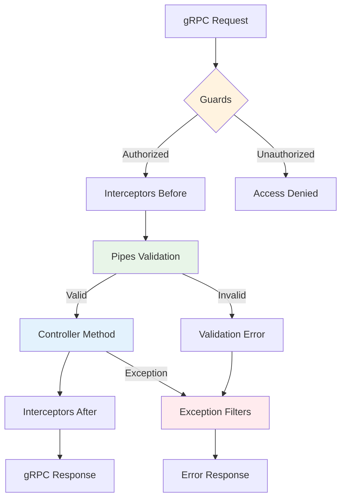

# Global Middleware

Thư viện `@ecom-co/grpc` cung cấp chức năng Global Middleware cho phép bạn áp dụng middleware (pipes, filters, interceptors, guards) cho tất cả methods trong gRPC controllers mà không cần khai báo decorators riêng lẻ cho từng method.

:::info Global Middleware là gì?
Global Middleware tự động áp dụng các chức năng chung như validation, error handling, logging và authentication cho tất cả gRPC methods trong ứng dụng của bạn, giảm thiểu boilerplate code và đảm bảo tính nhất quán.
:::

## Lợi Ích

- **🔄 Áp Dụng Tự Động**: Middleware được áp dụng tự động cho tất cả gRPC methods
- **📝 Giảm Thiểu Boilerplate**: Không cần thêm decorators cho từng method
- **🎯 Quản Lý Tập Trung**: Cấu hình middleware ở một nơi
- **🛠️ Bảo Trì Dễ Dàng**: Thay đổi cấu hình một lần, áp dụng mọi nơi

## Luồng Thực Thi Middleware



## Các Loại Middleware Được Hỗ Trợ

### 1. Pipes (Validation & Transformation)

Pipes chuyển đổi dữ liệu đầu vào và validate requests trước khi chúng đến controller methods của bạn.

```typescript
import { PipeTransform } from '@nestjs/common';

pipes?: PipeTransform[];
```

#### Ví Dụ Cấu Hình

```typescript
import { ValidationPipe } from '@nestjs/common';
import { GrpcValidationPipe } from '@ecom-co/grpc';

pipes: [
  new GrpcValidationPipe({
    enableErrorLogging: true,
    stripUnknownProperties: true,
    validationOptions: {
      whitelist: true,
      transform: true,
    },
  }),
  new ValidationPipe()
]
```

### 2. Filters (Exception Handling)

Filters xử lý exceptions và chuyển đổi chúng thành các gRPC responses phù hợp.

```typescript
import { ExceptionFilter } from '@nestjs/common';

filters?: ExceptionFilter[];
```

#### Ví Dụ Cấu Hình

```typescript
import { GrpcExceptionFilter } from '@ecom-co/grpc';

filters: [
  new GrpcExceptionFilter({
    enableLogging: true,
    exposeInternalErrors: process.env.NODE_ENV !== 'production',
    defaultErrorMessage: 'An unexpected error occurred',
  })
]
```

### 3. Interceptors (Cross-cutting Concerns)

Interceptors xử lý các concerns xuyên suốt như logging, caching và monitoring.

```typescript
import { NestInterceptor } from '@nestjs/common';

interceptors?: NestInterceptor[];
```

#### Ví Dụ Cấu Hình

```typescript
import { GrpcLoggingInterceptor } from '@ecom-co/grpc';

interceptors: [
  new GrpcLoggingInterceptor({
    logLevel: 'info',
    logRequest: true,
    logResponse: process.env.NODE_ENV === 'development',
    isDevelopment: process.env.NODE_ENV === 'development',
  })
]
```

### 4. Guards (Access Control)

Guards xử lý authentication và authorization trước khi thực thi method.

```typescript
import { CanActivate } from '@nestjs/common';

guards?: CanActivate[];
```

#### Ví Dụ Cấu Hình

```typescript
import { AuthGuard } from './guards/auth.guard';
import { RoleGuard } from './guards/role.guard';

guards: [
  new AuthGuard(),
  new RoleGuard()
]
```

## Ví Dụ Setup Hoàn Chỉnh

### Cấu Hình Module

```typescript title="app.module.ts"
import { Module } from '@nestjs/common';
import { 
  GrpcModule, 
  GrpcValidationPipe, 
  GrpcExceptionFilter,
  GrpcLoggingInterceptor 
} from '@ecom-co/grpc';

@Module({
  imports: [
    GrpcModule.forRoot({
      configs: [
        {
          name: 'user-service',
          type: 'server',
          package: 'user',
          port: 50052,
          protoPath: 'src/proto/services/user.proto',
        },
      ],
      globalMiddleware: {
        // Authentication và authorization
        guards: [
          new AuthGuard(),
          new RoleGuard(),
        ],
        
        // Xử lý request/response
        interceptors: [
          new GrpcLoggingInterceptor({
            logLevel: 'info',
            logRequest: true,
            logResponse: process.env.NODE_ENV === 'development',
          }),
          new MetricsInterceptor(),
        ],
        
        // Validation và transformation đầu vào
        pipes: [
          new GrpcValidationPipe({
            enableErrorLogging: true,
            stripUnknownProperties: true,
            validationOptions: {
              whitelist: true,
              transform: true,
            },
          }),
        ],
        
        // Xử lý exception
        filters: [
          new GrpcExceptionFilter({
            enableLogging: true,
            exposeInternalErrors: process.env.NODE_ENV !== 'production',
            customErrorMappings: {
              'DatabaseError': GrpcInternalException,
              'ValidationError': GrpcInvalidArgumentException,
            },
          }),
        ],
      },
    }),
  ],
})
export class AppModule {}
```

### Triển Khai Controller Gọn Gàng

Với Global Middleware, controllers của bạn trở nên gọn gàng hơn nhiều:

```typescript title="user.controller.ts"
import { Controller } from '@nestjs/common';
import { GrpcMethod } from '@ecom-co/grpc';

@Controller()
export class UserController {
  constructor(private readonly userService: UserService) {}

  @GrpcMethod('UserService', 'GetUser')
  async getUser(data: GetUserRequest): Promise<UserResponse> {
    // Tất cả middleware được áp dụng tự động:
    // ✅ Authentication (AuthGuard)
    // ✅ Authorization (RoleGuard) 
    // ✅ Logging (GrpcLoggingInterceptor)
    // ✅ Metrics (MetricsInterceptor)
    // ✅ Validation (GrpcValidationPipe)
    // ✅ Exception handling (GrpcExceptionFilter)
    
    return this.userService.findById(data.id);
  }

  @GrpcMethod('UserService', 'CreateUser')
  async createUser(data: CreateUserRequest): Promise<UserResponse> {
    // Tất cả middleware cũng được áp dụng tự động cho method này
    return this.userService.create(data);
  }
}
```

## Thứ Tự Thực Thi Middleware

:::note Trình Tự Thực Thi
Middleware thực thi theo thứ tự cụ thể để đảm bảo xử lý request/response đúng cách:
:::


1. **Guards** → Kiểm soát truy cập và authentication
2. **Interceptors (Before)** → Pre-processing và setup
3. **Pipes** → Validation và data transformation  
4. **Controller Method** → Thực thi business logic
5. **Interceptors (After)** → Post-processing và cleanup
6. **Filters** → Xử lý exception (nếu có lỗi xảy ra)

## Cấu Hình Theo Môi Trường

### Môi Trường Development

```typescript title="development.config.ts"
const developmentMiddleware = {
  guards: [
    new AuthGuard({ strict: false }), // Auth lỏng lẻo cho testing
  ],
  
  interceptors: [
    new GrpcLoggingInterceptor({
      logLevel: 'debug',
      logRequest: true,
      logResponse: true, // Logging đầy đủ cho debugging
      isDevelopment: true,
    }),
  ],
  
  pipes: [
    new GrpcValidationPipe({
      enableErrorLogging: true,
      stripUnknownProperties: false, // Giữ lại cho debugging
      validationOptions: {
        forbidNonWhitelisted: false, // Cho phép extra fields
      },
    }),
  ],
  
  filters: [
    new GrpcExceptionFilter({
      enableLogging: true,
      exposeInternalErrors: true, // Hiển thị lỗi chi tiết
      isDevelopment: true,
    }),
  ],
};
```

### Môi Trường Production

```typescript title="production.config.ts"
const productionMiddleware = {
  guards: [
    new AuthGuard({ strict: true }), // Authentication nghiêm ngặt
    new RateLimitGuard({ limit: 100 }), // Rate limiting
  ],
  
  interceptors: [
    new GrpcLoggingInterceptor({
      logLevel: 'error',
      logRequest: false,
      logResponse: false, // Logging tối thiểu
      isDevelopment: false,
    }),
    new MetricsInterceptor(), // Performance monitoring
  ],
  
  pipes: [
    new GrpcValidationPipe({
      enableErrorLogging: false,
      stripUnknownProperties: true, // Bảo mật
      validationOptions: {
        forbidNonWhitelisted: true, // Validation nghiêm ngặt
      },
    }),
  ],
  
  filters: [
    new GrpcExceptionFilter({
      enableLogging: true,
      exposeInternalErrors: false, // Ẩn chi tiết internal
      isDevelopment: false,
    }),
  ],
};
```

## Patterns Sử Dụng Nâng Cao

### Tích Hợp Custom Middleware

```typescript title="custom-middleware.ts"
// Custom Rate Limiting Guard
@Injectable()
export class RateLimitGuard implements CanActivate {
  private readonly requests = new Map<string, number[]>();

  canActivate(context: ExecutionContext): boolean {
    const request = context.switchToRpc().getContext();
    const clientId = this.getClientId(request);
    
    const now = Date.now();
    const windowMs = 60000; // 1 phút
    const limit = 100; // 100 requests mỗi phút
    
    const clientRequests = this.requests.get(clientId) || [];
    const recentRequests = clientRequests.filter(time => now - time < windowMs);
    
    if (recentRequests.length >= limit) {
      throw new GrpcResourceExhaustedException('Rate limit exceeded');
    }
    
    recentRequests.push(now);
    this.requests.set(clientId, recentRequests);
    
    return true;
  }
  
  private getClientId(request: any): string {
    // Trích xuất client identifier từ metadata
    return request.metadata?.get('client-id')?.[0] || 'anonymous';
  }
}

// Custom Metrics Interceptor
@Injectable()
export class MetricsInterceptor implements NestInterceptor {
  intercept(context: ExecutionContext, next: CallHandler): Observable<any> {
    const start = Date.now();
    const methodName = context.getHandler().name;
    
    return next.handle().pipe(
      tap({
        next: () => {
          const duration = Date.now() - start;
          this.recordMetric('grpc_request_duration', duration, { method: methodName });
          this.recordMetric('grpc_request_success', 1, { method: methodName });
        },
        error: (error) => {
          const duration = Date.now() - start;
          this.recordMetric('grpc_request_duration', duration, { method: methodName });
          this.recordMetric('grpc_request_error', 1, { 
            method: methodName, 
            error: error.constructor.name 
          });
        },
      }),
    );
  }
  
  private recordMetric(name: string, value: number, labels: Record<string, string>) {
    // Gửi metrics đến hệ thống monitoring của bạn (Prometheus, DataDog, v.v.)
    console.log(`Metric: ${name}=${value}`, labels);
  }
}
```

## Tham Chiếu Tùy Chọn Cấu Hình

### Tùy Chọn GrpcValidationPipe

| Tùy Chọn | Type | Default | Mô Tả |
|----------|------|---------|-------|
| `enableErrorLogging` | `boolean` | `true` | Bật logging lỗi chi tiết |
| `stripUnknownProperties` | `boolean` | `false` | Loại bỏ properties không xác định từ input |
| `errorMessagePrefix` | `string` | `''` | Prefix cho error messages |
| `validationOptions` | `ValidationOptions` | `{}` | Tùy chọn class-validator |
| `transformOptions` | `ClassTransformOptions` | `{}` | Tùy chọn class-transformer |
| `validationGroups` | `string[]` | `[]` | Validation groups để áp dụng |

### Tùy Chọn GrpcExceptionFilter

| Tùy Chọn | Type | Default | Mô Tả |
|----------|------|---------|-------|
| `enableLogging` | `boolean` | `true` | Bật exception logging |
| `exposeInternalErrors` | `boolean` | `!production` | Hiển thị chi tiết lỗi internal |
| `defaultErrorMessage` | `string` | `'Unknown error'` | Error message mặc định |
| `customErrorMappings` | `Record<string, Constructor>` | `{}` | Custom error type mappings |

### Tùy Chọn GrpcLoggingInterceptor

| Tùy Chọn | Type | Default | Mô Tả |
|----------|------|---------|-------|
| `logLevel` | `'debug'\|'info'\|'warn'\|'error'` | `'info'` | Mức độ logging |
| `logRequest` | `boolean` | `true` | Log requests đến |
| `logResponse` | `boolean` | `false` | Log responses đi |
| `isDevelopment` | `boolean` | `false` | Flag chế độ development |

:::tip Best Practices
- **Thứ Tự Quan Trọng**: Đặt guards trước interceptors, pipes trước controllers
- **Hiệu Suất**: Tránh các operation nặng trong middleware được gọi thường xuyên
- **Bảo Mật**: Không bao giờ expose internal errors trong production
- **Monitoring**: Luôn bao gồm metrics collection trong production
- **Môi Trường**: Sử dụng cấu hình khác nhau cho dev/staging/production
:::

:::warning Lỗi Thường Gặp
- **Memory Leaks**: Dọn dẹp resources trong interceptors và guards
- **Circular Dependencies**: Tránh inject services phụ thuộc vào middleware
- **Error Handling**: Luôn có ít nhất một exception filter
- **Rate Limiting**: Đừng quên implement rate limiting cho public services
:::

## Xử Lý Sự Cố

### Middleware Không Hoạt Động

1. **Kiểm tra module imports**: Đảm bảo `GrpcModule` được import đúng cách
2. **Xác minh cấu hình**: Kiểm tra middleware được cấu hình đúng trong `globalMiddleware`
3. **Kiểm tra dependencies**: Đảm bảo tất cả services cần thiết có sẵn trong module

```typescript
// Debug logging để xác minh middleware loading
console.log('Global middleware configured:', {
  guards: globalMiddleware.guards?.length || 0,
  interceptors: globalMiddleware.interceptors?.length || 0,
  pipes: globalMiddleware.pipes?.length || 0,
  filters: globalMiddleware.filters?.length || 0,
});
```

### Vấn Đề Hiệu Suất

1. **Profile middleware**: Sử dụng performance monitoring để xác định bottlenecks
2. **Tối ưu thứ tự**: Đặt middleware nhẹ trước
3. **Cache kết quả**: Cache các operations tốn kém trong guards và interceptors

### Xung Đột với Local Decorators

- Global middleware có độ ưu tiên thấp hơn method-level decorators
- Bạn có thể tắt global middleware cho specific methods nếu cần
- Sử dụng `@UseGuards(null)` hoặc tương tự để override global settings

:::note Bước Tiếp Theo
- Tìm hiểu về [Client Module](./client-module.md) cho chức năng gRPC client nâng cao
- Khám phá [Exception Handling](./exception-handling.md) cho quản lý lỗi nâng cao
- Xem [Advanced Features](./advanced-features.md) cho circuit breakers và tracing
:::
