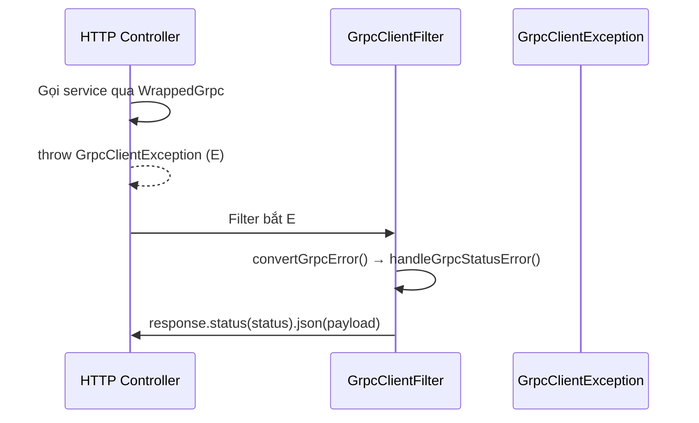
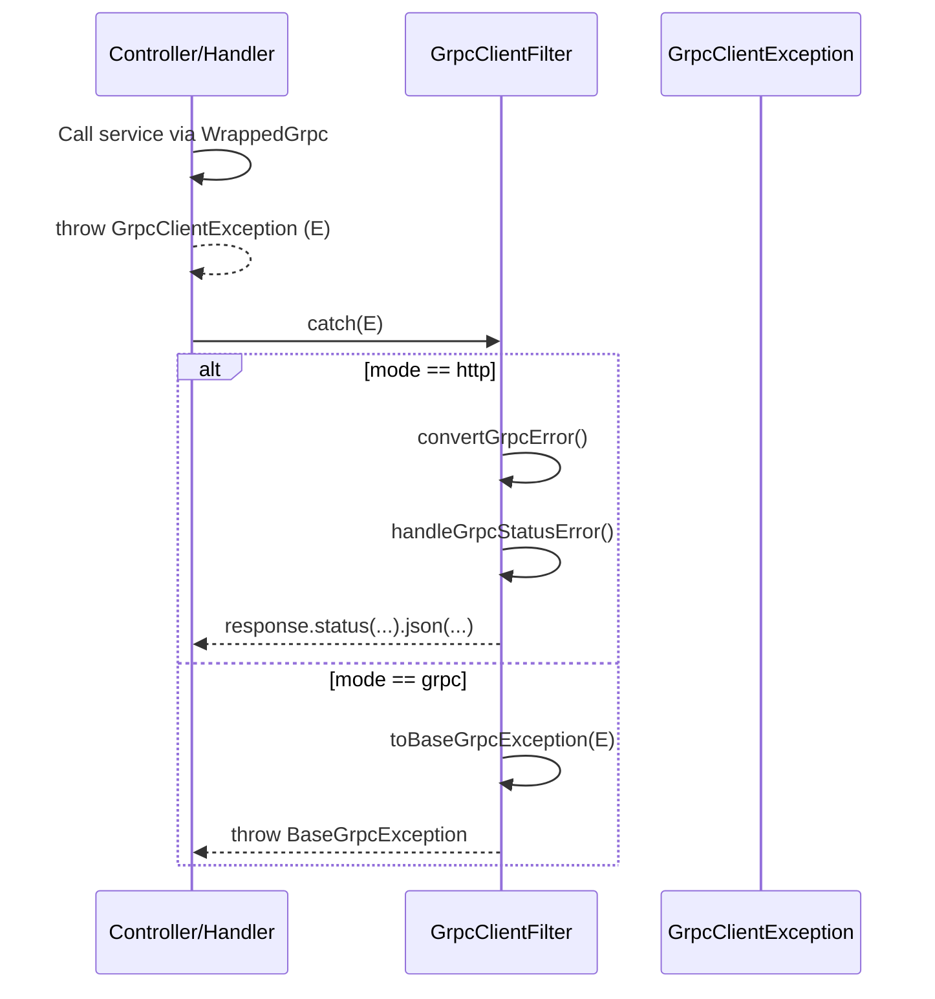

import Tabs from '@theme/Tabs';
import TabItem from '@theme/TabItem';

:::info
`GrpcClientFilter` là `@Catch(GrpcClientException)` dùng ở HTTP layer. Nó nhận lỗi chuẩn từ `WrappedGrpc` và ánh xạ sang HTTP status + body nhất quán, có hỗ trợ validation error, logging chi tiết và metadata.
:::

### Tính năng chính

- **Mapping gRPC status → HTTP status** (ví dụ `UNAVAILABLE` → `503`, `INVALID_ARGUMENT` → `400`).
- **Hỗ trợ validation**: nếu `INVALID_ARGUMENT` và `details` là JSON, tách `errors` và `fieldErrors`.
- **Logging linh hoạt**: level `debug`/`warn`/`error`, tùy chọn stack trace, metadata, dev mode.
- **Tùy biến runtime**: `updateOptions()` để đổi behavior khi đang chạy.

### Cách hoạt động



### Options

| Option                  | Type                       | Mặc định                       | Mô tả                                                    |
| ----------------------- | -------------------------- | ------------------------------ | -------------------------------------------------------- |
| `defaultErrorMessage`   | `string`                   | "An unexpected error occurred" | Thông điệp chung khi không expose lỗi nội bộ.            |
| `enableDetailedLogging` | `boolean`                  | `true`                         | Bật log chi tiết (bao gồm details keys/type...).         |
| `enableStackTrace`      | `boolean`                  | `false`                        | Log kèm stack trace.                                     |
| `exposeInternalErrors`  | `boolean`                  | `false`                        | Cho phép trả message nội bộ ra HTTP (prod nên để false). |
| `includeMetadata`       | `boolean`                  | `false`                        | Log kèm gRPC metadata nếu có.                            |
| `isDevelopment`         | `boolean`                  | `false`                        | Thêm trường `debug` trong response và log raw details.   |
| `logLevel`              | `'debug'\|'warn'\|'error'` | `'error'`                      | Mức log sử dụng khi ghi log.                             |
| `mode`                  | `'http'\|'grpc'`           | `'http'`                       | Cách xử lý exception: map HTTP hoặc rethrow gRPC.        |

:::note
`updateOptions(partial)` cho phép thay đổi options khi runtime, và `getOptions()` trả về snapshot cấu hình hiện tại.
:::

### Mapping gRPC → HTTP

| gRPC Code             | HTTP Status | error                                      | message                                                   |
| --------------------- | ----------: | ------------------------------------------ | --------------------------------------------------------- |
| `ABORTED`             |         409 | `ABORTED`                                  | Operation was aborted                                     |
| `ALREADY_EXISTS`      |         409 | `ALREADY_EXISTS`                           | Resource already exists                                   |
| `CANCELLED`           |         408 | `CANCELLED`                                | Request was cancelled                                     |
| `DATA_LOSS`           |         500 | `DATA_LOSS`                                | Data loss detected                                        |
| `DEADLINE_EXCEEDED`   |         408 | `DEADLINE_EXCEEDED`                        | Request deadline exceeded                                 |
| `FAILED_PRECONDITION` |         412 | `FAILED_PRECONDITION`                      | Failed precondition                                       |
| `INTERNAL`            |         500 | `INTERNAL`                                 | defaultErrorMessage hoặc details nếu exposeInternalErrors |
| `INVALID_ARGUMENT`    |         400 | `INVALID_ARGUMENT` hoặc `VALIDATION_ERROR` | Tách `errors`/`fieldErrors` nếu `details` là JSON         |
| `NOT_FOUND`           |         404 | `NOT_FOUND`                                | Resource not found                                        |
| `OUT_OF_RANGE`        |         400 | `OUT_OF_RANGE`                             | Value out of range                                        |
| `PERMISSION_DENIED`   |         403 | `PERMISSION_DENIED`                        | Permission denied                                         |
| `RESOURCE_EXHAUSTED`  |         429 | `RESOURCE_EXHAUSTED`                       | Resource exhausted                                        |
| `UNAUTHENTICATED`     |         401 | `UNAUTHENTICATED`                          | Authentication required                                   |
| `UNAVAILABLE`         |         503 | `UNAVAILABLE`                              | Service unavailable                                       |
| `UNIMPLEMENTED`       |         501 | `UNIMPLEMENTED`                            | Method not implemented                                    |
| `UNKNOWN`             |         500 | `UNKNOWN`                                  | defaultErrorMessage hoặc details nếu exposeInternalErrors |
| `UNKNOWN_GRPC_CODE`   |         500 | `UNKNOWN_GRPC_CODE`                        | defaultErrorMessage hoặc chi tiết code lạ                 |

### Response payload

Payload chuẩn trả về bởi filter:

```json
{
    "statusCode": 400,
    "error": "VALIDATION_ERROR",
    "message": "Validation failed",
    "errors": ["email must be an email"],
    "fieldErrors": { "email": { "isEmail": "email must be an email" } },
    "path": "/v1/users",
    "timestamp": "2024-05-01T10:00:00.000Z",
    "details": "...", // optional
    "debug": {
        // chỉ khi isDevelopment = true
        "grpcCode": 3,
        "originalError": "INVALID_ARGUMENT: ...",
        "stackTrace": "..."
    }
}
```

### Sử dụng trong NestJS

<Tabs>
  <TabItem value="global" label="Global Filter Setup">

```ts
// main.ts
import { NestFactory } from '@nestjs/core';
import { AppModule } from './app.module';
import { GrpcClientFilter } from '@ecom-co/grpc';

async function bootstrap() {
    const app = await NestFactory.create(AppModule);

    // Setup global filter
    app.useGlobalFilters(
        new GrpcClientFilter({
            enableDetailedLogging: true,
            logLevel: 'error',
            isDevelopment: process.env.NODE_ENV !== 'production',
            exposeInternalErrors: process.env.NODE_ENV !== 'production',
            enableStackTrace: process.env.NODE_ENV !== 'production',
            includeMetadata: true,
        }),
    );

    await app.listen(3000);
}
bootstrap();
```

  </TabItem>
  <TabItem value="module" label="Module Provider">

```ts
// app.module.ts
import { Module } from '@nestjs/common';
import { APP_FILTER } from '@nestjs/core';
import { GrpcClientFilter } from '@ecom-co/grpc';

@Module({
    providers: [
        {
            provide: APP_FILTER,
            useFactory: () =>
                new GrpcClientFilter({
                    enableDetailedLogging: process.env.NODE_ENV !== 'production',
                    logLevel: (process.env.LOG_LEVEL as any) || 'error',
                    isDevelopment: process.env.NODE_ENV === 'development',
                    exposeInternalErrors: false, // Luôn false trong production
                }),
        },
    ],
})
export class AppModule {}
```

  </TabItem>
  <TabItem value="controller" label="Per Controller">

```ts
// users.controller.ts
import { Controller, Get, Post, Body, Param, UseFilters } from '@nestjs/common';
import { GrpcClientFilter } from '@ecom-co/grpc';
import { UserService } from './user.service';

@UseFilters(
    new GrpcClientFilter({
        exposeInternalErrors: false,
        enableDetailedLogging: true,
    }),
)
@Controller('users')
export class UsersController {
    constructor(private readonly userService: UserService) {}

    @Get(':id')
    async getUser(@Param('id') id: string) {
        // Nếu UserService throw GrpcClientException, filter sẽ xử lý
        return this.userService.findById(id);
    }

    @Post()
    async createUser(@Body() userData: any) {
        return this.userService.create(userData);
    }
}
```

  </TabItem>
  <TabItem value="scenarios" label="Error Scenarios">

```ts
// Các tình huống lỗi thường gặp và cách filter xử lý

// 1. Validation Error (INVALID_ARGUMENT với JSON details)
// gRPC trả về:
// code: 3 (INVALID_ARGUMENT)
// details: '{"errors":["email must be valid"],"fieldErrors":{"email":{"isEmail":"email must be valid"}}}'
//
// HTTP Response:
// {
//   "statusCode": 400,
//   "error": "VALIDATION_ERROR",
//   "message": "Validation failed",
//   "errors": ["email must be valid"],
//   "fieldErrors": {"email": {"isEmail": "email must be valid"}},
//   "path": "/users",
//   "timestamp": "2024-05-01T10:00:00.000Z"
// }

// 2. Not Found (NOT_FOUND)
// gRPC: code: 5, details: "User with id 123 not found"
// HTTP: 404 với message tương ứng

// 3. Service Unavailable (UNAVAILABLE)
// gRPC: code: 14, details: "Service temporarily unavailable"
// HTTP: 503 Service Unavailable

// 4. Authentication Required (UNAUTHENTICATED)
// gRPC: code: 16, details: "Invalid token"
// HTTP: 401 Unauthorized

// 5. Internal Error (INTERNAL) - Production
// gRPC: code: 13, details: "Database connection failed"
// HTTP: 500 với generic message (không expose chi tiết)
```

  </TabItem>
  <TabItem value="runtime" label="Runtime Configuration">

```ts
// service.ts - Cập nhật options khi runtime
import { Injectable } from '@nestjs/common';
import { GrpcClientFilter } from '@ecom-co/grpc';

@Injectable()
export class ConfigService {
    constructor(private readonly grpcFilter: GrpcClientFilter) {}

    enableDebugMode() {
        this.grpcFilter.updateOptions({
            isDevelopment: true,
            enableStackTrace: true,
            logLevel: 'debug',
        });
    }

    setProductionMode() {
        this.grpcFilter.updateOptions({
            isDevelopment: false,
            enableStackTrace: false,
            exposeInternalErrors: false,
            logLevel: 'error',
        });
    }

    getCurrentConfig() {
        return this.grpcFilter.getOptions();
    }
}
```

  </TabItem>
  <TabItem value="testing" label="Testing với Filter">

```ts
// user.controller.spec.ts
import { Test, TestingModule } from '@nestjs/testing';
import { GrpcClientFilter, GrpcClientException } from '@ecom-co/grpc';
import { UsersController } from './users.controller';
import { UserService } from './user.service';

describe('UsersController with GrpcClientFilter', () => {
    let controller: UsersController;
    let userService: UserService;
    let filter: GrpcClientFilter;

    beforeEach(async () => {
        const module: TestingModule = await Test.createTestingModule({
            controllers: [UsersController],
            providers: [
                {
                    provide: UserService,
                    useValue: {
                        findById: jest.fn(),
                        create: jest.fn(),
                    },
                },
            ],
        }).compile();

        controller = module.get<UsersController>(UsersController);
        userService = module.get<UserService>(UserService);
        filter = new GrpcClientFilter({
            isDevelopment: true,
            enableDetailedLogging: false, // Tắt log trong test
        });
    });

    it('should handle NOT_FOUND error', async () => {
        const exception = new GrpcClientException('User not found', 5);
        jest.spyOn(userService, 'findById').mockRejectedValue(exception);

        const mockResponse = {
            status: jest.fn().mockReturnThis(),
            json: jest.fn(),
            headersSent: false,
        };

        const mockHost = {
            switchToHttp: () => ({
                getResponse: () => mockResponse,
                getRequest: () => ({ url: '/users/123', method: 'GET' }),
            }),
        };

        filter.catch(exception, mockHost as any);

        expect(mockResponse.status).toHaveBeenCalledWith(404);
        expect(mockResponse.json).toHaveBeenCalledWith(
            expect.objectContaining({
                statusCode: 404,
                error: 'NOT_FOUND',
                message: 'Resource not found',
            }),
        );
    });
});
```

  </TabItem>
</Tabs>

### Mermaid: Flow xử lý exception

```mermaid"
flowchart TD
  A[GrpcClientException] --> B{mode}
  B -- http --> C{headersSent?}
  C -- Yes --> D[return]
  C -- No --> E[logException]
  E --> F[convertGrpcError]
  F --> G[handleGrpcStatusError]
  G --> H[response.status(...).json(...)]
  B -- grpc --> I[toBaseGrpcException]
  I --> J[throw BaseGrpcException]
```

### Best practices

- **Không expose lỗi nội bộ** ở production: `exposeInternalErrors: false`.
- **Bật detailed logging** ở staging/dev để debug nhanh.
- **Đảm bảo WrappedGrpc** được dùng ở client để luôn ném `GrpcClientException` chuẩn.

## Mode (http | grpc)

Granicular control for where the exception is handled:

- `mode: 'http'` (mặc định): map `GrpcClientException` → HTTP response (status + body) theo bảng Mapping gRPC → HTTP phía trên.
- `mode: 'grpc'`: chuyển `GrpcClientException` thành `BaseGrpcException` tương ứng và ném lại để Nest gRPC trả về gRPC status/payload chuẩn.

```ts:title="HTTP mode (default)"
app.useGlobalFilters(new GrpcClientFilter({
  mode: 'http',
  enableDetailedLogging: true,
}));
```

```ts:title="gRPC mode (propagate native gRPC)"
app.useGlobalFilters(new GrpcClientFilter({
  mode: 'grpc',
}));
```

Note: `WrappedGrpc` chỉ ném `GrpcClientException`. Việc map sang HTTP hoặc gRPC được quyết định ở filter qua `mode`.

### Sequence Diagram (http | grpc)


