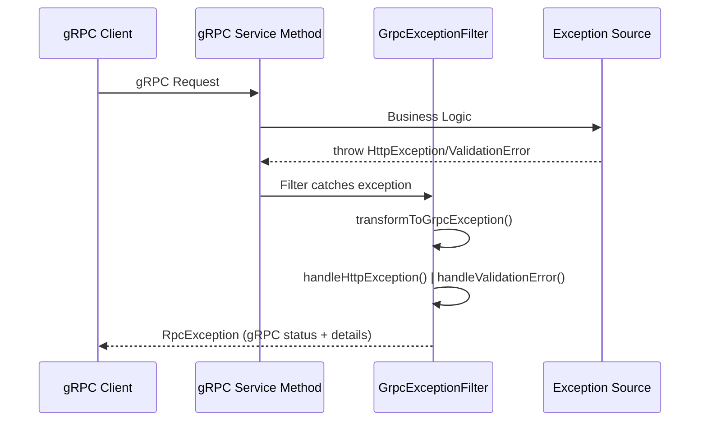
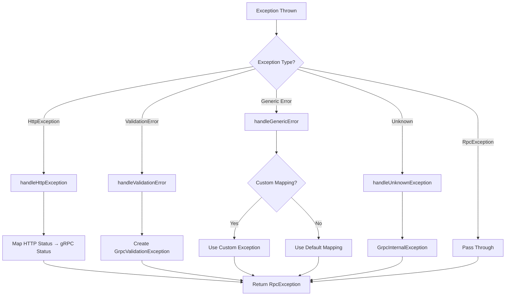

import Tabs from '@theme/Tabs';
import TabItem from '@theme/TabItem';

:::info
`GrpcExceptionFilter` là server-side filter dùng trong gRPC microservice. Nó chuyển đổi HTTP exceptions, validation errors và generic errors thành `RpcException` chuẩn gRPC để trả về cho client.
:::

:::warning Khác biệt quan trọng

- **GrpcClientFilter**: Client-side, convert `GrpcClientException` → HTTP response
- **GrpcExceptionFilter**: Server-side, convert HTTP/Validation errors → `RpcException`
  :::

### Tổng quan

- **Mục tiêu**: Chuẩn hóa error handling ở gRPC server layer
- **Điểm nổi bật**:
    - **HTTP → gRPC mapping**: Tự động map HTTP status codes sang gRPC status codes
    - **Validation support**: Xử lý `ValidationError` từ class-validator
    - **Custom mappings**: Cho phép định nghĩa custom error mappings
    - **Flexible logging**: Configurable logging với error details

### Cách hoạt động



### Options

| Option                 | Type                                                    | Mặc định                               | Mô tả                                    |
| ---------------------- | ------------------------------------------------------- | -------------------------------------- | ---------------------------------------- |
| `customErrorMappings`  | `Record<string, new (message: string) => RpcException>` | `{}`                                   | Custom mapping cho specific error names. |
| `defaultErrorMessage`  | `string`                                                | `"Unknown error occurred"`             | Message mặc định cho unknown exceptions. |
| `enableLogging`        | `boolean`                                               | `true`                                 | Bật/tắt logging exceptions.              |
| `exposeInternalErrors` | `boolean`                                               | `!production`                          | Expose chi tiết lỗi nội bộ (dev mode).   |
| `logger`               | `Logger`                                                | `new Logger(GrpcExceptionFilter.name)` | Custom logger instance.                  |

### HTTP → gRPC Status Mapping

| HTTP Status | gRPC Exception Class        | gRPC Code | Mô tả                         |
| ----------: | --------------------------- | --------: | ----------------------------- |
|         400 | `GrpcBadRequestException`   |         3 | INVALID_ARGUMENT              |
|         400 | `GrpcValidationException`   |         3 | INVALID_ARGUMENT (validation) |
|         401 | `GrpcUnauthorizedException` |        16 | UNAUTHENTICATED               |
|         403 | `GrpcForbiddenException`    |         7 | PERMISSION_DENIED             |
|         404 | `GrpcNotFoundException`     |         5 | NOT_FOUND                     |
|         408 | `GrpcTimeoutException`      |         4 | DEADLINE_EXCEEDED             |
|         409 | `GrpcConflictException`     |         6 | ALREADY_EXISTS                |
|         503 | `GrpcUnavailableException`  |        14 | UNAVAILABLE                   |
|     default | `GrpcInternalException`     |        13 | INTERNAL                      |

### Sử dụng trong gRPC Microservice

<Tabs>
  <TabItem value="global" label="Global Filter Setup">

```ts
// main.ts - gRPC Microservice
import { NestFactory } from '@nestjs/core';
import { MicroserviceOptions, Transport } from '@nestjs/microservices';
import { GrpcExceptionFilter } from '@ecom-co/grpc';
import { AppModule } from './app.module';

async function bootstrap() {
    const app = await NestFactory.createMicroservice<MicroserviceOptions>(AppModule, {
        transport: Transport.GRPC,
        options: {
            package: 'user',
            protoPath: join(__dirname, '../proto/user.proto'),
            url: '0.0.0.0:50051',
        },
    });

    // Setup global exception filter
    app.useGlobalFilters(
        new GrpcExceptionFilter({
            enableLogging: true,
            exposeInternalErrors: process.env.NODE_ENV !== 'production',
            defaultErrorMessage: 'Service temporarily unavailable',
        }),
    );

    await app.listen();
}
bootstrap();
```

  </TabItem>
  <TabItem value="controller" label="gRPC Controller">

```ts
// user.controller.ts
import { Controller, UseFilters } from '@nestjs/common';
import { GrpcMethod } from '@nestjs/microservices';
import { GrpcExceptionFilter } from '@ecom-co/grpc';
import { UserService } from './user.service';

@Controller()
@UseFilters(GrpcExceptionFilter) // Per-controller filter
export class UserController {
    constructor(private readonly userService: UserService) {}

    @GrpcMethod('UserService', 'GetUser')
    async getUser(data: { id: string }) {
        // Nếu service throw HttpException, filter sẽ convert thành RpcException
        return this.userService.findById(data.id);
    }

    @GrpcMethod('UserService', 'CreateUser')
    async createUser(data: CreateUserDto) {
        // Validation errors sẽ được convert thành GrpcValidationException
        return this.userService.create(data);
    }
}
```

  </TabItem>
  <TabItem value="service" label="Service với Exception Handling">

```ts
// user.service.ts
import { Injectable, NotFoundException, BadRequestException } from '@nestjs/common';
import { GrpcNotFoundException, GrpcValidationException } from '@ecom-co/grpc';

@Injectable()
export class UserService {
    async findById(id: string) {
        if (!id) {
            // Sẽ được convert thành GrpcBadRequestException
            throw new BadRequestException('User ID is required');
        }

        const user = await this.userRepository.findById(id);
        if (!user) {
            // Sẽ được convert thành GrpcNotFoundException
            throw new NotFoundException(`User with ID ${id} not found`);
        }

        return user;
    }

    async create(userData: CreateUserDto) {
        // Validation errors từ class-validator sẽ được handle
        const existingUser = await this.userRepository.findByEmail(userData.email);
        if (existingUser) {
            throw new BadRequestException('Email already exists');
        }

        // Hoặc throw trực tiếp gRPC exception
        if (!userData.email.includes('@')) {
            throw new GrpcValidationException('Invalid email format', [
                { field: 'email', message: 'Must be valid email' },
            ]);
        }

        return this.userRepository.create(userData);
    }
}
```

  </TabItem>
  <TabItem value="custom" label="Custom Error Mappings">

```ts
// Custom error classes
class DatabaseConnectionError extends Error {
  constructor(message: string) {
    super(message);
    this.name = 'DatabaseConnectionError';
  }
}

class RateLimitError extends Error {
  constructor(message: string) {
    super(message);
    this.name = 'RateLimitError';
  }
}

// Setup filter với custom mappings
const filter = new GrpcExceptionFilter({
  customErrorMappings: {
    'DatabaseConnectionError': GrpcUnavailableException,
    'RateLimitError': GrpcResourceExhaustedException,
    'CustomBusinessError': GrpcFailedPreconditionException,
  },
  enableLogging: true,
  exposeInternalErrors: false,
});

// Trong service
async someMethod() {
  try {
    await this.database.connect();
  } catch (error) {
    if (error.code === 'CONNECTION_REFUSED') {
      // Sẽ được map thành GrpcUnavailableException
      throw new DatabaseConnectionError('Database connection failed');
    }
    throw error;
  }
}
```

  </TabItem>
  <TabItem value="validation" label="Validation Error Handling">

```ts
// dto/create-user.dto.ts
import { IsEmail, IsString, MinLength, IsOptional } from 'class-validator';

export class CreateUserDto {
    @IsString()
    @MinLength(2)
    name: string;

    @IsEmail()
    email: string;

    @IsString()
    @MinLength(6)
    password: string;

    @IsOptional()
    @IsString()
    phone?: string;
}

// Khi validation fail, filter sẽ tạo GrpcValidationException với details:
// {
//   "code": 3, // INVALID_ARGUMENT
//   "details": {
//     "type": "VALIDATION_ERROR",
//     "errors": [
//       { "field": "email", "message": "email must be an email" },
//       { "field": "password", "message": "password must be longer than or equal to 6 characters" }
//     ]
//   },
//   "message": "Validation failed"
// }
```

  </TabItem>
  <TabItem value="testing" label="Testing với Filter">

```ts
// user.controller.spec.ts
import { Test, TestingModule } from '@nestjs/testing';
import { GrpcExceptionFilter } from '@ecom-co/grpc';
import { BadRequestException } from '@nestjs/common';
import { UserController } from './user.controller';
import { UserService } from './user.service';

describe('UserController with GrpcExceptionFilter', () => {
    let controller: UserController;
    let userService: UserService;
    let filter: GrpcExceptionFilter;

    beforeEach(async () => {
        const module: TestingModule = await Test.createTestingModule({
            controllers: [UserController],
            providers: [
                {
                    provide: UserService,
                    useValue: {
                        findById: jest.fn(),
                        create: jest.fn(),
                    },
                },
            ],
        }).compile();

        controller = module.get<UserController>(UserController);
        userService = module.get<UserService>(UserService);
        filter = new GrpcExceptionFilter({
            enableLogging: false, // Tắt log trong test
            exposeInternalErrors: true,
        });
    });

    it('should convert BadRequestException to RpcException', () => {
        const httpException = new BadRequestException('Invalid input');

        const result = filter.catch(httpException);

        result.subscribe({
            error: (error) => {
                expect(error.code).toBe(3); // INVALID_ARGUMENT
                expect(error.message).toBe('Invalid input');
            },
        });
    });
});
```

  </TabItem>
</Tabs>

### Mermaid: Exception Transformation Flow



### Best Practices

- **Sử dụng HTTP exceptions** trong business logic, để filter tự động convert
- **Custom mappings** cho domain-specific errors
- **Tắt exposeInternalErrors** trong production để bảo mật
- **Validation** sử dụng class-validator DTOs để có error details chi tiết
- **Logging** để monitor và debug issues

:::tip
Kết hợp với `GrpcClientFilter` ở client-side để có complete error handling pipeline: Service → gRPC → HTTP.
:::
