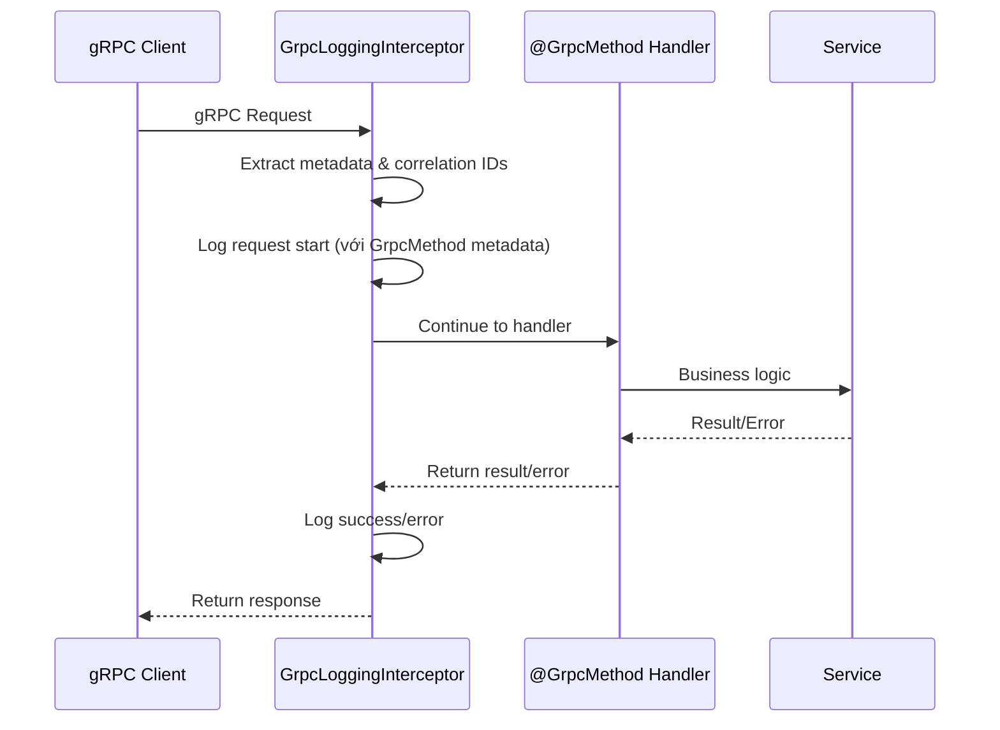

import Tabs from '@theme/Tabs';
import TabItem from '@theme/TabItem';

:::info
Bộ gRPC Utilities bao gồm 2 components chính: **GrpcMethod decorator** (enhanced metadata) và **GrpcLoggingInterceptor** (comprehensive logging).
:::

## GrpcMethod Decorator

Enhanced version của `@GrpcMethod` từ NestJS với additional metadata support.

### Features

- **Metadata enrichment**: Thêm description, logLevel, rateLimit, requiresAuth
- **Integration ready**: Tương thích với GrpcLoggingInterceptor
- **Type safe**: Full TypeScript support với GrpcMethodMetadata interface

### GrpcMethodMetadata Options

| Option         | Type                                     | Mặc định           | Mô tả                                     |
| -------------- | ---------------------------------------- | ------------------ | ----------------------------------------- |
| `description`  | `string`                                 | `"Service.Method"` | Mô tả method cho logging và documentation |
| `logLevel`     | `'debug' \| 'info' \| 'warn' \| 'error'` | `'info'`           | Log level cho method này                  |
| `rateLimit`    | `number`                                 | `undefined`        | Rate limit (requests per minute)          |
| `requiresAuth` | `boolean`                                | `undefined`        | Có yêu cầu authentication không           |

### Usage Examples

<Tabs>
  <TabItem value="basic" label="Basic Usage">

```ts
import { Controller } from '@nestjs/common';
import { GrpcMethod } from '@ecom-co/grpc';

@Controller()
export class UserController {
    // Basic usage - tương tự @GrpcMethod gốc
    @GrpcMethod('UserService', 'GetUser')
    async getUser(data: { id: string }) {
        return this.userService.findById(data.id);
    }

    // Với metadata
    @GrpcMethod('UserService', 'CreateUser', {
        description: 'Create new user account',
        logLevel: 'info',
        requiresAuth: true,
        rateLimit: 100, // 100 requests per minute
    })
    async createUser(data: CreateUserDto) {
        return this.userService.create(data);
    }
}
```

  </TabItem>
  <TabItem value="advanced" label="Advanced Metadata">

```ts
@Controller()
export class PaymentController {
    @GrpcMethod('PaymentService', 'ProcessPayment', {
        description: 'Process payment transaction',
        logLevel: 'warn', // Log as warning due to sensitivity
        requiresAuth: true,
        rateLimit: 10, // Strict rate limit for payments
    })
    async processPayment(data: PaymentDto) {
        return this.paymentService.process(data);
    }

    @GrpcMethod('PaymentService', 'GetTransactionHistory', {
        description: 'Retrieve user transaction history',
        logLevel: 'debug',
        requiresAuth: true,
        rateLimit: 50,
    })
    async getTransactionHistory(data: { userId: string; limit: number }) {
        return this.paymentService.getHistory(data.userId, data.limit);
    }
}
```

  </TabItem>
</Tabs>

---

## GrpcLoggingInterceptor

Comprehensive logging interceptor cho gRPC methods với correlation ID tracking và data sanitization.

### Features

- **Correlation tracking**: Extract và generate correlation-id, request-id, trace-id
- **Data sanitization**: Tự động ẩn sensitive fields (password, token, secret, key)
- **Metadata integration**: Sử dụng GrpcMethod metadata để enhance logging
- **Configurable**: Flexible logging options cho different environments

### LoggingOptions

| Option          | Type                                                 | Mặc định                         | Mô tả                              |
| --------------- | ---------------------------------------------------- | -------------------------------- | ---------------------------------- |
| `isDevelopment` | `boolean`                                            | `NODE_ENV === 'development'`     | Development mode với detailed logs |
| `logLevel`      | `'debug' \| 'info' \| 'warn' \| 'error' \| 'silent'` | `'info'` (dev), `'error'` (prod) | Minimum log level                  |
| `logRequest`    | `boolean`                                            | `!production`                    | Log request data                   |
| `logResponse`   | `boolean`                                            | `development`                    | Log response data                  |

### Usage Examples

<Tabs>
  <TabItem value="global" label="Global Setup">

```ts
// app.module.ts
import { Module } from '@nestjs/common';
import { APP_INTERCEPTOR } from '@nestjs/core';
import { GrpcLoggingInterceptor, createGrpcLoggingInterceptor } from '@ecom-co/grpc';

@Module({
    providers: [
        {
            provide: APP_INTERCEPTOR,
            useFactory: createGrpcLoggingInterceptor({
                isDevelopment: process.env.NODE_ENV === 'development',
                logLevel: (process.env.LOG_LEVEL as any) || 'info',
                logRequest: true,
                logResponse: process.env.NODE_ENV === 'development',
            }),
            inject: [Reflector],
        },
    ],
})
export class AppModule {}
```

  </TabItem>
  <TabItem value="controller" label="Per Controller">

```ts
// user.controller.ts
import { Controller, UseInterceptors } from '@nestjs/common';
import { GrpcLoggingInterceptor } from '@ecom-co/grpc';

@Controller()
@UseInterceptors(
    new GrpcLoggingInterceptor(new Reflector(), {
        logLevel: 'debug',
        logRequest: true,
        logResponse: false, // Không log response vì có thể chứa sensitive data
    }),
)
export class UserController {
    @GrpcMethod('UserService', 'GetUser', {
        description: 'Get user by ID',
        logLevel: 'info',
    })
    async getUser(data: { id: string }) {
        return this.userService.findById(data.id);
    }
}
```

  </TabItem>
  <TabItem value="logs" label="Log Examples">

```bash
# Start log
[UserService - GetUser] Started | ID: 550e8400-e29b-41d4-a716-446655440000

# Request details (debug level)
[UserService.GetUser] Request Details {
  "metadata": {
    "description": "Get user by ID",
    "requiresAuth": true,
    "rateLimit": 100
  },
  "timestamp": "2024-05-01T10:00:00.000Z",
  "correlationId": "550e8400-e29b-41d4-a716-446655440000",
  "requestId": "req-123",
  "traceId": "trace-456"
}

# Input data (debug level, sanitized)
[UserService.GetUser] Input {
  "id": "user-123",
  "includeProfile": true,
  "token": "[REDACTED]"  // Automatically sanitized
}

# Success log
[UserService - GetUser] Success (150ms) | ID: 550e8400-e29b-41d4-a716-446655440000

# Error log
[UserService.GetUser] Error (75ms) | ID: 550e8400-e29b-41d4-a716-446655440000 {
  "code": 5,
  "message": "User not found",
  "duration": 75,
  "timestamp": "2024-05-01T10:00:00.075Z",
  "correlationId": "550e8400-e29b-41d4-a716-446655440000",
  "requestId": "req-123",
  "traceId": "trace-456"
}
```

  </TabItem>
</Tabs>

## Integration Example

<Tabs>
  <TabItem value="full" label="Full Integration">

```ts
// user.controller.ts
import { Controller, UseInterceptors } from '@nestjs/common';
import { GrpcMethod, GrpcLoggingInterceptor } from '@ecom-co/grpc';

@Controller()
@UseInterceptors(
    new GrpcLoggingInterceptor(new Reflector(), {
        logLevel: 'info',
        logRequest: true,
        logResponse: false,
    }),
)
export class UserController {
    @GrpcMethod('UserService', 'CreateUser', {
        description: 'Create new user with enhanced logging',
        logLevel: 'info',
        requiresAuth: true,
        rateLimit: 50,
    })
    async createUser(data: CreateUserDto) {
        // Method sẽ có:
        // 1. Enhanced metadata từ GrpcMethod
        // 2. Comprehensive logging từ GrpcLoggingInterceptor
        return this.userService.create(data);
    }

    @GrpcMethod('UserService', 'GetUser', {
        description: 'Retrieve user by ID',
        logLevel: 'debug',
        requiresAuth: true,
        rateLimit: 100,
    })
    async getUser(data: { id: string }) {
        return this.userService.findById(data.id);
    }
}
```

  </TabItem>
</Tabs>

### Mermaid: Flow Diagram



### Best Practices

- **Sử dụng GrpcMethod metadata** để document và configure methods
- **Setup GrpcLoggingInterceptor globally** cho consistent logging
- **Combine với GrpcExceptionFilter** để handle errors properly
- **Configure log levels** phù hợp với environment (dev/staging/prod)
- **Use correlation IDs** để trace requests across services

:::tip
Hai utilities này được thiết kế để work together seamlessly. GrpcLoggingInterceptor sẽ đọc metadata từ GrpcMethod để enhance logging output.
:::

:::note
Để validation, sử dụng `GrpcValidationPipe` - xem docs riêng tại [GrpcValidationPipe](/grpc-validation-pipe).
:::
