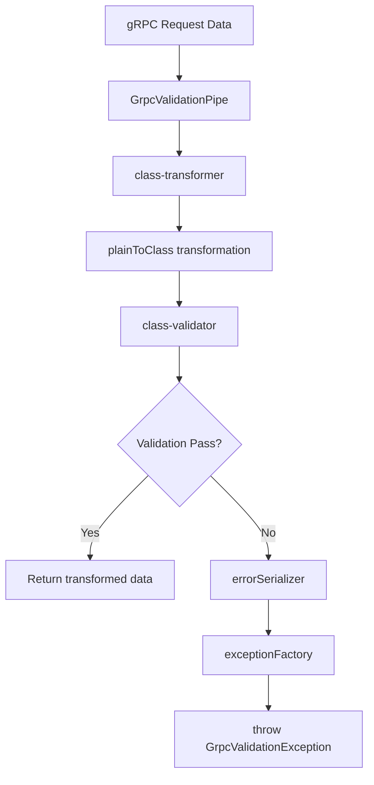

import Tabs from '@theme/Tabs';
import TabItem from '@theme/TabItem';

:::info
`GrpcValidationPipe` là validation pipe chuyên dụng cho gRPC requests, sử dụng class-validator decorators với custom error serialization và throw `GrpcValidationException` để tương thích với gRPC error handling.
:::

### Tổng quan

- **class-validator integration**: Sử dụng decorators từ class-validator (@IsString, @IsEmail, etc.)
- **Custom error handling**: Configurable error serialization và exception factory
- **GrpcValidationException**: Throw structured gRPC validation errors
- **Transform support**: class-transformer integration cho type conversion
- **Validation groups**: Support cho conditional validation
- **Runtime configuration**: Có thể update options khi đang chạy

### Features



### GrpcValidationPipeOptions

| Option                   | Type       | Mặc định                  | Mô tả                           |
| ------------------------ | ---------- | ------------------------- | ------------------------------- |
| `dataSerializer`         | `function` | `identity`                | Custom data serializer function |
| `enableErrorLogging`     | `boolean`  | `false`                   | Log validation errors           |
| `errorMessagePrefix`     | `string`   | `"Validation failed"`     | Prefix cho error messages       |
| `errorSerializer`        | `function` | `defaultErrorSerializer`  | Custom error serializer         |
| `exceptionFactory`       | `function` | `defaultExceptionFactory` | Custom exception factory        |
| `stripUnknownProperties` | `boolean`  | `true`                    | Remove unknown properties       |
| `transformOptions`       | `object`   | `{}`                      | class-transformer options       |
| `validationGroups`       | `string[]` | `[]`                      | Validation groups               |
| `validationOptions`      | `object`   | `{}`                      | class-validator options         |

### Usage Examples

<Tabs>
  <TabItem value="basic" label="Basic Validation">

```ts
// dto/create-user.dto.ts
import { IsEmail, IsString, MinLength, IsOptional, IsInt, Min, Max } from 'class-validator';

export class CreateUserDto {
    @IsString()
    @MinLength(2, { message: 'Name must be at least 2 characters' })
    name: string;

    @IsEmail({}, { message: 'Invalid email format' })
    email: string;

    @IsString()
    @MinLength(8, { message: 'Password must be at least 8 characters' })
    password: string;

    @IsOptional()
    @IsInt()
    @Min(18, { message: 'Age must be at least 18' })
    @Max(120, { message: 'Age must be less than 120' })
    age?: number;
}

// user.controller.ts
import { Controller, UsePipes } from '@nestjs/common';
import { GrpcValidationPipe, GrpcMethod } from '@ecom-co/grpc';

@Controller()
export class UserController {
    @GrpcMethod('UserService', 'CreateUser')
    @UsePipes(new GrpcValidationPipe())
    async createUser(data: CreateUserDto) {
        // data đã được validate và transform
        return this.userService.create(data);
    }
}
```

  </TabItem>
  <TabItem value="custom" label="Custom Configuration">

```ts
// Custom validation pipe với error logging
const customValidationPipe = new GrpcValidationPipe({
    enableErrorLogging: true,
    errorMessagePrefix: 'Input validation failed',
    stripUnknownProperties: true,
    transformOptions: {
        enableImplicitConversion: true,
        excludeExtraneousValues: true,
    },
    validationOptions: {
        whitelist: true, // Strip non-decorated properties
        forbidNonWhitelisted: true, // Throw error for unknown properties
    },
});

@Controller()
export class PaymentController {
    @GrpcMethod('PaymentService', 'ProcessPayment')
    @UsePipes(customValidationPipe)
    async processPayment(data: PaymentDto) {
        return this.paymentService.process(data);
    }
}
```

  </TabItem>
  <TabItem value="groups" label="Validation Groups">

```ts
// dto với validation groups
export class UpdateUserDto {
    @IsString()
    @MinLength(2)
    name: string;

    @IsEmail()
    @ValidateIf((o) => o.groups?.includes('email-update'))
    email?: string;

    @IsString()
    @MinLength(8)
    @ValidateIf((o) => o.groups?.includes('password-change'))
    password?: string;

    groups?: string[];
}

// Sử dụng validation groups
@GrpcMethod('UserService', 'UpdateProfile')
@UsePipes(
    new GrpcValidationPipe({
        validationGroups: ['email-update'], // Chỉ validate email
    }),
)
async updateProfile(data: UpdateUserDto) {
    return this.userService.update(data);
}

@GrpcMethod('UserService', 'ChangePassword')
@UsePipes(
    new GrpcValidationPipe({
        validationGroups: ['password-change'], // Chỉ validate password
    }),
)
async changePassword(data: UpdateUserDto) {
    return this.userService.changePassword(data);
}
```

  </TabItem>
  <TabItem value="transform" label="Transform Options">

```ts
// dto với transform decorators
import { Transform, Type } from 'class-transformer';
import { IsString, IsNumber, IsDate, ValidateNested } from 'class-validator';

export class AddressDto {
    @IsString()
    street: string;

    @IsString()
    city: string;

    @IsString()
    @Transform(({ value }) => value?.toUpperCase()) // Transform to uppercase
    country: string;
}

export class CreateUserDto {
    @IsString()
    @Transform(({ value }) => value?.trim()) // Trim whitespace
    name: string;

    @IsString()
    @Transform(({ value }) => value?.toLowerCase()) // Transform to lowercase
    email: string;

    @IsNumber()
    @Transform(({ value }) => parseInt(value)) // Convert string to number
    age: number;

    @IsDate()
    @Type(() => Date) // Transform to Date object
    birthDate: Date;

    @ValidateNested()
    @Type(() => AddressDto) // Nested object validation
    address: AddressDto;
}

// Pipe với transform options
const transformValidationPipe = new GrpcValidationPipe({
    transformOptions: {
        enableImplicitConversion: true, // Auto convert types
        excludeExtraneousValues: true, // Remove non-decorated properties
        exposeDefaultValues: true, // Include default values
    },
    stripUnknownProperties: true,
});
```

  </TabItem>
  <TabItem value="error" label="Custom Error Handling">

```ts
// Custom error serializer
const customErrorSerializer = (errors: ValidationError[]): ValidationErrorInfo[] => {
    return errors.map((error) => ({
        property: error.property,
        value: error.value,
        constraints: error.constraints || {},
        // Add custom fields
        errorCode: `VALIDATION_${error.property.toUpperCase()}`,
        severity: 'high',
    }));
};

// Custom exception factory
const customExceptionFactory = (message: string, errors: ValidationErrorInfo[]) => {
    const errorDetails = {
        type: 'VALIDATION_ERROR',
        errors: errors.map((e) => ({
            field: e.property,
            code: e.errorCode,
            message: Object.values(e.constraints).join(', '),
        })),
        timestamp: new Date().toISOString(),
    };

    return new GrpcValidationException(JSON.stringify(errorDetails), errors);
};

// Pipe với custom handlers
const advancedValidationPipe = new GrpcValidationPipe({
    errorSerializer: customErrorSerializer,
    exceptionFactory: customExceptionFactory,
    enableErrorLogging: true,
});

@Controller()
export class UserController {
    @GrpcMethod('UserService', 'CreateUser')
    @UsePipes(advancedValidationPipe)
    async createUser(data: CreateUserDto) {
        return this.userService.create(data);
    }
}
```

  </TabItem>
  <TabItem value="runtime" label="Runtime Configuration">

```ts
// Runtime configuration methods
const pipe = new GrpcValidationPipe();

// Chainable setters
pipe.setErrorLogging(true)
    .setValidationGroups(['create', 'required'])
    .setErrorSerializer((errors) => {
        // Custom serialization logic
        return errors.map((e) => ({ field: e.property, message: e.constraints }));
    });

// Update options object
pipe.updateOptions({
    enableErrorLogging: process.env.NODE_ENV === 'development',
    validationGroups: process.env.VALIDATION_GROUPS?.split(',') || [],
});

// Create new pipe with additional options
const newPipe = pipe.withOptions({
    errorMessagePrefix: 'Custom validation error',
    stripUnknownProperties: false,
});
```

  </TabItem>
</Tabs>

### Validation Error Response

Khi validation fail, GrpcValidationPipe sẽ throw `GrpcValidationException` với format:

```json
{
    "code": 3,
    "message": "Validation failed",
    "details": {
        "type": "VALIDATION_ERROR",
        "errors": ["email must be an email", "password must be longer than or equal to 8 characters"],
        "fieldErrors": {
            "email": {
                "isEmail": "email must be an email"
            },
            "password": {
                "minLength": "password must be longer than or equal to 8 characters"
            }
        },
        "timestamp": "2024-05-01T10:00:00.000Z"
    }
}
```

### Advanced DTO Examples

<Tabs>
  <TabItem value="nested" label="Nested Validation">

```ts
// Nested DTOs với validation
export class ContactInfoDto {
    @IsEmail()
    email: string;

    @IsString()
    @Matches(/^\+[1-9]\d{1,14}$/, { message: 'Invalid phone number format' })
    phone: string;
}

export class PreferencesDto {
    @IsBoolean()
    emailNotifications: boolean;

    @IsString()
    @IsIn(['light', 'dark'], { message: 'Theme must be light or dark' })
    theme: string;

    @IsString()
    @IsIn(['en', 'vi', 'ja'], { message: 'Invalid language' })
    language: string;
}

export class CreateUserDto {
    @IsString()
    @MinLength(2)
    name: string;

    @ValidateNested()
    @Type(() => ContactInfoDto)
    contact: ContactInfoDto;

    @ValidateNested()
    @Type(() => PreferencesDto)
    @IsOptional()
    preferences?: PreferencesDto;

    @IsArray()
    @IsString({ each: true })
    @ArrayMinSize(1, { message: 'At least one role is required' })
    roles: string[];
}
```

  </TabItem>
  <TabItem value="conditional" label="Conditional Validation">

```ts
export class PaymentDto {
    @IsNumber()
    @Min(0.01, { message: 'Amount must be greater than 0' })
    amount: number;

    @IsString()
    @IsIn(['credit_card', 'paypal', 'bank_transfer'])
    method: string;

    // Chỉ required khi method là credit_card
    @ValidateIf((o) => o.method === 'credit_card')
    @IsString()
    @Matches(/^\d{16}$/, { message: 'Invalid card number' })
    cardNumber?: string;

    @ValidateIf((o) => o.method === 'credit_card')
    @IsString()
    @Matches(/^\d{3,4}$/, { message: 'Invalid CVV' })
    cvv?: string;

    // Required khi method là paypal
    @ValidateIf((o) => o.method === 'paypal')
    @IsEmail()
    paypalEmail?: string;

    // Required khi method là bank_transfer
    @ValidateIf((o) => o.method === 'bank_transfer')
    @IsString()
    @MinLength(10, { message: 'Invalid account number' })
    accountNumber?: string;
}
```

  </TabItem>
  <TabItem value="custom-validators" label="Custom Validators">

```ts
import { registerDecorator, ValidationOptions, ValidationArguments } from 'class-validator';

// Custom validator decorator
export function IsStrongPassword(validationOptions?: ValidationOptions) {
    return function (object: object, propertyName: string) {
        registerDecorator({
            name: 'isStrongPassword',
            target: object.constructor,
            propertyName: propertyName,
            options: validationOptions,
            validator: {
                validate(value: any, args: ValidationArguments) {
                    if (typeof value !== 'string') return false;

                    // At least 8 chars, 1 uppercase, 1 lowercase, 1 number, 1 special char
                    const strongPasswordRegex = /^(?=.*[a-z])(?=.*[A-Z])(?=.*\d)(?=.*[@$!%*?&])[A-Za-z\d@$!%*?&]{8,}$/;
                    return strongPasswordRegex.test(value);
                },
                defaultMessage(args: ValidationArguments) {
                    return 'Password must contain at least 8 characters, 1 uppercase, 1 lowercase, 1 number and 1 special character';
                },
            },
        });
    };
}

// Usage trong DTO
export class CreateUserDto {
    @IsString()
    name: string;

    @IsEmail()
    email: string;

    @IsStrongPassword()
    password: string;
}
```

  </TabItem>
</Tabs>

### Integration với Exception Filters

GrpcValidationPipe hoạt động seamlessly với exception filters:

```ts
// GrpcExceptionFilter sẽ tự động handle GrpcValidationException
@Controller()
@UseFilters(GrpcExceptionFilter) // Server-side filter
export class UserController {
    @GrpcMethod('UserService', 'CreateUser')
    @UsePipes(new GrpcValidationPipe())
    async createUser(data: CreateUserDto) {
        // Nếu validation fail → GrpcValidationException → GrpcExceptionFilter → RpcException
        return this.userService.create(data);
    }
}

// Hoặc với GrpcClientFilter ở HTTP layer
@Controller('users')
@UseFilters(GrpcClientFilter) // Client-side filter
export class HttpUserController {
    @Post()
    async createUser(@Body() userData: CreateUserDto) {
        // gRPC call có thể throw GrpcValidationException → GrpcClientFilter → HTTP response
        return this.userGrpcService.create(userData);
    }
}
```

### Testing

<Tabs>
  <TabItem value="unit" label="Unit Testing">

```ts
// user.controller.spec.ts
import { Test, TestingModule } from '@nestjs/testing';
import { GrpcValidationPipe, GrpcValidationException } from '@ecom-co/grpc';
import { UserController } from './user.controller';
import { CreateUserDto } from './dto/create-user.dto';

describe('UserController with GrpcValidationPipe', () => {
    let controller: UserController;
    let pipe: GrpcValidationPipe;

    beforeEach(async () => {
        const module: TestingModule = await Test.createTestingModule({
            controllers: [UserController],
            providers: [
                {
                    provide: 'UserService',
                    useValue: {
                        create: jest.fn(),
                    },
                },
            ],
        }).compile();

        controller = module.get<UserController>(UserController);
        pipe = new GrpcValidationPipe({
            enableErrorLogging: false, // Tắt log trong test
        });
    });

    it('should validate valid input', async () => {
        const validInput = {
            name: 'John Doe',
            email: 'john@example.com',
            password: 'StrongPass123!',
            age: 25,
        };

        const result = await pipe.transform(validInput, {
            type: 'body',
            metatype: CreateUserDto,
        });

        expect(result).toEqual(expect.objectContaining(validInput));
    });

    it('should throw GrpcValidationException for invalid input', async () => {
        const invalidInput = {
            name: '', // Too short
            email: 'invalid-email', // Invalid format
            password: '123', // Too short
            age: 15, // Below minimum
        };

        await expect(
            pipe.transform(invalidInput, {
                type: 'body',
                metatype: CreateUserDto,
            }),
        ).rejects.toThrow(GrpcValidationException);
    });
});
```

  </TabItem>
  <TabItem value="e2e" label="E2E Testing">

```ts
// user.e2e-spec.ts
import { Test, TestingModule } from '@nestjs/testing';
import { GrpcValidationPipe } from '@ecom-co/grpc';
import { AppModule } from '../src/app.module';

describe('User gRPC Service (e2e)', () => {
    let app: INestApplication;

    beforeEach(async () => {
        const moduleFixture: TestingModule = await Test.createTestingModule({
            imports: [AppModule],
        }).compile();

        app = moduleFixture.createNestApplication();
        app.useGlobalPipes(new GrpcValidationPipe());
        await app.init();
    });

    it('should reject invalid user data', async () => {
        const invalidUserData = {
            name: '',
            email: 'invalid',
            password: '123',
        };

        // Test gRPC call với invalid data
        const result = await grpcClient.createUser(invalidUserData);

        expect(result.error).toBeDefined();
        expect(result.error.code).toBe(3); // INVALID_ARGUMENT
        expect(result.error.details).toContain('VALIDATION_ERROR');
    });
});
```

  </TabItem>
</Tabs>

### Best Practices

- **Sử dụng DTOs** với class-validator decorators cho tất cả gRPC inputs
- **Enable error logging** trong development để debug validation issues
- **Custom error serializers** cho domain-specific error formats
- **Validation groups** cho conditional validation scenarios
- **Transform options** để auto-convert và sanitize input data
- **Combine với exception filters** để handle validation errors properly

:::tip
GrpcValidationPipe được thiết kế để work seamlessly với GrpcExceptionFilter và GrpcClientFilter, tạo thành complete validation pipeline từ gRPC → HTTP.
:::

:::warning
Validation chỉ áp dụng cho parameters có `metatype` (class). Primitive types (string, number, boolean) sẽ được pass through mà không validate.
:::
