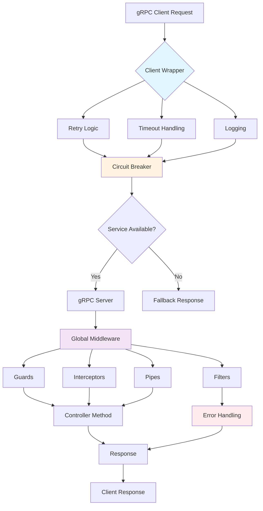
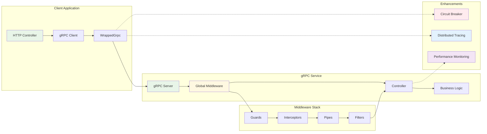

# Introduction

:::info About @ecom-co/grpc
A comprehensive gRPC utilities library for NestJS applications with enterprise-grade features including client wrapping, exception handling, validation, logging, circuit breaker, and distributed tracing.
:::

## Overview

The `@ecom-co/grpc` library provides a complete suite of utilities to enhance gRPC development in NestJS applications. It focuses on reliability, observability, and developer experience through well-designed components that handle common challenges in microservices architectures.

## Key Features

### 🎯 Enhanced Decorators
- **@GrpcMethod()**: Enhanced gRPC method decorator with metadata support
- **@EnhancedOperation()**: Performance monitoring and caching capabilities
- **@TraceOperation()**: Distributed tracing integration
- **@Cacheable()**: Method-level caching with TTL
- **@MonitorPerformance()**: Automatic performance monitoring

### 🛡️ Exception Handling
- **GrpcExceptionFilter**: Server-side exception handling and transformation
- **GrpcClientExceptionFilter**: Client-side error handling for HTTP endpoints
- **Custom Exception Classes**: Structured error handling with gRPC status codes

### ✅ Validation & Transformation
- **GrpcValidationPipe**: Request validation with class-validator integration
- **Custom Data Serializers**: Flexible data transformation
- **Error Message Customization**: Detailed validation error reporting

### 📝 Logging & Observability
- **GrpcLoggingInterceptor**: Comprehensive request/response logging
- **Correlation IDs**: Request tracking across services
- **Performance Metrics**: Response time and throughput monitoring

### 🔧 Client Enhancements
- **WrappedGrpc**: Enhanced client with retry, timeout, and logging
- **Automatic Retries**: Configurable retry logic for resilience
- **Timeout Management**: Request timeout handling
- **Error Recovery**: Graceful error handling and recovery

### ⚡ Advanced Features
- **Circuit Breaker**: Fault tolerance and service protection
- **Distributed Tracing**: End-to-end request tracing
- **Health Checks**: Service health monitoring
- **Load Balancing**: Client-side load balancing support

## Architecture Overview

## Component Overview

| Component | Purpose | Key Features |
|-----------|---------|--------------|
| **WrappedGrpc** | Enhanced gRPC client | Retry, timeout, logging, error handling |
| **GrpcExceptionFilter** | Server exception handling | Error transformation, logging, metrics |
| **GrpcClientExceptionFilter** | Client error mapping | gRPC to HTTP error conversion |
| **GrpcValidationPipe** | Request validation | class-validator integration, custom serializers |
| **GrpcLoggingInterceptor** | Request/response logging | Performance metrics, correlation IDs |
| **CircuitBreakerService** | Fault tolerance | Service protection, automatic recovery |
| **DistributedTracerService** | Request tracing | End-to-end visibility, performance analysis |

:::tip Getting Started
Ready to enhance your gRPC services? Start with our [Quick Start Guide](./quick-start.md) to get up and running in minutes.
:::

:::warning Production Considerations
When deploying to production, ensure you:
- Configure appropriate timeouts and retry policies
- Enable proper logging levels
- Set up health checks and monitoring
- Configure circuit breaker thresholds
- Review security settings for error exposure
:::

## What's Next?

- **[Quick Start](./quick-start.md)**: Get started with basic setup
- **[Usage Examples](./usage-examples.md)**: Learn through practical examples  
- **[Client Module](./client-module.md)**: Deep dive into client features
- **[Exception Handling](./exception-handling.md)**: Master error handling
- **[Advanced Features](./advanced-features.md)**: Explore enterprise features
- **[API Reference](./api-reference.md)**: Complete API documentation