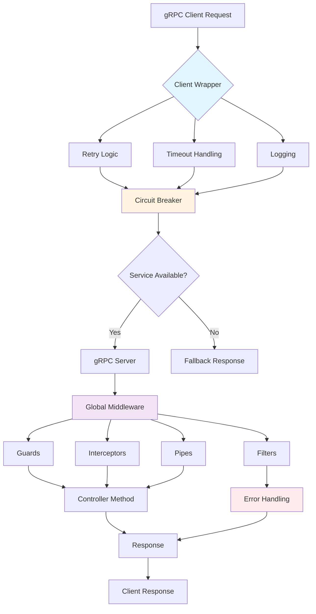
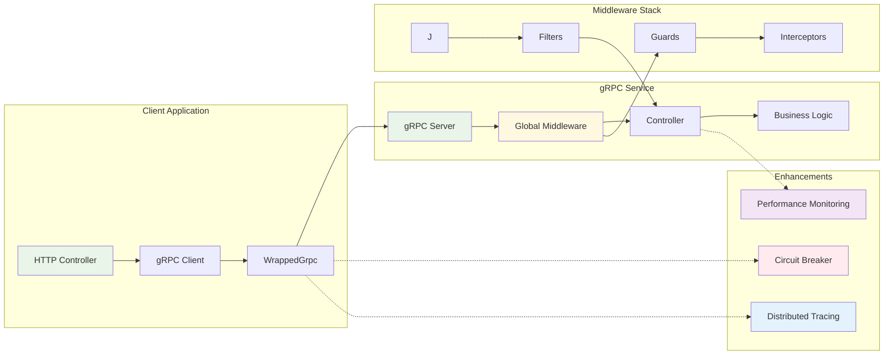

# Giới Thiệu

:::info Về @ecom-co/grpc
Thư viện gRPC utilities toàn diện cho ứng dụng NestJS với các tính năng cấp enterprise bao gồm client wrapping, exception handling, validation, logging, circuit breaker và distributed tracing.
:::

## Tổng Quan

Thư viện `@ecom-co/grpc` cung cấp bộ utilities hoàn chỉnh để nâng cao phát triển gRPC trong ứng dụng NestJS. Nó tập trung vào độ tin cậy, khả năng quan sát và trải nghiệm developer thông qua các component được thiết kế tốt để xử lý những thách thức phổ biến trong kiến trúc microservices.

## Tính Năng Chính

### 🎯 Enhanced Decorators
- **@GrpcMethod()**: Decorator method gRPC nâng cao với hỗ trợ metadata
- **@EnhancedOperation()**: Khả năng monitoring hiệu suất và caching
- **@TraceOperation()**: Tích hợp distributed tracing
- **@Cacheable()**: Caching cấp method với TTL
- **@MonitorPerformance()**: Monitoring hiệu suất tự động

### 🛡️ Xử Lý Exception
- **GrpcExceptionFilter**: Xử lý và chuyển đổi exception phía server
- **GrpcClientExceptionFilter**: Xử lý lỗi phía client cho HTTP endpoints
- **Custom Exception Classes**: Xử lý lỗi có cấu trúc với gRPC status codes

### ✅ Validation & Transformation
- **GrpcValidationPipe**: Validation request với tích hợp class-validator
- **Custom Data Serializers**: Chuyển đổi dữ liệu linh hoạt
- **Error Message Customization**: Báo cáo lỗi validation chi tiết

### 📝 Logging & Observability
- **GrpcLoggingInterceptor**: Logging request/response toàn diện
- **Correlation IDs**: Theo dõi request qua các services
- **Performance Metrics**: Monitoring thời gian phản hồi và throughput

### 🔧 Client Enhancements
- **WrappedGrpc**: Client nâng cao với retry, timeout và logging
- **Automatic Retries**: Logic retry có thể cấu hình cho resilience
- **Timeout Management**: Xử lý timeout request
- **Error Recovery**: Xử lý và phục hồi lỗi graceful

### ⚡ Tính Năng Nâng Cao
- **Circuit Breaker**: Fault tolerance và bảo vệ service
- **Distributed Tracing**: Tracing request end-to-end
- **Health Checks**: Monitoring sức khỏe service
- **Load Balancing**: Hỗ trợ load balancing phía client

## Tổng Quan Kiến Trúc

## Tổng Quan Component

| Component | Mục đích | Tính năng chính |
|-----------|---------|--------------|
| **WrappedGrpc** | Client gRPC nâng cao | Retry, timeout, logging, xử lý lỗi |
| **GrpcExceptionFilter** | Xử lý exception server | Chuyển đổi lỗi, logging, metrics |
| **GrpcClientExceptionFilter** | Mapping lỗi client | Chuyển đổi lỗi gRPC sang HTTP |
| **GrpcValidationPipe** | Validation request | Tích hợp class-validator, custom serializers |
| **GrpcLoggingInterceptor** | Logging request/response | Performance metrics, correlation IDs |
| **CircuitBreakerService** | Fault tolerance | Bảo vệ service, phục hồi tự động |
| **DistributedTracerService** | Tracing request | Khả năng hiển thị end-to-end, phân tích hiệu suất |

:::tip Bắt Đầu
Sẵn sàng nâng cao gRPC services của bạn? Bắt đầu với [Hướng Dẫn Nhanh](./quick-start.md) để khởi động trong vài phút.
:::

:::warning Cân Nhắc Production
Khi deploy lên production, đảm bảo bạn:
- Cấu hình timeout và retry policies phù hợp
- Kích hoạt logging levels đúng cách
- Thiết lập health checks và monitoring
- Cấu hình ngưỡng circuit breaker
- Xem xét cài đặt bảo mật cho error exposure
:::

## Tiếp Theo Là Gì?

- **[Hướng Dẫn Nhanh](./quick-start.md)**: Bắt đầu với setup cơ bản
- **[Ví Dụ Sử Dụng](./usage-examples.md)**: Học qua ví dụ thực tế  
- **[Client Module](./client-module.md)**: Tìm hiểu sâu về tính năng client
- **[Xử Lý Exception](./exception-handling.md)**: Làm chủ xử lý lỗi
- **[Tính Năng Nâng Cao](./advanced-features.md)**: Khám phá tính năng enterprise
- **[Tài Liệu API](./api-reference.md)**: Tài liệu API hoàn chỉnh