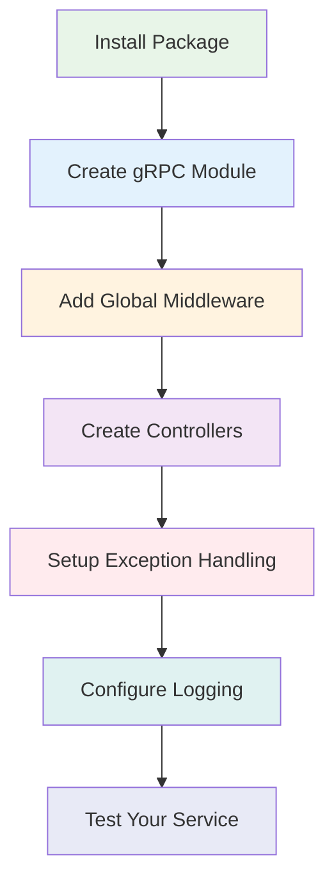

# Hướng Dẫn Nhanh

Khởi động với `@ecom-co/grpc` chỉ trong vài phút! Hướng dẫn này sẽ dẫn bạn qua các bước setup cần thiết.

## Cài Đặt

```bash
npm install @ecom-co/grpc
```

:::info Điều Kiện Tiên Quyết
- NestJS >= 10.0.0
- Node.js >= 16.0.0
- TypeScript >= 4.5.0
:::

## Luồng Setup Cơ Bản



## Bước 1: Tạo gRPC Module Của Bạn

```typescript title="app.module.ts"
import { Module } from '@nestjs/common';
import { GrpcModule } from '@ecom-co/grpc';

@Module({
  imports: [
    GrpcModule.forRoot({
      configs: [
        {
          name: 'user-service',
          type: 'server',
          port: 50052,
          protoPath: 'src/proto/user.proto',
        },
      ],
    }),
  ],
})
export class AppModule {}
```

## Bước 2: Thêm Global Middleware

:::tip Global Middleware
Global middleware tự động áp dụng cho tất cả gRPC methods, loại bỏ nhu cầu decorators riêng lẻ trên mỗi controller method.
:::

```typescript title="app.module.ts"
import { Module } from '@nestjs/common';
import { 
  GrpcModule, 
  GrpcValidationPipe, 
  GrpcExceptionFilter,
  GrpcLoggingInterceptor 
} from '@ecom-co/grpc';

@Module({
  imports: [
    GrpcModule.forRoot({
      configs: [
        {
          name: 'user-service',
          type: 'server',
          package: 'user',
          port: 50052,
          protoPath: 'src/proto/user.proto',
        },
      ],
      globalMiddleware: {
        // Validation cho tất cả requests
        pipes: [new GrpcValidationPipe({
          enableErrorLogging: true,
          stripUnknownProperties: true,
        })],
        
        // Exception handling cho tất cả errors
        filters: [new GrpcExceptionFilter({
          enableLogging: true,
          exposeInternalErrors: process.env.NODE_ENV !== 'production',
        })],
        
        // Logging cho tất cả requests/responses
        interceptors: [new GrpcLoggingInterceptor({
          logLevel: process.env.NODE_ENV === 'production' ? 'error' : 'info',
          logRequest: true,
          logResponse: process.env.NODE_ENV === 'development',
        })],
      },
    }),
  ],
})
export class AppModule {}
```

## Bước 3: Tạo Controller Của Bạn

```typescript title="user.controller.ts"
import { Controller } from '@nestjs/common';
import { GrpcMethod } from '@ecom-co/grpc';

interface GetUserRequest {
  id: string;
}

interface User {
  id: string;
  name: string;
  email: string;
}

@Controller()
export class UserController {
  @GrpcMethod('UserService', 'GetUser')
  async getUser(data: GetUserRequest): Promise<User> {
    // Business logic của bạn ở đây
    return {
      id: data.id,
      name: 'John Doe',
      email: 'john@example.com',
    };
  }

  @GrpcMethod('UserService', 'CreateUser')
  async createUser(data: CreateUserRequest): Promise<User> {
    // Logic tạo user
    return newUser;
  }
}
```

## Bước 4: Setup Main Application

```typescript title="main.ts"
import { NestFactory } from '@nestjs/core';
import { MicroserviceOptions, Transport } from '@nestjs/microservices';
import { join } from 'path';
import { AppModule } from './app.module';

async function bootstrap() {
  const app = await NestFactory.createMicroservice<MicroserviceOptions>(
    AppModule,
    {
      transport: Transport.GRPC,
      options: {
        package: 'user',
        protoPath: join(__dirname, 'proto/user.proto'),
        url: '0.0.0.0:50052',
      },
    },
  );

  await app.listen();
  console.log('gRPC Server running on port 50052');
}

bootstrap();
```

## Step 5: Add gRPC Client (Optional)

For HTTP services that need to call gRPC services:

```typescript title="user.service.ts"
import { Injectable } from '@nestjs/common';
import { createWrappedGrpc, GrpcOptions } from '@ecom-co/grpc';
import { ClientGrpc } from '@nestjs/microservices';

@Injectable()
export class UserService {
  private userService: any;

  constructor(private client: ClientGrpc) {
    // Wrap the client with enhanced features
    const options: GrpcOptions = {
      enableLogging: true,
      retry: 3,
      timeout: 10000,
      retryableCodes: [1, 4, 8, 10, 13, 14, 15], // Common retryable gRPC codes
    };

    const wrappedClient = createWrappedGrpc(this.client, options);
    this.userService = wrappedClient.getService('UserService');
  }

  async getUser(id: string) {
    return this.userService.getUser({ id }).toPromise();
  }
}
```

## Step 6: Add HTTP Exception Filter

For HTTP controllers that use gRPC clients:

```typescript title="app.controller.ts"
import { Controller, Get, Param, UseFilters } from '@nestjs/common';
import { GrpcClientExceptionFilter } from '@ecom-co/grpc';
import { UserService } from './user.service';

@Controller('users')
@UseFilters(new GrpcClientExceptionFilter({
  enableDetailedLogging: true,
  exposeInternalErrors: false,
}))
export class AppController {
  constructor(private readonly userService: UserService) {}

  @Get(':id')
  async getUser(@Param('id') id: string) {
    return this.userService.getUser(id);
  }
}
```

## Testing Your Setup

### 1. Start the gRPC Server

```bash
npm run start
```

### 2. Test with grpcurl

```bash
# Install grpcurl first
go install github.com/fullstorydev/grpcurl/cmd/grpcurl@latest

# Test your service
grpcurl -plaintext \
  -d '{"id": "123"}' \
  localhost:50052 \
  user.UserService/GetUser
```

### 3. Expected Response

```json
{
  "id": "123",
  "name": "John Doe",
  "email": "john@example.com"
}
```

## Configuration Quick Reference

| Component | Key Options |
|-----------|-------------|
| **GrpcValidationPipe** | `enableErrorLogging`, `stripUnknownProperties` |
| **GrpcExceptionFilter** | `enableLogging`, `exposeInternalErrors` |
| **GrpcLoggingInterceptor** | `logLevel`, `logRequest`, `logResponse` |
| **WrappedGrpc** | `retry`, `timeout`, `retryableCodes` |

:::warning Common Issues
- **Port Conflicts**: Ensure your gRPC port isn't already in use
- **Proto Path**: Use absolute paths or paths relative to your project root
- **Package Names**: Ensure package names match between your proto files and module configuration
:::

:::tip Next Steps
Now that you have a basic setup running:
- Explore [Usage Examples](./usage-examples.md) for more complex scenarios
- Learn about [Exception Handling](./exception-handling.md) for robust error management
- Check out [Advanced Features](./advanced-features.md) for circuit breakers and tracing
:::

## Development vs Production

### Development Configuration

```typescript
const developmentMiddleware = {
  pipes: [new GrpcValidationPipe({
    enableErrorLogging: true,
    stripUnknownProperties: true,
  })],
  filters: [new GrpcExceptionFilter({
    enableLogging: true,
    exposeInternalErrors: true, // Show detailed errors
  })],
  interceptors: [new GrpcLoggingInterceptor({
    logLevel: 'info',
    logRequest: true,
    logResponse: true, // Log everything in dev
  })],
};
```

### Production Configuration

```typescript
const productionMiddleware = {
  pipes: [new GrpcValidationPipe({
    enableErrorLogging: false, // Reduce noise
    stripUnknownProperties: true,
  })],
  filters: [new GrpcExceptionFilter({
    enableLogging: true,
    exposeInternalErrors: false, // Hide internal details
  })],
  interceptors: [new GrpcLoggingInterceptor({
    logLevel: 'error',
    logRequest: false, // Reduce log volume
    logResponse: false,
  })],
};
```

Congratulations! 🎉 You now have a fully functional gRPC service with enhanced error handling, validation, and logging capabilities.