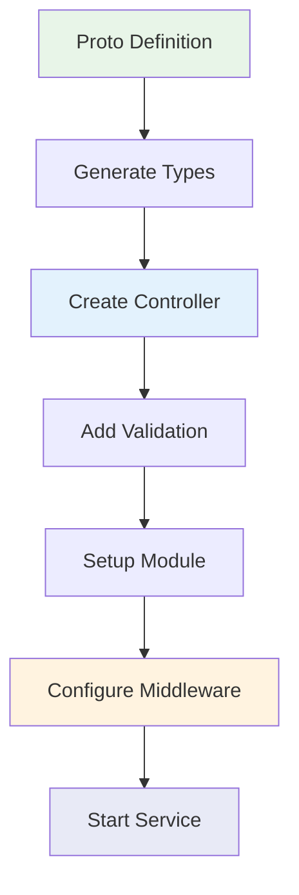
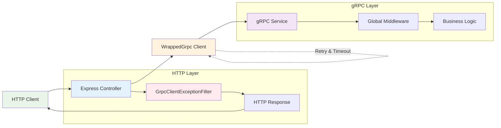

# Ví Dụ Sử Dụng

Phần này cung cấp ví dụ toàn diện cho các tình huống và use cases khác nhau với thư viện `@ecom-co/grpc`.

## gRPC Service Cơ Bản

### Setup Service Hoàn Chỉnh



#### 1. Proto Definition

```protobuf title="user.proto"
syntax = "proto3";

package user;

service UserService {
  rpc GetUser(GetUserRequest) returns (User);
  rpc CreateUser(CreateUserRequest) returns (User);
  rpc UpdateUser(UpdateUserRequest) returns (User);
  rpc DeleteUser(DeleteUserRequest) returns (DeleteUserResponse);
  rpc ListUsers(ListUsersRequest) returns (ListUsersResponse);
}

message User {
  string id = 1;
  string name = 2;
  string email = 3;
  string phone = 4;
  int64 created_at = 5;
  int64 updated_at = 6;
}

message GetUserRequest {
  string id = 1;
}

message CreateUserRequest {
  string name = 1;
  string email = 2;
  string phone = 3;
}

message UpdateUserRequest {
  string id = 1;
  string name = 2;
  string email = 3;
  string phone = 4;
}

message DeleteUserRequest {
  string id = 1;
}

message DeleteUserResponse {
  bool success = 1;
}

message ListUsersRequest {
  int32 page = 1;
  int32 limit = 2;
}

message ListUsersResponse {
  repeated User users = 1;
  int32 total = 2;
}
```

#### 2. Controller with Validation

```typescript title="user.controller.ts"
import { Controller } from '@nestjs/common';
import { IsEmail, IsNotEmpty, IsString, IsOptional } from 'class-validator';
import { GrpcMethod } from '@ecom-co/grpc';

// DTOs with validation
class CreateUserDto {
  @IsNotEmpty()
  @IsString()
  name: string;

  @IsEmail()
  email: string;

  @IsOptional()
  @IsString()
  phone?: string;
}

class UpdateUserDto {
  @IsNotEmpty()
  @IsString()
  id: string;

  @IsOptional()
  @IsString()
  name?: string;

  @IsOptional()
  @IsEmail()
  email?: string;

  @IsOptional()
  @IsString()
  phone?: string;
}

@Controller()
export class UserController {
  constructor(private readonly userService: UserService) {}

  @GrpcMethod('UserService', 'GetUser')
  async getUser(data: { id: string }) {
    return this.userService.findById(data.id);
  }

  @GrpcMethod('UserService', 'CreateUser')
  async createUser(data: CreateUserDto) {
    return this.userService.create(data);
  }

  @GrpcMethod('UserService', 'UpdateUser')
  async updateUser(data: UpdateUserDto) {
    return this.userService.update(data.id, data);
  }

  @GrpcMethod('UserService', 'DeleteUser')
  async deleteUser(data: { id: string }) {
    await this.userService.delete(data.id);
    return { success: true };
  }

  @GrpcMethod('UserService', 'ListUsers')
  async listUsers(data: { page: number; limit: number }) {
    const result = await this.userService.findMany(data.page, data.limit);
    return {
      users: result.users,
      total: result.total,
    };
  }
}
```

#### 3. Service with Business Logic

```typescript title="user.service.ts"
import { Injectable, NotFoundException } from '@nestjs/common';
import { 
  GrpcNotFoundException, 
  GrpcAlreadyExistsException,
  GrpcInvalidArgumentException 
} from '@ecom-co/grpc';

@Injectable()
export class UserService {
  private users: User[] = [];

  async findById(id: string): Promise<User> {
    const user = this.users.find(u => u.id === id);
    if (!user) {
      throw new GrpcNotFoundException(`User with ID ${id} not found`);
    }
    return user;
  }

  async create(data: CreateUserDto): Promise<User> {
    // Check if user already exists
    const existingUser = this.users.find(u => u.email === data.email);
    if (existingUser) {
      throw new GrpcAlreadyExistsException(`User with email ${data.email} already exists`);
    }

    const user: User = {
      id: this.generateId(),
      name: data.name,
      email: data.email,
      phone: data.phone || '',
      created_at: Date.now(),
      updated_at: Date.now(),
    };

    this.users.push(user);
    return user;
  }

  async update(id: string, data: Partial<UpdateUserDto>): Promise<User> {
    const userIndex = this.users.findIndex(u => u.id === id);
    if (userIndex === -1) {
      throw new GrpcNotFoundException(`User with ID ${id} not found`);
    }

    const updatedUser = {
      ...this.users[userIndex],
      ...data,
      updated_at: Date.now(),
    };

    this.users[userIndex] = updatedUser;
    return updatedUser;
  }

  async delete(id: string): Promise<void> {
    const userIndex = this.users.findIndex(u => u.id === id);
    if (userIndex === -1) {
      throw new GrpcNotFoundException(`User with ID ${id} not found`);
    }

    this.users.splice(userIndex, 1);
  }

  async findMany(page: number = 1, limit: number = 10): Promise<{ users: User[]; total: number }> {
    if (page < 1 || limit < 1) {
      throw new GrpcInvalidArgumentException('Page and limit must be positive numbers');
    }

    const startIndex = (page - 1) * limit;
    const endIndex = startIndex + limit;
    
    return {
      users: this.users.slice(startIndex, endIndex),
      total: this.users.length,
    };
  }

  private generateId(): string {
    return Math.random().toString(36).substr(2, 9);
  }
}
```

## HTTP Service with gRPC Client

### Hybrid HTTP-gRPC Architecture



#### 1. HTTP Controller with gRPC Client

```typescript title="user-http.controller.ts"
import { 
  Controller, 
  Get, 
  Post, 
  Put, 
  Delete, 
  Body, 
  Param, 
  Query,
  UseFilters 
} from '@nestjs/common';
import { GrpcClientExceptionFilter } from '@ecom-co/grpc';

@Controller('api/users')
@UseFilters(new GrpcClientExceptionFilter({
  enableDetailedLogging: true,
  logLevel: 'error',
  exposeInternalErrors: process.env.NODE_ENV !== 'production',
}))
export class UserHttpController {
  constructor(private readonly userGrpcService: UserGrpcService) {}

  @Get(':id')
  async getUser(@Param('id') id: string) {
    return this.userGrpcService.getUser(id);
  }

  @Post()
  async createUser(@Body() createUserDto: CreateUserDto) {
    return this.userGrpcService.createUser(createUserDto);
  }

  @Put(':id')
  async updateUser(@Param('id') id: string, @Body() updateUserDto: UpdateUserDto) {
    return this.userGrpcService.updateUser(id, updateUserDto);
  }

  @Delete(':id')
  async deleteUser(@Param('id') id: string) {
    return this.userGrpcService.deleteUser(id);
  }

  @Get()
  async listUsers(
    @Query('page') page: string = '1',
    @Query('limit') limit: string = '10'
  ) {
    return this.userGrpcService.listUsers(parseInt(page), parseInt(limit));
  }
}
```

#### 2. gRPC Client Service

```typescript title="user-grpc.service.ts"
import { Injectable, OnModuleInit } from '@nestjs/common';
import { ClientGrpc } from '@nestjs/microservices';
import { createWrappedGrpc, GrpcOptions } from '@ecom-co/grpc';
import { lastValueFrom } from 'rxjs';

interface UserGrpcService {
  getUser(data: { id: string }): Observable<User>;
  createUser(data: CreateUserRequest): Observable<User>;
  updateUser(data: UpdateUserRequest): Observable<User>;
  deleteUser(data: { id: string }): Observable<{ success: boolean }>;
  listUsers(data: { page: number; limit: number }): Observable<{ users: User[]; total: number }>;
}

@Injectable()
export class UserGrpcService implements OnModuleInit {
  private userService: UserGrpcService;

  constructor(private client: ClientGrpc) {}

  onModuleInit() {
    // Configure enhanced client options
    const options: GrpcOptions = {
      enableLogging: process.env.NODE_ENV !== 'production',
      retry: 3,
      timeout: 30000, // 30 seconds
      maxRetryDelay: 5000, // 5 seconds max delay between retries
      retryableCodes: [
        1,  // CANCELLED
        4,  // DEADLINE_EXCEEDED
        8,  // RESOURCE_EXHAUSTED
        10, // ABORTED
        13, // INTERNAL
        14, // UNAVAILABLE
        15, // DATA_LOSS
      ],
    };

    const wrappedClient = createWrappedGrpc(this.client, options);
    this.userService = wrappedClient.getService<UserGrpcService>('UserService');
  }

  async getUser(id: string): Promise<User> {
    return lastValueFrom(this.userService.getUser({ id }));
  }

  async createUser(data: CreateUserRequest): Promise<User> {
    return lastValueFrom(this.userService.createUser(data));
  }

  async updateUser(id: string, data: Partial<UpdateUserRequest>): Promise<User> {
    return lastValueFrom(this.userService.updateUser({ id, ...data }));
  }

  async deleteUser(id: string): Promise<{ success: boolean }> {
    return lastValueFrom(this.userService.deleteUser({ id }));
  }

  async listUsers(page: number, limit: number): Promise<{ users: User[]; total: number }> {
    return lastValueFrom(this.userService.listUsers({ page, limit }));
  }
}
```

## Advanced Usage with Decorators

### Enhanced Method Decorators

```typescript title="advanced-user.controller.ts"
import { Controller } from '@nestjs/common';
import { 
  GrpcMethod,
  EnhancedOperation,
  TraceOperation,
  Cacheable,
  MonitorPerformance 
} from '@ecom-co/grpc';

@Controller()
export class AdvancedUserController {
  constructor(private readonly userService: UserService) {}

  @GrpcMethod('UserService', 'GetUser')
  @EnhancedOperation({
    operationName: 'getUserById',
    performanceThreshold: 1000, // Log if takes > 1 second
    includeArgs: true,
    includeResult: false, // Don't log result for privacy
  })
  @TraceOperation('user-service', 'get-user')
  @Cacheable({ ttl: 300 }) // Cache for 5 minutes
  @MonitorPerformance()
  async getUser(data: { id: string }) {
    return this.userService.findById(data.id);
  }

  @GrpcMethod('UserService', 'CreateUser')
  @EnhancedOperation({
    operationName: 'createUser',
    performanceThreshold: 2000,
    includeArgs: false, // Don't log sensitive data
    includeResult: true,
  })
  @TraceOperation('user-service', 'create-user')
  @MonitorPerformance()
  async createUser(data: CreateUserDto) {
    return this.userService.create(data);
  }

  @GrpcMethod('UserService', 'GetUserStats')
  @EnhancedOperation({
    operationName: 'getUserStats',
    cacheEnabled: true,
    cacheTtl: 600, // Cache for 10 minutes
  })
  @Cacheable({ ttl: 600 })
  async getUserStats(data: { id: string }) {
    // Heavy computation that benefits from caching
    return this.userService.calculateUserStats(data.id);
  }
}
```

## Error Handling Examples

### Custom Exception Handling

```typescript title="custom-error-handling.ts"
import { 
  GrpcException,
  GrpcInvalidArgumentException,
  GrpcNotFoundException,
  GrpcPermissionDeniedException,
  GrpcUnauthenticatedException,
  createGrpcException 
} from '@ecom-co/grpc';

@Injectable()
export class UserService {
  async authenticatedAction(userId: string, token: string) {
    // Authentication check
    if (!token) {
      throw new GrpcUnauthenticatedException('Authentication token required');
    }

    if (!this.isValidToken(token)) {
      throw new GrpcUnauthenticatedException('Invalid authentication token');
    }

    // Authorization check
    const user = await this.findById(userId);
    if (!this.hasPermission(user, 'admin')) {
      throw new GrpcPermissionDeniedException('Admin permission required');
    }

    // Business logic validation
    if (!this.isValidOperation(user)) {
      throw new GrpcInvalidArgumentException('Operation not allowed for this user');
    }

    return this.performAction(user);
  }

  async customErrorExample() {
    try {
      // Some operation that might fail
      return await this.riskyOperation();
    } catch (error) {
      // Create custom gRPC exception with details
      throw createGrpcException(
        'INTERNAL',
        'Failed to process user operation',
        {
          errorCode: 'USER_OPERATION_FAILED',
          timestamp: new Date().toISOString(),
          operation: 'customErrorExample',
          details: error.message,
        }
      );
    }
  }
}
```

### Error Response Format

When using the HTTP integration, errors are automatically transformed:

```json title="Error Response Examples"
{
  "statusCode": 404,
  "message": "User with ID 123 not found",
  "error": "Not Found",
  "timestamp": "2024-01-15T10:30:00.000Z",
  "path": "/api/users/123",
  "grpcCode": 5,
  "grpcMessage": "User with ID 123 not found"
}

{
  "statusCode": 400,
  "message": [
    "name should not be empty",
    "email must be an email"
  ],
  "error": "Bad Request",
  "timestamp": "2024-01-15T10:30:00.000Z",
  "path": "/api/users",
  "grpcCode": 3,
  "grpcMessage": "Validation failed"
}
```

## Circuit Breaker Integration

### Service Protection

```typescript title="circuit-breaker-example.ts"
import { Injectable } from '@nestjs/common';
import { CircuitBreakerService, CircuitBreakerConfig } from '@ecom-co/grpc';

@Injectable()
export class ExternalApiService {
  private circuitBreakerConfig: CircuitBreakerConfig = {
    failureThreshold: 5, // Open circuit after 5 failures
    recoveryTimeout: 30000, // 30 seconds recovery timeout
    monitoringPeriod: 60000, // 1 minute monitoring window
    expectedErrors: ['TIMEOUT', 'CONNECTION_ERROR'],
  };

  constructor(private circuitBreaker: CircuitBreakerService) {}

  async callExternalService(data: any) {
    return this.circuitBreaker.execute(
      'external-api',
      () => this.makeApiCall(data),
      this.circuitBreakerConfig
    );
  }

  private async makeApiCall(data: any) {
    // Your external API call logic
    return fetch('https://external-api.com/data', {
      method: 'POST',
      body: JSON.stringify(data),
    });
  }
}
```

:::tip Best Practices
- Use validation DTOs for all input data
- Implement proper error handling with specific gRPC exceptions
- Enable caching for expensive operations
- Configure circuit breakers for external dependencies
- Use detailed logging for debugging and monitoring
:::

:::warning Performance Considerations
- Cache frequently accessed data
- Set appropriate timeouts for different operations
- Monitor circuit breaker metrics
- Use bulk operations when possible
- Consider async processing for heavy operations
:::

:::note Monitoring
Enable comprehensive monitoring by:
- Using `@MonitorPerformance()` on critical methods
- Configuring detailed logging levels
- Setting up circuit breaker metrics collection
- Implementing distributed tracing
:::

## Testing Your Implementation

### Unit Testing

```typescript title="user.controller.spec.ts"
import { Test, TestingModule } from '@nestjs/testing';
import { UserController } from './user.controller';
import { UserService } from './user.service';
import { GrpcNotFoundException } from '@ecom-co/grpc';

describe('UserController', () => {
  let controller: UserController;
  let service: UserService;

  beforeEach(async () => {
    const module: TestingModule = await Test.createTestingModule({
      controllers: [UserController],
      providers: [
        {
          provide: UserService,
          useValue: {
            findById: jest.fn(),
            create: jest.fn(),
          },
        },
      ],
    }).compile();

    controller = module.get<UserController>(UserController);
    service = module.get<UserService>(UserService);
  });

  describe('getUser', () => {
    it('should return user when found', async () => {
      const user = { id: '1', name: 'Test User', email: 'test@example.com' };
      jest.spyOn(service, 'findById').mockResolvedValue(user);

      const result = await controller.getUser({ id: '1' });
      expect(result).toEqual(user);
    });

    it('should throw GrpcNotFoundException when user not found', async () => {
      jest.spyOn(service, 'findById').mockRejectedValue(
        new GrpcNotFoundException('User not found')
      );

      await expect(controller.getUser({ id: '999' })).rejects.toThrow(
        GrpcNotFoundException
      );
    });
  });
});
```

This comprehensive example demonstrates the full capabilities of the `@ecom-co/grpc` library in real-world scenarios.