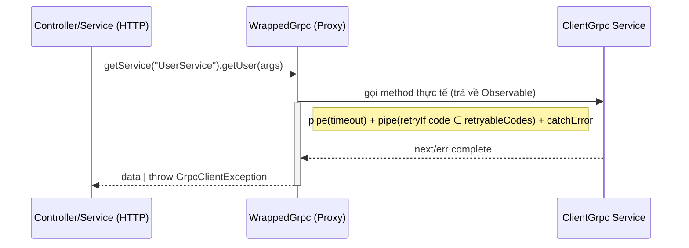

import Tabs from '@theme/Tabs';
import TabItem from '@theme/TabItem';

:::info
`WrappedGrpc` là một lớp wrapper cho `ClientGrpc` (NestJS) giúp bạn: log request có sanitization, áp `timeout`, `retry` theo `retryableCodes` với exponential backoff cap, và thống nhất error thành `GrpcClientException` để filter HTTP có thể xử lý.
:::

### Tổng quan

- **Mục tiêu**: Chuẩn hoá cách gọi gRPC ở Client, giảm lặp và tăng observability.
- **Điểm nổi bật**:
    - **Logging** có sanitize fields nhạy cảm (`password`, `token`, `secret`, `key`).
    - **Timeout**: auto `timeout(ms)` cho mỗi gRPC `Observable`.
    - **Retry**: `rxjs` retry với exponential backoff, chỉ retry khi `code` thuộc `retryableCodes`.
    - **Error chuẩn**: chuyển mọi lỗi thành `GrpcClientException` (giúp HTTP layer/filter xử lý thống nhất).

### Cách hoạt động (tóm tắt)



:::tip
`WrappedGrpc` sử dụng `Proxy` để intercept từng method của service được trả về bởi `clientGrpc.getService(name)`. Nếu method trả về `Observable`, nó sẽ tự động wrap `pipe()` với `timeout`, `retry`, và `catchError`.
:::

### Khởi tạo

```ts
import { ClientGrpc } from '@nestjs/microservices';
import { createWrappedGrpc, WrappedGrpc } from '@ecom-co/grpc';

constructor(@Inject('GRPC_CLIENT') private readonly clientGrpc: ClientGrpc) {
  this.grpc = createWrappedGrpc(this.clientGrpc, {
    enableLogging: true,
    timeout: 30000,
    retry: 2,
    maxRetryDelay: 10000,
    retryableCodes: [1, 4, 8, 10, 13, 14, 15],
  });
}

const userService = this.grpc.getService<UserService>('UserService');
```

### API surface

- **`createWrappedGrpc(clientGrpc: ClientGrpc, options?: GrpcOptions): WrappedGrpc`**
- **`new WrappedGrpc(clientGrpc: ClientGrpc, options?: GrpcOptions)`**
- **`getService<T>(name: string): T`** — trả về service như `ClientGrpc.getService`, nhưng các method Observable sẽ được wrap.
- **`getClientByServiceName<T>(name: string): T`** — passthrough.

### GrpcOptions

| Option           | Type          | Mặc định              | Mô tả                                                                          |
| ---------------- | ------------- | --------------------- | ------------------------------------------------------------------------------ |
| `enableLogging`  | `boolean`     | `true`                | Bật/tắt log khi gọi method gRPC (args được sanitize).                          |
| `timeout`        | `number` (ms) | `30000`               | Áp `rxjs timeout`. >0 thì bật; 0 hoặc undefined sẽ bỏ qua.                     |
| `retry`          | `number`      | `0`                   | Số lần retry khi lỗi có `code` thuộc `retryableCodes`.                         |
| `maxRetryDelay`  | `number` (ms) | `10000`               | Trần delay cho exponential backoff: `min(1000 * 2^retryCount, maxRetryDelay)`. |
| `retryableCodes` | `number[]`    | `[1,4,8,10,13,14,15]` | Danh sách gRPC status codes sẽ được phép retry.                                |

:::note
Backoff sử dụng `Math.min(1000 * Math.pow(2, retryCount), maxRetryDelay)`. Ví dụ: 1s → 2s → 4s → ... capped bởi `maxRetryDelay`.
:::

### Error model: GrpcClientException

Mọi lỗi sau khi qua `catchError` sẽ ném `GrpcClientException` với các field:

| Field      | Type       | Mô tả                                    |
| ---------- | ---------- | ---------------------------------------- |
| `message`  | `string`   | Thông điệp lỗi.                          |
| `code`     | `number?`  | gRPC status code (nếu có).               |
| `details`  | `unknown?` | Thông tin chi tiết (string hoặc object). |
| `metadata` | `unknown?` | Metadata gRPC (nếu được đính kèm).       |

:::warning
`retry` chỉ áp dụng khi lỗi có `code` và nằm trong `retryableCodes`. Nếu không, lỗi được throw ngay.
:::

### Ví dụ sử dụng

<Tabs>
  <TabItem value="setup" label="Setup trong Module">

```ts
// user.module.ts
import { Module } from '@nestjs/common';
import { ClientsModule, Transport } from '@nestjs/microservices';
import { join } from 'path';

@Module({
    imports: [
        ClientsModule.register([
            {
                name: 'USER_GRPC_CLIENT',
                transport: Transport.GRPC,
                options: {
                    package: 'user',
                    protoPath: join(__dirname, '../proto/user.proto'),
                    url: 'localhost:50051',
                },
            },
        ]),
    ],
    providers: [UserService],
    exports: [UserService],
})
export class UserModule {}
```

  </TabItem>
  <TabItem value="service" label="Service Implementation">

```ts
// user.service.ts
import { Injectable, Inject } from '@nestjs/common';
import { ClientGrpc } from '@nestjs/microservices';
import { createWrappedGrpc, WrappedGrpc } from '@ecom-co/grpc';
import { firstValueFrom, Observable } from 'rxjs';

interface UserGrpcService {
    getUser(data: { id: string }): Observable<any>;
    createUser(data: any): Observable<any>;
    updateUser(data: any): Observable<any>;
}

@Injectable()
export class UserService {
    private grpc: WrappedGrpc;
    private userService: UserGrpcService;

    constructor(@Inject('USER_GRPC_CLIENT') private readonly client: ClientGrpc) {
        this.grpc = createWrappedGrpc(this.client, {
            enableLogging: true,
            timeout: 15000, // 15 seconds
            retry: 3,
            maxRetryDelay: 5000,
            retryableCodes: [1, 4, 8, 10, 13, 14, 15], // CANCELLED, DEADLINE_EXCEEDED, etc.
        });
    }

    onModuleInit() {
        this.userService = this.grpc.getService<UserGrpcService>('UserService');
    }

    async findById(id: string) {
        try {
            return await firstValueFrom(this.userService.getUser({ id }));
        } catch (error) {
            // error sẽ là GrpcClientException, sẽ được GrpcClientFilter xử lý
            throw error;
        }
    }

    async create(userData: any) {
        return firstValueFrom(this.userService.createUser(userData));
    }
}
```

  </TabItem>
  <TabItem value="controller" label="Controller Usage">

```ts
// user.controller.ts
import { Controller, Get, Post, Body, Param } from '@nestjs/common';
import { UserService } from './user.service';

@Controller('users')
export class UserController {
    constructor(private readonly userService: UserService) {}

    @Get(':id')
    async getUser(@Param('id') id: string) {
        // Nếu gRPC service lỗi, GrpcClientFilter sẽ tự động convert thành HTTP response
        return this.userService.findById(id);
    }

    @Post()
    async createUser(@Body() userData: any) {
        return this.userService.create(userData);
    }
}
```

  </TabItem>
  <TabItem value="observable" label="Observable Pattern">

```ts
// Sử dụng Observable trực tiếp
const user$ = userService.getUser({ id: '123' });
user$.subscribe({
    next: (u) => console.log(u),
    error: (e) => console.error(e), // e instanceof GrpcClientException
});

// Hoặc convert thành Promise
const user = await firstValueFrom(userService.getUser({ id: '123' }));
```

  </TabItem>
  <TabItem value="advanced" label="Advanced Configuration">

```ts
// Cấu hình nâng cao cho production
const grpc = createWrappedGrpc(clientGrpc, {
    enableLogging: process.env.NODE_ENV !== 'production',
    timeout: 30000, // 30s cho operations phức tạp
    retry: 2, // Ít retry hơn để tránh cascade failure
    maxRetryDelay: 8000,
    retryableCodes: [
        1, // CANCELLED - client cancel
        4, // DEADLINE_EXCEEDED - timeout
        8, // RESOURCE_EXHAUSTED - rate limit
        14, // UNAVAILABLE - service down
    ],
});

// Sử dụng với error handling chi tiết
try {
    const result = await firstValueFrom(service.complexOperation(data));
    return result;
} catch (error) {
    if (error.code === 5) {
        // NOT_FOUND
        throw new NotFoundException('Resource not found');
    }
    // Các lỗi khác để GrpcClientFilter xử lý
    throw error;
}
```

  </TabItem>
</Tabs>

### Logging & sanitize args

```ts
// Các field sau sẽ bị thay bằng "[REDACTED]" trong log: password, token, secret, key
this.logger.debug(`Calling gRPC method: ${service}.${method}`, { args: sanitizedArgs });
```

### Mermaid: Retry & Timeout pipeline

```mermaid
flowchart TD
  A[Observable từ ClientGrpc] --> B{timeout > 0?}
  B -- No --> C
  B -- Yes --> C[apply timeout(ms)]
  C --> D{retry > 0?}
  D -- No --> E[catchError → throw GrpcClientException]
  D -- Yes --> F[retryIf(code ∈ retryableCodes) with exp backoff]
  F --> E
```

### Best practices

- **Đặt timeout** phù hợp với SLA của service.
- **Giới hạn retry** để tránh gây load dồn khi downstream gặp sự cố.
- **Kết hợp GrpcClientFilter** ở HTTP layer để mapping lỗi gRPC → HTTP chuẩn.
